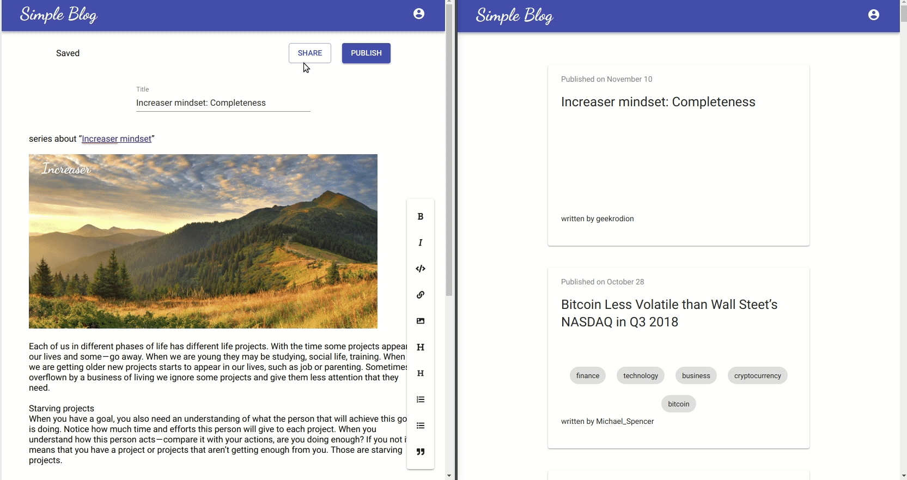

## Goal for this part

Often when you work on a story, you want to share your draft with somebody with better writing skills, so that he can go over the content and fix errors.



All code for this part you can find in [front-end](https://github.com/RodionChachura/simple-blog-front/tree/part-6) and [back-end](https://github.com/RodionChachura/simple-blog-back/tree/part-6) repositories.

## Back-end

From back-end side, we want two new endpoints — one for sharing and one to get stories that shared with you. And of course, we want our back-end to send notifications when somebody changes the content of the story.

### Blog.Model Project

To add shares, we will go through the same steps as we deed with likes since we have the same many-to-many relationship here. We will create a *Share* model and update accordingly *User* and *Story* models.

```cs:title=Share.cs
namespace Blog.Model
{
    public class Share
    {
        public string StoryId { get; set; }
        public Story Story { get; set; }

        public string UserId { get; set; }
        public User User { get; set; }
    }
}
```

### Blog.Data Project

*Share*Repository will inherit *EntityBaseRepository* and will have one more additional method. If you followed up to this point you may remember that previously *EntityBaseRepository* required an entity to have *Id* field and it was not convenient since we have entities where two keys together work as a primary key(Like and Share) so I made some changes.

```cs:title=ShareRepository.cs
public class ShareRepository : EntityBaseRepository<Share>, IShareRepository
{
  public ShareRepository(BlogContext context) : base(context) {}

  public List<Story> StoriesSharedToUser(string userId)
  {
    return _context.Set<Share>()
      .Where(s => s.UserId == userId)
      .Select(s => s.Story)
      .Include(s => s.Owner)
      .ToList();
  }
}
```

### Blog.API Project

So we need two new endpoints. Let’s add them.

```cs:title=StoriesController.cs
...

[HttpPost("{id}/share")]
public ActionResult Share(string id, [FromBody]ShareViewModel model)
{
    var ownerId = HttpContext.User.Identity.Name;
    if (!storyRepository.IsOwner(id, ownerId)) return Forbid("You are not the owner of this story");

    var userToShare = userRepository.GetSingle(u => u.Username == model.Username);
    if (userToShare == null) {
        return BadRequest(new { username = "No user with this name" });
    }
    var owner = userRepository.GetSingle(s => s.Id == ownerId);
    var story = storyRepository.GetSingle(s => s.Id == id, s => s.Shares);
    if (story.OwnerId == ownerId) {
        return BadRequest(new { username = "You can't share story with yourself" });
    }

    var existingShare = story.Shares.Find(l => l.UserId == userToShare.Id);
    if (existingShare == null)
    {
        shareRepository.Add(new Share
        {
            UserId = userToShare.Id,
            StoryId = id
        });
        shareRepository.Commit();
        hubContext.Clients.User(userToShare.Id).SendAsync(
            "notification",
            new Notification<ShareRelatedPayload>
            {
                NotificationType = NotificationType.SHARE,
                Payload = new ShareRelatedPayload
                {
                    Username = owner.Username,
                    StoryTitle = story.Title
                }
            }
        );
    }
    return NoContent();
}

...

[HttpGet("shared")]
public ActionResult<SharedDraftsViewModel> GetSharedToYouDrafts()
{
    var userId = HttpContext.User.Identity.Name;

    var stories = shareRepository.StoriesSharedToUser(userId).Where(s => s.Draft);
    var usernames = stories.Select(s => s.Owner.Username).Distinct().ToList();

    return new SharedDraftsViewModel {
        UsersDrafts = usernames.Select(username => new UserDrafts {
            Username = username,
            Drafts = stories
                .Where(s => s.Owner.Username == username)
                .Select(mapper.Map<DraftViewModel>)
                .ToList()
        }).ToList()
    };
}
```

There is nothing new — very similar to what we had in toggle like and drafts actions.

## Front-end

On front-end part, we will update [saga](https://github.com/RodionChachura/simple-blog-front/blob/part-6/src/sagas/generic.js#L41) where we receive notifications.

```js:title=generic.js
const { notificationType, payload } = yield take(channel)
if (['LIKE', 'UNLIKE'].includes(notificationType)) {
  const message = `${payload.username} ${notificationType.toLowerCase()}d "${payload.storyTitle}"`
  yield put(toggleSnackbar(message))
} else if (notificationType === 'SHARE') {
  const message = `${payload.username} invited you to edit his story: "${payload.storyTitle}"`
  yield put(toggleSnackbar(message))
} else if (notificationType === 'STORY_EDIT') {
  const { navigation, editor } = yield select()
  if (navigation.page === 'editor' && editor.storyId === payload.id) {
    yield put(updateStory(payload))
  }
}
```

When we receive notification about changes in a shared draft this part of editor reducer will be triggered:

```cs:title=editor.js
...    
[a.updateStory]: (state, { title, tags, lastEditTime, content }) => ({
  ...state,
  title,
  tags,
  lastSave: lastEditTime * 1000,
  content: Value.fromJSON(JSON.parse(content)),
}),
...
```

This way, when somebody changes part of the story, we will see the effect of real-time collaboration.

Other changes on front-end part include shared tab in your stories page and share dialog in editor page. But we will not cover them here.

For now, this is the last part of the series. Thanks, those who followed me up to this point.

