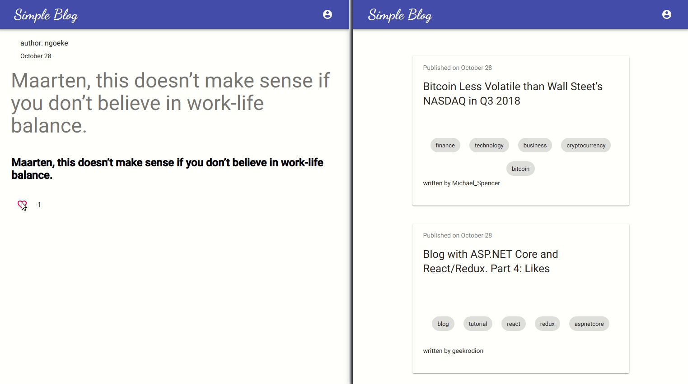

### Goal for this part

In this part, we are going to make real-time notifications so that when somebody likes one of your stories, notification will appear in the app.



All code for this part you can find in [front-end](https://github.com/RodionChachura/simple-blog-front/tree/part-5) and [back-end](https://github.com/RodionChachura/simple-blog-back/tree/part-5) repositories.

## Back-end

To make real-time notifications, we will use the *SignalR* library.

### SignalR Notifications

For now, we will have only two types of notifications — like and unlike.

```cs:title=NotificationType.cs
namespace Blog.API.Notifications
{
    public enum NotificationType { LIKE, UNLIKE }
}
```

Now let’s make the convention that all our notifications will have *NotificationType* property.

```cs:title=INotification.cs
namespace Blog.API.Notifications.Abstraction
{
    public interface INotification
    {
        NotificationType NotificationType { get; set; }
    }
}
```

In some cases, notifications will have a payload and in some — not. In this part, we will use ones with the payload. Let’s specify a model for them.

```cs:title=Notification.cs
using Blog.API.Notifications.Abstraction;

namespace Blog.API.Notifications.Models
{
  public class Notification<T> : INotification
  {
    public NotificationType NotificationType { get; set; }
    public T Payload { get; set; }
  }
}
```

And let’s make a model for like/unlike payload.

```cs:title=LikeRelatedPayload.cs
namespace Blog.API.Notifications.Models
{
    public class LikeRelatedPayload
    {
        public string Username { get; set; }
        public string StoryTitle { get; set; }
    }
}
```

Two final files in the Notifications directory will be for *SignalR* — *Hub* specification and *UserIdProvider*. For now, hub won’t contain any methods. *UserIdProvider* needed to tell *SignalR* what to use as *userId*.

```cs:title=NotificationsHub.cs
using System.Threading.Tasks;
using Microsoft.AspNetCore.Authorization;
using Microsoft.AspNetCore.SignalR;

namespace Blog.API.Notifications
{
    [Authorize]
    public class NotificationsHub : Hub { }
}
```

```cs:title=UserIdProvider.cs
using Microsoft.AspNetCore.SignalR;

namespace Blog.API.Notifications
{
  public class UserIdProvider : IUserIdProvider
  {
    public string GetUserId(HubConnectionContext connection)
    {
      return connection.User.Identity.Name;
    }
  }
}
```

### Startup

In the Startup class, we need to add additional code in *Configure* and *ConfigureServices* methods. Since we will use JWT for SignalR authentication, we need to change authentication configuration a little bit too.

```cs:title=Startup.cs
public class Startup
{
    public void ConfigureServices(IServiceCollection services)
    {
        ...
        services.AddAuthentication(JwtBearerDefaults.AuthenticationScheme)
            .AddJwtBearer(options =>
            {
                options.TokenValidationParameters = new TokenValidationParameters
                {
                    ValidateIssuer = false,
                    ValidateAudience = false,
                    ValidateLifetime = true,
                    ValidateIssuerSigningKey = true,

                    IssuerSigningKey = new SymmetricSecurityKey(
                        Encoding.UTF8.GetBytes(Configuration.GetValue<string>("JWTSecretKey"))
                    )
                };

                options.Events = new JwtBearerEvents
                {
                    OnMessageReceived = context =>
                    {
                        var accessToken = context.Request.Query["access_token"];

                        var path = context.HttpContext.Request.Path;
                        if (!string.IsNullOrEmpty(accessToken) && (path.StartsWithSegments("/notifications")))
                        {
                            context.Token = accessToken;
                        }
                        return Task.CompletedTask;
                    }
                };
            });

        ...

        services.AddSignalR().AddJsonProtocol(options =>
        {
            options.PayloadSerializerSettings.ContractResolver = new CamelCasePropertyNamesContractResolver();
            options.PayloadSerializerSettings.Converters.Add(new StringEnumConverter());
        });
        services.AddSingleton<IUserIdProvider, UserIdProvider>();
    }

    // This method gets called by the runtime. Use this method to configure the HTTP request pipeline.
    public void Configure(IApplicationBuilder app, IHostingEnvironment env)
    {
        ...
        app.UseSignalR(routes => 
        {
            routes.MapHub<NotificationsHub>("/notifications");
        });
        app.UseMvc();
    }
}
```

### StoriesController

The last step is to update *ToggleLike *action* *in *StoriesController*. Here we will use previously described models to build our notification message.

```cs:title=StoriesController.cs
[HttpPost("{id}/toggleLike")]
public ActionResult ToggleLike(string id)
{
    var userId = HttpContext.User.Identity.Name;

    var story = storyRepository.GetSingle(s => s.Id == id, s => s.Likes);
    if (userId == story.OwnerId) return BadRequest("You can't like your own story");

    var user = userRepository.GetSingle(userId);
    var existingLike = story.Likes.Find(l => l.UserId == userId);
    var payload = new LikeRelatedPayload
    {
        Username = user.Username,
        StoryTitle = story.Title
    };
    if (existingLike == null)
    {
        hubContext.Clients.User(story.OwnerId).SendAsync(
            "notification",
            new Notification<LikeRelatedPayload>
            {
                NotificationType = NotificationType.LIKE,
                Payload = payload
            }
        );
        likeRepository.Add(new Like
        {
            UserId = userId,
            StoryId = id
        });
    }
    else 
    {
        hubContext.Clients.User(story.OwnerId).SendAsync(
            "notification",
            new Notification<LikeRelatedPayload>
            {
                NotificationType = NotificationType.UNLIKE,
                Payload = payload
            }
        );
        likeRepository.Delete(existingLike);
    }
    likeRepository.Commit();
    return NoContent();
}
```

## Front-end

On the front-end part, we need to make a *SignalR* connection in the *startApp* saga. The first step is to specify the parameters for the connection. For now, we will use hardcoded URL:) Then we will try to connect for 10 seconds. If connected successfully we will listen for notifications and if something happens will show a message for a user.

```js:title=generic.js
function* listenNotifications() {
  const connection = new signalR.HubConnectionBuilder()
    .withUrl("http://localhost:5000/notifications", { accessTokenFactory: () => localStorage.token })
    .build()
    
  let attempt = 0
  let connected = false
  while(attempt < 10 && !connected) {
    attempt++
    connected = true
    try {
      yield call(() => connection.start())
      console.info('SignalR: successfully connected')
    } catch(err) {
      console.info(`SignalR: attempt ${attempt}: failed to connect`)
      yield call(delay, 1000)
      connected = false
    }
  }

  if (connected) {
    const getEventChannel = connection => eventChannel(emit => {
      const handler = data => { emit(data) }
      connection.on('notification', handler)
      return () => { connection.off() }
    })
  
    const channel = yield call(getEventChannel, connection)
    while(true) {
      const { notificationType, payload } = yield take(channel)
      const message = `${payload.username} ${notificationType.toLowerCase()}d "${payload.storyTitle}"`
      yield put(toggleSnackbar(message))
    }
  }
}

export function* startApp() {
  ...
  yield spawn(listenNotifications)
  ...
}
```

The rest on the front-end part is quite simple:) In the [next part](/blog/asp-react-blog/collaborative-editing), we will add collaborative editing for stories.
