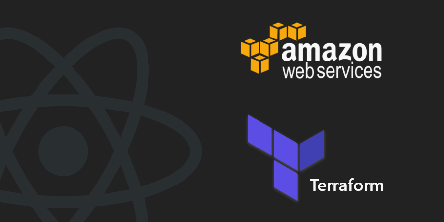
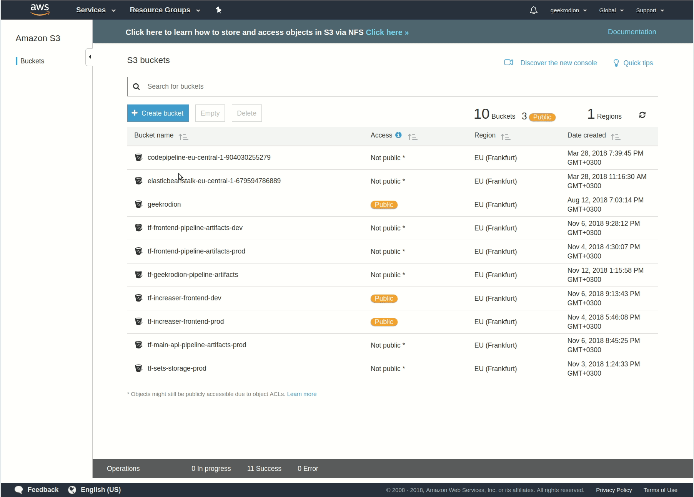

In the [previous part](/blog/aws-website/hosting), we have done all required to deploy the static website on *AWS*. But there was a problem — when you make changes, you need to type commands for deployment manually — it sucks. In this part, we will create *CodePipeline* that will update our website each time we make a commit in the specific branch.

## Step by Step

* Setup remote storage for *Terraform* state.

* Create and deploy a CI container to *ECR*.

* Make the CI pipeline with *CodePipeline* and *CodeBuild*.

* Add *buildspec.yaml* in the root of the repository.

## Remote state

In the previous part, we kept the state in the repository. Now our *Terraform* state will keep our *AWS* credentials. Because of this, we will start with creating an *S3* bucket for *Terraform* state. Then we can move the state from the repository to the bucket.



To let *Terraform* know about the remote state we will add this part in *main.tf*:

```hcl:title=main.tf
...
terraform {
  backend "s3" {
    bucket = "infrastructure-remote-state"
    key    = "geekrodion/frontend.tfstate"
    region = "eu-central-1"
  }
}
...
```

Now, we can type:

```shell{ promptUser: geekrodion }
terraform init
```

## CI/CD container

If we need a container, we should create *Dockerfile* first.

```Dockerfile:title=Dockerfile
FROM node:latest

RUN apt-get update \
  && apt-get install -y python-dev \
  && curl -O https://bootstrap.pypa.io/get-pip.py \
  && python get-pip.py \
  && pip install awscli
```

In my case, to build website *nodeJS* needed so we will use node as a base image. Also, we will install additional libraries to run *AWS* commands inside of the container.

We will use *ECR* as a container registry. So let’s create a repository, by adding resources to the existing *Terraform* file.

```hcl:title=main.tf
resource "aws_ecr_repository" "ci" {
  name = "tf-ci"
}

resource "aws_ecr_repository_policy" "ci-policy" {
  repository = "${aws_ecr_repository.ci.name}"

  policy = <<EOF
{
  "Version": "2008-10-17",
  "Statement": [
    {
      "Sid": "everybody",
      "Effect": "Allow",
      "Principal": "*",
      "Action": [
        "ecr:*"
      ]
    }
  ]
}
EOF
}
```

After running *terraform apply*, time to push the container to the repository. There is a script for this.

```shell:title=push_ci_container.sh
#!/bin/bash

REPOSITORY_URL=${AWS_ACCOUNT_ID}.dkr.ecr.${AWS_REGION}.amazonaws.com/tf-ci

eval $(aws ecr get-login --no-include-email --region $AWS_REGION)

docker build -t $REPOSITORY_URL:$1 .
docker push $REPOSITORY_URL:$1
```

Before running script, be sure you set all required variables, and you have docker on your machine.

```shell{ promptUser: geekrodion }
. ./push_ci_container.sh geekrodion
```

The name of the container will be the parameter you pass to the script:)

## CodePipeline

Now it is the time to create some real infrastructure:) First let’s specify all required environment variables.

To go along, you need to set these variables:

```shell{ promptUser: geekrodion }
export AWS_ACCESS_KEY_ID=<YOUR_AWS_ACCESS_KEY_ID>
export AWS_SECRET_ACCESS_KEY=<YOUR_AWS_SECRET_ACCESS_KEY>
export AWS_REGION=<YOUR_AWS_REGION>
export GITHUB_TOKEN=<YOUR_GITHUB_TOKEN>
```

It all clear about the first three variables. Since we keep our site on *GitHub*, we need to specify token. It quite simple to get, you can find steps [there](https://help.github.com/articles/creating-a-personal-access-token-for-the-command-line/).

Also, we need additional variables in *vars.tf* file. We will specify *AWS* credentials, the name of the CI container(this is a parameter we pass in *push_ci_container* script) and variables describing the repository.

```hcl:title=vars.tf
variable "domain" {
  default = "geekrodion.com"
}

// optional
variable "bucket_name" {
  default = "geekrodion"
}

// new variables
variable "region" { }

variable "access_key" { }

variable "secret_key" { }

variable "ci_container_name" {
  default = "geekrodion"
}

variable "repo_owner" {
  default = "RodionChachura"
}

variable "repo_name" {
  default = "geekrodion.com"
}

variable "branch" {
  default = "master"
}
```

There are quite a lot of new resources, and we will not list them here, but you can find them in the repository. And resources quite simple, the only part that I would like to dwell upon is *aws_codebuild_project*.

```hcl:title=main.tf
resource "aws_codebuild_project" "codebuild" {
  name         = "tf-codebuild-${var.bucket_name}"
  service_role = "${aws_iam_role.codebuild_role.arn}"

  artifacts {
    type = "CODEPIPELINE"
  }


  environment {
    compute_type = "BUILD_GENERAL1_SMALL"
    image        = "${data.aws_caller_identity.current.account_id}.dkr.ecr.${var.region}.amazonaws.com/tf-ci:${var.ci_container_name}"
    type         = "LINUX_CONTAINER"

    environment_variable {
      name = "AWS_ACCESS_KEY_ID"
      value = "${var.access_key}"
    }
    environment_variable {
      name = "AWS_SECRET_ACCESS_KEY"
      value = "${var.secret_key}"
    }
    environment_variable {
      name = "AWS_DEFAULT_REGION"
      value = "${var.region}"
    }
    environment_variable {
      name = "BUCKET"
      value = "${var.bucket_name}"
    }
    environment_variable {
      name = "DISTRIBUTION_ID"
      value = "${aws_cloudfront_distribution.frontend.id}"
    }
  }

  source {
    type      = "CODEPIPELINE"
  }
}
```

In this resource, we specify an image for building a website and butch of variables. As you may remember from the previous part, those are required to make the deployment.

## buildspec.yaml

This file specifies steps to execute in CI pipeline. In my case, I only need to install libraries and call the deployment script we made in the previous part.

```yaml:title=buildspec.yaml
version: 0.2
            
phases:
  install:
    commands:
      - cd front
      - npm install
  build:
    commands:
      - . ./management/deploy.sh
```

That’s it! Now you can go to aws.amazon.com, and watch *CodePipeline* building your website.