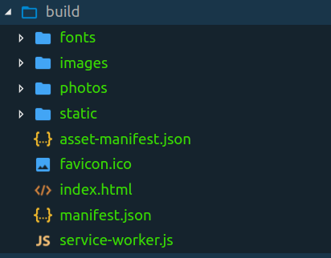
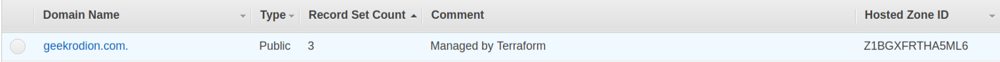
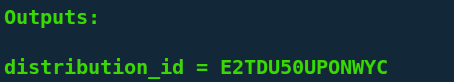

There are tons of easy ways to deploy SPA: *skotty*, *surge*, *GitHub pages*. But mostly all of them provide just a little abstraction around IAAS such as *AWS*. In this article, you will see how is easy to deploy the website on *AWS* with the help of *Terraform*.

## Goal

Our goal is to make your website accessible by a specific domain(in my case it is the website at [geekrodion.com](https://geekrodion.com)).

## Prepare Your Website

There are a lot of frameworks to make SPA. I decided to use [create-react-app](https://github.com/facebook/create-react-app) to bootstrap my website. After running* npm build* I have ready to deploy folder.



## Domain

When you have your website in place — it is time to buy a domain. It is not so expensive — I bought a nice geekrodion.com domain for 12$ at *AWS*. You can purchase a domain from other providers, though I suggest using *AWS* since it domain hosted zone and records will be easier to connect with other *AWS* services.

## Describing infrastructure as a code

Now you can create a directory and put there three files. The first one with variables(*vars.tf*), the second one with the code(*main.tf*) and the third one with outputs(*outputs.tf*).

### vars.tf

We need only two variables — the name of your domain on *AWS* and optional name of the *S3* bucket.

```hcl:title=vars.tf
variable "domain" {
  default = "geekrodion.com"
}

// optional
variable "bucket_name" {
  default = "geekrodion"
}
```

### main.tf

File with the code will describe *AWS* services to create:

1. route zone of your domain

1. Certificate for your domain so that your site will be accessible with secure https protocol

1. S3 bucket for your website files

1. *CloudFront* distribution so that your site will be served on CDN and will be fast to reach around the world

1. hosted zone records for *CloudFront* and validation that you own domain and can obtain the certificate from *AWS*.

```hcl:title=main.tf
provider "aws" {
}

provider "aws" {
  region = "us-east-1"
  alias = "virginia"
}

resource "aws_route53_zone" "route_zone" {
  name = "${var.domain}"
}

resource "aws_acm_certificate" "domain_virginia" {
  provider = "aws.virginia"
  domain_name = "${var.domain}"
  validation_method = "DNS"
}

resource "aws_route53_record" "cert_validation_virginia" {
  name = "${aws_acm_certificate.domain_virginia.domain_validation_options.0.resource_record_name}"
  type = "${aws_acm_certificate.domain_virginia.domain_validation_options.0.resource_record_type}"
  records = ["${aws_acm_certificate.domain_virginia.domain_validation_options.0.resource_record_value}"]
  zone_id = "${aws_route53_zone.route_zone.zone_id}"
  ttl = 60
}

resource "aws_acm_certificate_validation" "cert_validation_virginia" {
  provider = "aws.virginia"
  certificate_arn = "${aws_acm_certificate.domain_virginia.arn}"
  validation_record_fqdns = ["${aws_route53_record.cert_validation_virginia.fqdn}"]
}

resource "aws_s3_bucket" "frontend" {
  bucket = "${var.bucket_name}"
  acl = "public-read"
  policy = <<EOF
{
  "Id": "bucket_policy_site",
  "Version": "2012-10-17",
  "Statement": [
    {
      "Sid": "bucket_policy_site_main",
      "Action": [
        "s3:GetObject"
      ],
      "Effect": "Allow",
      "Resource": "arn:aws:s3:::${var.bucket_name}/*",
      "Principal": "*"
    }
  ]
}
EOF
  website {
    index_document = "index.html"
    error_document = "index.html"
  }
}

resource "aws_cloudfront_distribution" "frontend" {
  depends_on = ["aws_acm_certificate_validation.cert_validation_virginia"]
  origin {
    domain_name = "${aws_s3_bucket.frontend.bucket_domain_name}"
    origin_id   = "${var.bucket_name}"
  }

  enabled             = true
  is_ipv6_enabled     = true
  default_root_object = "index.html"

  aliases = ["${var.domain}"]

  default_cache_behavior {
    allowed_methods  = ["GET", "HEAD"]
    cached_methods   = ["GET", "HEAD"]
    target_origin_id = "${var.bucket_name}"

    forwarded_values {
      query_string = false

      cookies {
        forward = "none"
      }
    }
    compress = true
    viewer_protocol_policy = "redirect-to-https"
  }

  viewer_certificate {
    acm_certificate_arn = "${aws_acm_certificate.domain_virginia.arn}"
    ssl_support_method = "sni-only"
  }

  restrictions {
    geo_restriction {
      restriction_type = "none"
    }
  }
}

resource "aws_route53_record" "frontend_record" {
  zone_id = "${aws_route53_zone.route_zone.zone_id}"
  name    = ""
  type    = "A"

  alias {
    name = "${aws_cloudfront_distribution.frontend.domain_name}"
    zone_id = "${aws_cloudfront_distribution.frontend.hosted_zone_id}"
    evaluate_target_health = false
  }
}
```

### outputs.tf

After the creation of infrastructure, we need only one variable to know — distribution_id. This variable will be used in the deployment script.

```hcl:title=outputs.tf
output "distribution_id" {
  value = "${aws_cloudfront_distribution.frontend.id}"
}
```

## Creating infrastructure

As you can see, there are no credentials in terraform code. It is because we will specify them in environment variables.

```shell{ promptUser: geekrodion }
export AWS_ACCESS_KEY_ID=<YOUR_AWS_ACCESS_KEY_ID>
export AWS_DEFAULT_REGION=<YOUR_AWS_DEFAULT_REGION>
export AWS_SECRET_ACCESS_KEY=<YOUR_AWS_SECRET_ACCESS_KEY>
```

Next, we want to init our terraforms and import hosted zone. Since when you bought your domain hosted zone was created by *AWS*. Therefore you should go to the *AWS* page with hosted zones and get *hosted_zone_id*.



Now, you ready to create infrastructure!

```shell{ promptUser: geekrodion }
terraform init
terraform import aws_route53_zone.route_zone <YOUR_ROUTE_ZONE_ID>
terraform apply
```

## Deployment

When the last command executed — you will see in terminal one output variable — *distribution_id*. This variable will be used when you want to update your website.



Deployment script is simple.

```shell:title=deploy.sh
npm run build

aws s3 cp build s3://$BUCKET_NAME --recursive
aws cloudfront create-invalidation --distribution-id $DISTRIBUTION_ID --paths "/*"
```

You only need to specify two variables for deployment — the name of the *S3* bucket(look at *vars.tf*) and distribution id(look at terminal output).

In this article, we learn how to deploy SPA to AWS with the help of Terraform.
