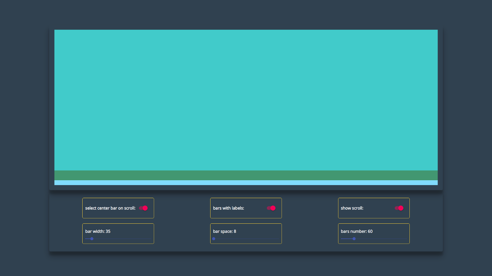

In this post, we are going to make a React component that will be available as an NPM module so that we could use it in different projects. We will cover a lot of concepts here, and you find this story useful if you think about creating a chart component or build a library.

## Planning Component

First, we are going to bootstrap the project and create the specification for our library. Then we will implement the demo page that will show the functionality of our component and a function for test data generation. Ather that we can start the development of the bar chart. First, we will create a layout of the component. And then we will add bars, labels, and custom scroll. Finally, we will deploy a demo page and publish an NPM module.

## Project Setup

[Create-react-app](https://github.com/facebook/create-react-app) is the best tool for bootstrapping the front-end project, and I always use it for new apps. However, since we want to make an NPM module, we need a different starter. After some research, I found a tool named [create-react-library](https://github.com/DimiMikadze/create-react-library) that using create-react-app to run demo and rollup to build the library.

To start a new project, we will type these commands:
```shell{promptUser: geekrodion}
npm install -g create-react-library
create-react-library increaser-Timer
cd increaser-Timer
```

After initializing the project, we will install the only extra library we will need.

```shell{promptUser: geekrodion}
npm install --save styled-components
```

And add additional fields in the `rollup.config.js` file.

```js
    ...
    external: ['styled-components'],
    globals: { 'styled-components': 'styled' }
}

```

First, we will run rollup to watch our `src` module and automatically recompile it into `dist` whenever we make changes.

```shell{promptUser: geekrodion}
npm start
```

The second part will be running the example create-react-app that’s linked to the local version of our module. In another tab:

```shell{promptUser: geekrodion}
cd example
npm start
```

## Specification

You may notice that when you are using third-party React components, your code editor autofill the names of parameters, and you can go to the definition of the component to see properties and their types. It happens because libraries export a file with declarations. Let’s also create one.

`index.d.ts`
```js
import React from 'react'

export interface Theme {
  mainColor: string;
  scrollerBackgroundColor: string;
  labelFontSize: number;
}

export interface Item {
  value: number;
  color: string;
}

export interface Bar {
  label?: string;
  items: Item[]
}

export interface BarChartProps {
  bars: Bar[];
  barWidth: number;
  barSpace: number;
  centerBarIndex: number;
  onBarSelect: (centerBarIndex: number) => void;
  selectCenterBarOnScroll: boolean;
  showScroll: boolean;
  theme: Theme;
}

export declare class BarChart extends React.Component<BarChartProps, any> {}
```

To make this file be published on NPM together with the code, we need to edit `package.json`.

```json
{
    ...
    "typings": "./index.d.ts",
    "files": ["dist", "index.d.ts"],
    ...
}
```

With this file in place, when we are using the library, we are going to see hint like this.


## Demo Page


When we are using create-react-library, we have two projects. One with demo page that we are using for development of our component and other is library itself. First, we are going to develop a demo page with all parameters available to change in UI, so that we can comfortably develop and test our library.

Demo page will have a container for chart and panel where we can change parameters of the library. To change them we need two components: `Switch` for boolean parameters, and Slider for parameters such as bar width and space. And since they only required for demo page, we will install [material-ui](https://material-ui.com/) in the demo project.

```shell{promptUser: geekrodion}
cd example
npm install --save @material-ui/core @material-ui/lib
```

```js
import React from 'react'
import styled from 'styled-components'
import { Switch } from '@material-ui/core'
import { Slider } from '@material-ui/lab'

import { BarChart } from 'increaser-charts'
import { getMockBars } from './mock';

const Page = styled.div`
  min-height: 100vh;
  width: 100%;
  background-color: #2c3e50;
  display: flex;
  flex-direction: column;
  justify-content: center;
  align-items: center;
`

const Container = styled.div`
  width: 80%;
  padding: 20px;
  box-shadow: 0 19px 38px rgba(0, 0, 0, 0.3), 0 15px 12px rgba(0, 0, 0, 0.22);
  border-radius: 5px;
  display: flex;
`

const Wrapper = styled(Container)`
  height: 60vh;
  align-items: center;
  justify-content: center;
  @media (max-width: 640px) {
    width: 100%;
    box-shadow: none
  }
`

const Panel = styled(Container)`
  flex-direction: column;
`

const PanelRow = styled.div`
  width: 100%;
  display: flex;
  flex-direction: row;
  flex-wrap: wrap;
  justify-content: space-around;
`

const ParamContainer = styled.div`
  padding: 10px;
  margin: 10px;
  display: flex;
  border-radius: 5px;
  border: 1px solid gold;
  height: 80px;
  width: 280px;
`

const BoolParam = styled(ParamContainer)`
  flex-direction: row;
  align-items: center;
  justify-content: space-between;
`

const RangeParam = styled(ParamContainer)`
  flex-direction: column;
  justify-content: space-around;
`

const Param = styled.h4`
  color: white;
`

export default class App extends React.Component {
  constructor(props) {
    super(props)
    const barsNumber = 60
    const barsWithLabels = true
    this.state = {
      centerBarIndex: undefined,
      barWidth: 35,
      barSpace: 8,
      barsNumber,
      barsWithLabels,
      bars: getMockBars(barsNumber, barsWithLabels),
      showScroller: true,
      selectCenterBarOnScroll: true
    }
  }

  render() {
    const {
      bars,
      barWidth,
      barSpace,
      centerBarIndex,
      selectCenterBarOnScroll,
      showScroller,
      barsWithLabels,
      barsNumber
    } = this.state
    return (
      <Page>
        <Wrapper>
          <BarChart
            bars={bars}
            barWidth={barWidth}
            barSpace={barSpace}
            centerBarIndex={centerBarIndex}
            onBarSelect={(centerBarIndex) => this.setState({ centerBarIndex })}
            selectCenterBarOnScroll={selectCenterBarOnScroll}
            showScroller={showScroller}
          />
        </Wrapper>
        <Panel>
          <PanelRow>
            <BoolParam>
              <Param>select center bar on scroll: </Param>
              <Switch
                checked={selectCenterBarOnScroll}
                onChange={() => this.setState({ selectCenterBarOnScroll: !selectCenterBarOnScroll })}
              />
            </BoolParam>
            <BoolParam>
              <Param>bars with labels: </Param>
              <Switch
                checked={barsWithLabels}
                onChange={() => this.toggleBarsWithLabels()}
              />
            </BoolParam>
            <BoolParam>
              <Param>show scroll: </Param>
              <Switch
                checked={showScroller}
                onChange={() => this.setState({ showScroller: !showScroller })}
              />
            </BoolParam>
          </PanelRow>
          <PanelRow>
            <RangeParam>
              <Param>bar width: {barWidth}</Param>
              <Slider
                value={barWidth}
                min={5}
                max={300}
                step={1}
                onChange={(_, barWidth) => this.setState({ barWidth })}
              />
            </RangeParam>
            <RangeParam>
              <Param>bar space: {barSpace}</Param>
              <Slider
                value={barSpace}
                min={5}
                max={300}
                step={1}
                onChange={(_, barSpace) => this.setState({ barSpace })}
              />
            </RangeParam>
            <RangeParam>
              <Param>bars number: {barsNumber}</Param>
              <Slider
                value={barsNumber}
                min={0}
                max={300}
                step={1}
                onChange={(_, barsNumber) => this.changeBarNumber(barsNumber)}
              />
            </RangeParam>
          </PanelRow>
        </Panel>
      </Page>
    )
  }

  toggleBarsWithLabels = () => {
    const { barsNumber, barsWithLabels } = this.state
    const newBarsWithLabels = !barsWithLabels
    this.setState({
      barsWithLabels: newBarsWithLabels,
      bars: getMockBars(barsNumber, newBarsWithLabels)
    })
  }

  changeBarNumber = (barsNumber) => {
    const { barsWithLabels } = this.state
    const bars = getMockBars(barsNumber, barsWithLabels)
    this.setState({ bars, barsNumber })
  }
}
```

## Generating Mock Data

In the constructor of the demo page and on change of some parameters we will create mock data. The function will receive the number of bars we want to generate and should they include a label or not. To define the height of the bar we will use a function, that will return [normally distributed](https://medium.com/@geekrodion/16-normal-distribution-816ca2e9ce3d) random number.

```js
const MIN_TOTAL_HEIGHT = 0
const MAX_TOTAL_HEIGHT = 10
const MIN_SUBBAR_HEIGHT = 1
const COLORS = [
  '#5f27cd',
  '#9b59b6',
  '#33d9b2',
  '#F9A825',
  '#EF6C00',
  '#27ae60',
  '#f368e0',
  '#00CC00',
  '#283593',
  '#e74c3c',
  '#FC427B',
]

const getGaussianRandomNumber = () => new Array(6)
  .fill(0)
  .map(() => Math.random())
  .reduce((acc, n) => acc + n, 0) / 6

const getMockBarItems = () => {
  const randNumber = getGaussianRandomNumber()
  const height = MIN_TOTAL_HEIGHT + randNumber * (MAX_TOTAL_HEIGHT - MIN_TOTAL_HEIGHT)

  const getSubbars = (heightLeft, freeColors, result) => {
    if (heightLeft === 0) return result
    if (freeColors.lenght < 2) {
      const subbar = {
        value: heightLeft,
        color: freeColors[0]
      }
      return [ ...result, subbar ]
    }

    const getSubbaHeight = () => {
      const randomHeight = Math.random() * heightLeft
      const height = randomHeight < MIN_SUBBAR_HEIGHT ? randomHeight + MIN_SUBBAR_HEIGHT : randomHeight
      const totalHeightAfter = heightLeft - height

      if (totalHeightAfter < MIN_SUBBAR_HEIGHT) return heightLeft

      return height
    }
    const value = getSubbaHeight()
    const [ color, ...newFreeColors ] = freeColors
    const subbar = {
      value,
      color
    }

    return getSubbars(heightLeft - value, newFreeColors, [ ...result, subbar ])
  }

  return getSubbars(height, COLORS, [])
}

export const getMockBars = (number, withLabels = true) => {
  const bars = new Array(number)
    .fill(0)
    .map((_, index) => {
      const items = getMockBarItems()
      if (!withLabels) return { items }

      const getLabel = () => {
        if (index + 1 === number) return 'Today'
        const today = new Date()
        today.setDate(today.getDate() - (number - index - 1))
        return `${today.getMonth() + 1}/${today.getDate()}`
      }

      return {
        items,
        label: getLabel()
      }
    })

  return bars
}
```

## Bar Chart Layout Component



We will start development of `BarChart` by creating the basic layout of the component. Let’s start with index.js. At the root component, we are rendering DataContainer that contains `Bars` and `Labels` and `Scroller` container. Before rendering them, we need to take the width of the root container since this value required for `Bars`, `Labels`, and `Scroller`.

`index.js`
```js
render() {
  const { theme, showScroller, barWidth, barSpace, bars, centerBarIndex, onBarSelect } = this.props
  const { width, offset, oldOffset, height } = this.state

  const barTotalWidth = barWidth + barSpace
  const totalWidth = bars.length * barTotalWidth

  const getStartIndex = () => {
    const startIndex = Math.floor((totalWidth - width - oldOffset - (offset > oldOffset ? offset - oldOffset : 0)) / barTotalWidth)
    if (startIndex < 0) return 0

    return startIndex
  }

  const startIndex = getStartIndex()
  const Content = () => {
    if (!width) return null
    const dataConainerProps = { barTotalWidth, width, offset, oldOffset, totalWidth, startIndex }

    const Labels = () => {
      return (
        <LabelsContainer>

        </LabelsContainer>
      )
    }
    const lastIndex = Math.ceil((totalWidth + oldOffset + (offset < oldOffset ? oldOffset - offset : 0)) / barTotalWidth)
    const slicedBars = bars.slice(startIndex, lastIndex)
    const highest = bars.map(b => b.items).reduce((acc, bar) => {
      const height = sum(bar)
      return height > acc ? height : acc
    }, 0)

    const Bars = () => {
      if (!height) return null
      const barCommonProps = { startIndex, height, barWidth, barSpace, centerBarIndex, onBarSelect, highest}
      return slicedBars.map(({ items }, index) =>(
        <Bar
          {...barCommonProps}
          bar={items}
          index={index}
          key={index}
        />
      ))
    }

    return (
      <React.Fragment>
        <DataContainer {...dataConainerProps}>
          <BarsView ref={el => this.barsContainer = el}>
            <Bars/>
          </BarsView>
          <Labels/>
        </DataContainer>
        {showScroller && <Scroller/>}
      </React.Fragment>
    )
  }

  return (
    <ThemeProvider theme={{ ...DEFAULT_THEME, ...theme }}>
      <RootContainer ref={el => this.rootContainer = el }>
        <Content/>
      </RootContainer>
    </ThemeProvider>
  )
}

static getDerivedStateFromProps(nextProps, prevState) {
  const { width, offset, scrolling } = prevState
  if (!width) return null

  const { centerBarIndex, barWidth, barSpace, bars } = nextProps
  const bar = barWidth + barSpace
  const totalWidth = bars.length * bar + barSpace
  const getNewOffsets = () => {
    if (centerBarIndex !== undefined && !scrolling) {
      if (totalWidth < width) {
        return {
          oldOffset: 0,
          offset: 0
        }
      }
      const offsetToCenter = totalWidth - bar * centerBarIndex - (width + bar) / 2
      const getOffset = () => {
        if (offsetToCenter < 0) return 0
        if (offsetToCenter + width > totalWidth) return totalWidth - width
        return offsetToCenter
      }

      return {
        offset: getOffset(),
        oldOffset: offset
      }
    }
  }
  return {
    ...prevState,
    ...getNewOffsets(),
    totalWidth
  }
}
```

Bars and labels will be placed absolutely inside of `DataContainer`. The important point is that we render only part of data that will be visible to a user.

`data-container.js`
```js
import React from 'react'
import styled from 'styled-components'
import { animationStyle } from './styles';

const Wrapper = styled.div`
  width: 100%;
  height: 100%;
  position: relative;
  overflow: hidden;
`

const DataContainer = styled.div`
  height: 100%;
  position: absolute;
  display: flex;
  flex-direction: column;
  ${animationStyle}
`

export default ({
  barTotalWidth,
  width,
  offset,
  oldOffset,
  totalWidth,
  startIndex,
  children
}) => {
  const left = totalWidth < width ? (width - totalWidth) / 2 : width + oldOffset - totalWidth + startIndex * barTotalWidth
  const containerWidth = totalWidth - startIndex * barTotalWidth
  const animationOffset = offset - oldOffset
  const style = { left, width: containerWidth }

  return (
    <Wrapper>
      <DataContainer offset={animationOffset} style={style}>
        {children}
      </DataContainer>
    </Wrapper>
  )
```

Check [this commit](https://github.com/RodionChachura/increaser-charts/commit/a50aba22749aaa3b1af90f7df7502a138a8f5ab0) to see all changes.

## Bars Component


We will use SVG to render bars. This way each bar will be represented as a rect element with an appropriate color.

`bar.js`
```js
import React from 'react'
import { sum } from '../../utils'

export default ({
  bar,
  index,
  height,
  barWidth,
  barSpace,
  centerBarIndex,
  onBarSelect,
  highest,
  startIndex
}) => {
  const barTotalWidth = barWidth + barSpace
  const realIndex = index + startIndex
  const x = barTotalWidth * index + barSpace

  const valueToHeight = value => (value * height) / highest

  const Subbar = ({ value, color, valueBefore }) => {
    const rectHeight = valueToHeight(value)
    const y = height - valueToHeight(valueBefore) - rectHeight

    return (
      <rect
        opacity={realIndex === centerBarIndex ? 1 : 0.6}
        x={x}
        y={y}
        width={barWidth}
        height={height}
        fill={color}
      />
    )
  }

  const Selectable = () => (
    <rect
      onTouchEnd={e => {
        onBarSelect(realIndex)
        e.preventDefault()
      }}
      onClick={() => onBarSelect(realIndex)}
      cursor={'pointer'}
      x={x - barSpace / 2}
      width={barTotalWidth}
      y={0}
      height={height}
      fill={'transparent'}
    />
  )

  return (
    <g>
      {bar.map(({ value, color }, index) => {
        const valueBefore = sum(bar.slice(0, index))
        const props = { value, color, valueBefore, key: index }

        return <Subbar {...props}/>
      })}
      {onBarSelect && <Selectable/>}
    </g>
  )
} 
```

Now, having `Bar` component, we can update `index.js`. We will add code to render bars and to calculate new offset that used for animation we will add `getDerivedStateFromProps` method.

Check [this commit](https://github.com/RodionChachura/increaser-charts/commit/5bfba8145e3559d4720243e83dae2a7c4b60406a) to see all changes.

## Labels Component

Before rendering labels, we will check that bars have at least one label. If there are some labels, we will place them each one right under the appropriate bar. If we are selecting some bar, we will change its styles appropriately.

Check [this commit](https://github.com/RodionChachura/increaser-charts/commit/61d2d69f1d2d3f217ec9faf2fe7a9d2a78c6adff) to see all changes.

## Scroller Component

The last feature we will have in the library is `Scroller`. This element will show which part of the bars currently viewed. Also, we can use it to scroll bars. When user `mouseDown` on scroll we will call appropriate action and then we will watch for document mouseUp event to tell root component about changes on `x`. Then in root component, we will apply logic to change offset and therefore change the position of both scroll and bars.

```js
import React from 'react'
import styled from 'styled-components'
import { animationStyle } from './styles';

const Container = styled.div`
  position: relative;
  height: 20px;
  width: 100%;
  display: flex;
  align-items: center;
`

const Line = styled.div`
  position: absolute;
  width: 100%;
  height: 6px;
  background-color: ${props => props.theme.scrollerBackgroundColor};
`

const Position = styled.div`
  cursor: pointer;
  position: absolute;
  height: 6px;
  background-color: ${props => props.theme.mainColor};
  border-radius: 3px;
  &:hover {
    height: 8px;
    border-radius: 4px;
  }
  ${animationStyle}
`

export default class Scroller extends React.Component {
  render() {
    const { totalWidth, offset, oldOffset, width } = this.props
    const getMargin = offset => ((totalWidth - (offset + width)) /totalWidth) * 100
    const periodMargin = getMargin(oldOffset)
    if (periodMargin < 0) return null

    const periodWidth = (width * 100) / totalWidth
    const animationOffset = getMargin(offset) - periodMargin
    const positionStyle = { width: `${periodWidth}%`, marginLeft: `${periodMargin}%` }

    return (
      <Container>
        <Line/>
        <Position
          offset={(animationOffset * width) / 100}
          style={positionStyle}
          onTouchStart={e => e.preventDefault()}
          onDragStart={e => e.preventDefault()}
          onMouseDown={this.onMouseDown}
        />
      </Container>
    )
  }

  shouldComponentUpdate(nextProps) {
    return nextProps !== this.props
  }

  componentDidMount() {
    document.addEventListener('mouseup', this.onMouseUp)
    document.addEventListener('mousemove', this.onMouseMove)
  }

  componentWillUnmount() {
    document.removeEventListener('mouseup', this.onMouseUp)
    document.removeEventListener('mousemove', this.onMouseMove)
  }

  onMouseDown = () => {
    this.props.onDragStart()
  }

  onMouseMove = (e) => {
    const { scrolling, onDrag } = this.props
    if (scrolling && e.movementX) {
      onDrag(e.movementX)
    }
  }

  onMouseUp = () => {
    const { scrolling, onDragEnd } = this.props
    if (scrolling) {
      onDragEnd()
    }
  }
}
```

Final `index.js`:

```js
render() {
  const { theme, showScroller, barWidth, barSpace, bars, centerBarIndex, onBarSelect } = this.props
  const { width, offset, oldOffset, height, scrolling, totalWidth } = this.state

  const barTotalWidth = barWidth + barSpace

  const getStartIndex = () => {
    const startIndex = Math.floor((totalWidth - width - oldOffset - (offset > oldOffset ? offset - oldOffset : 0)) / barTotalWidth)
    if (startIndex < 0) return 0

    return startIndex
  }

  const startIndex = getStartIndex()
  const Content = () => {
    if (!width) return null
    const dataConainerProps = { barTotalWidth, width, offset, oldOffset, totalWidth, startIndex }

    const Labels = () => {
      const labels = slicedBars.map(b => b.label)
      if (labels.every(l => !l)) return null

      return (
        <LabelsContainer>
          {labels.map((label, index) => (
            <Label
              width={barWidth}
              space={barSpace}
              selected={centerBarIndex === index + startIndex}
              key={index + startIndex}
            >
              {label}
            </Label>
          ))}
        </LabelsContainer>
      )
    }
    const lastIndex = Math.ceil((totalWidth + oldOffset + (offset < oldOffset ? oldOffset - offset : 0)) / barTotalWidth)
    const slicedBars = bars.slice(startIndex, lastIndex)
    const highest = bars.map(b => b.items).reduce((acc, bar) => {
      const height = sum(bar)
      return height > acc ? height : acc
    }, 0)

    const Bars = () => {
      if (!height) return null
      const barCommonProps = { startIndex, height, barWidth, barSpace, centerBarIndex, onBarSelect, highest}
      return slicedBars.map(({ items }, index) =>(
        <Bar
          {...barCommonProps}
          bar={items}
          index={index}
          key={index}
        />
      ))
    }
    const scrollerProps = {
      totalWidth,
      width,
      offset,
      oldOffset,
      scrolling,
      onDragStart: () => this.setState({ scrolling: true, oldOffset: this.state.offset }),
      onDrag: this.onScroll,
      onDragEnd: () => this.setState({ scrolling: false })
    }
    return (
      <React.Fragment>
        <DataContainer {...dataConainerProps}>
          <BarsView ref={el => this.barsContainer = el}>
            <Bars/>
          </BarsView>
          {bars.length > 0 && <Line/>}
          <Labels/>
        </DataContainer>
        {showScroller && <Scroller {...scrollerProps} />}
      </React.Fragment>
    )
  }

  return (
    <ThemeProvider theme={{ ...DEFAULT_THEME, ...theme }}>
      <RootContainer ref={el => this.rootContainer = el }>
        <Content/>
      </RootContainer>
    </ThemeProvider>
  )
}

onScroll = (movementX) => {
    const { width, offset, totalWidth } = this.state
    const { barWidth, barSpace, bars, selectCenterBarOnScroll, centerBarIndex, onBarSelect } = this.props
    const additionalOffset = (totalWidth / width) * movementX
    const getOffset = () => {
      const newOffset = offset - additionalOffset
      if (newOffset < 0) return 0
      if (newOffset + width > totalWidth) return totalWidth - width
      return newOffset
    }
    const newOffset = getOffset(0)
    this.setState({ offset: newOffset, oldOffset: newOffset })
    if (selectCenterBarOnScroll) {
      const center = totalWidth - newOffset - width / 2
      const newCenterBarIndex = bars.findIndex((_, index) => (index * (barWidth + barSpace)) >= center) - 1
      if (centerBarIndex !== newCenterBarIndex) {
        onBarSelect(newCenterBarIndex)
      }
    }
  }
```

Check [this commit](https://github.com/RodionChachura/increaser-charts/commit/3cbb43c95b7ef9252b096e2fe35dada5d7beaba1) to see all changes.

## Conclusion

Now we can deploy our library to NPM and demo to GitHub pages by typing these commands:

```shell{promptUser: geekrodion}
npm publish --access-public
npm run deploy
```

I already integrated this chart in my app — [increaser.org](https://increaser.org). Check it out!