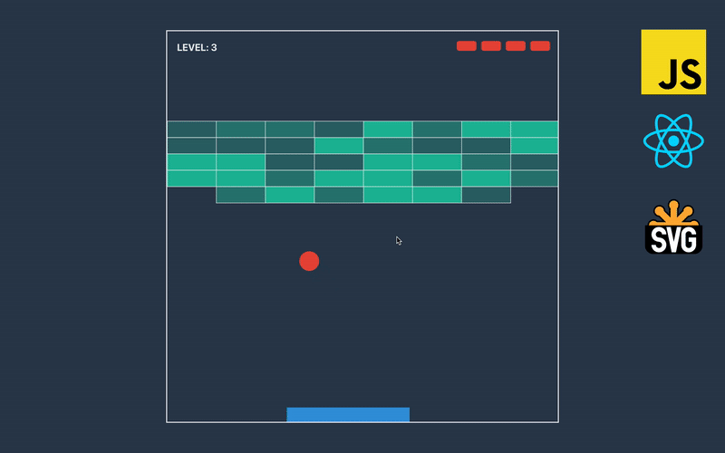
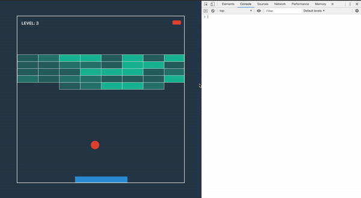

In this course, we are building a Breakout Game with JavaScript, React, and SVG without libraries, just plain modern JS and React. We are utilizing functional, immutable programming, and along the way, we learn React Hooks, SVG rendering, and basics of game development.

## Scene

We will work only in with one file today — scene.js since we already finished developing all other parts of the game. First, let’s update imports and declare a few variables at the top.

```js:title=src/components/scene.js
import React, { useEffect, useReducer } from 'react'

// ...
import { MOVEMENT, getNewGameState, getGameStateFromLevel } from '../game/core'
import { registerListener } from '../utils'

// ...
const MOVEMENT_KEYS = {
  LEFT: [65, 37],
  RIGHT: [68, 39]
}

const STOP_KEY = 32

const UPDATE_EVERY = 1000 / 60
```

8: // We have an object that maps movements to key codes on the keyboard.

13: // If the player will press the space key, we will pause or resume the game.

15: // We will update the state of the game and rerender 60 times per second.

There are not that many actions, we only need to handle situations when the size of container changes(to render the game properly); when player presses or releases keys on the keyboard; every few milliseconds will be called tick action, and reducer will return a new state of the game.

```js:title=src/components/scene.js
// ...
const ACTION = {
  CONTAINER_SIZE_CHANGE: 'CONTAINER_SIZE_CHANGE',
  KEY_DOWN: 'KEY_DOWN',
  KEY_UP: 'KEY_UP',
  TICK: 'TICK'
}
```

To make a reducer cleaner, we replace the switch-case with a more functional approach by creating an object with a handler for each action. The handler is a function that receives old state and payload.

```js:title=src/components/scene.js
// ...
const HANDLER = {
  [ACTION.CONTAINER_SIZE_CHANGE]: (state, containerSize) => ({
    ...state,
    containerSize,
    ...getProjectors(containerSize, state.game.size)
  }),
  [ACTION.KEY_DOWN]: (state, key) => {
    if (MOVEMENT_KEYS.LEFT.includes(key)) {
      return { ...state, movement: MOVEMENT.LEFT }
    } else if (MOVEMENT_KEYS.RIGHT.includes(key)) {
      return { ...state, movement: MOVEMENT.RIGHT }
    }
    return state
  },
  [ACTION.KEY_UP]: (state, key) => {
    const newState = { ...state, movement: undefined }
    if (key === STOP_KEY) {
      if (state.stopTime) {
        return { ...newState, stopTime: undefined, time: state.time + Date.now() - state.stopTime}
      } else {
        return { ...newState, stopTime: Date.now() }
      }
    }
    return newState
  },
  [ACTION.TICK]: state => {
    if (state.stopTime) return state

    const time = Date.now()
    const newGame = getNewGameState(state.game, state.movement, time - state.time)
    const newState = { ...state, time }
    if (newGame.lives < 1) {
      return { ...newState, game: getGameStateFromLevel(LEVELS[state.level]) }
    } else if (newGame.blocks.length < 1) {
      const level = state.level === LEVELS.length ? state.level : state.level + 1
      localStorage.setItem('level', level)
      const game = getGameStateFromLevel(LEVELS[state.level])
      return {
        ...newState,
        level,
        game,
        ...getProjectors(state.containerSize, game.size)
      }
    }
    return { ...newState, game: newGame }
  }
}
```

*3: // *When containers size changes, we update the state with new projectors.

*8: // *When the player presses the key, we check if it is left or right move.

*16: //* On key up, we check if a player wants to pause/resume the game and make appropriate operations with time.

*27: //* If the game is on pause, we return the old state. Otherwise, we calculate how much time left from the last update and call a function from the previous part.

In reducer, we take a handler for a received action type. If we implemented the handler for this action, we return a result of the call to the handler.

```js:title=src/components/scene.js
// ...
const reducer = (state, { type, payload }) => {
  const handler = HANDLER[type]
  if (!handler) return state
  return handler(state, payload)
}
```

Next, let’s work on the component. To simplify the dispatch call, we can write a small helper function.

```js:title=src/components/scene.js
// ...
export default (containerSize) => {
  const [state, dispatch] = useReducer(reducer, containerSize, getInitialState)
  const act = (type, payload) => dispatch({ type, payload })
  // ...
}
```

We want to update projectors every time the size of the container changes. To do this, we utilize *useEffect* hook.

```js:title=src/components/scene.js
// ...
export default (containerSize) => {
  // ...
  useEffect(() => act(ACTION.CONTAINER_SIZE_CHANGE, containerSize), [containerSize])
  // ...
}
```

After adding this hook, we can see that the game looks good regardless of the size of the screen.



On component mount, we want to subscribe to keys presses and spin up the game timer. To remove all these handlers on unmount, we return a function that will do unregistering.

```js:title=src/components/scene.js
// ...
export default (containerSize) => {
  // ...
  useEffect(() => {
    const onKeyDown = ({ which }) => act(ACTION.KEY_DOWN, which)
    const onKeyUp = ({ which }) => act(ACTION.KEY_UP, which)
    const tick = () => act(ACTION.TICK)

    const timerId = setInterval(tick, UPDATE_EVERY)
    const unregisterKeydown = registerListener('keydown', onKeyDown)
    const unregisterKeyup = registerListener('keyup', onKeyUp)
    return () => {
      clearInterval(timerId)
      unregisterKeydown()
      unregisterKeyup()
    }
  }, [])
  // ...
}
```


Congratulations! We finished the development of the game.
