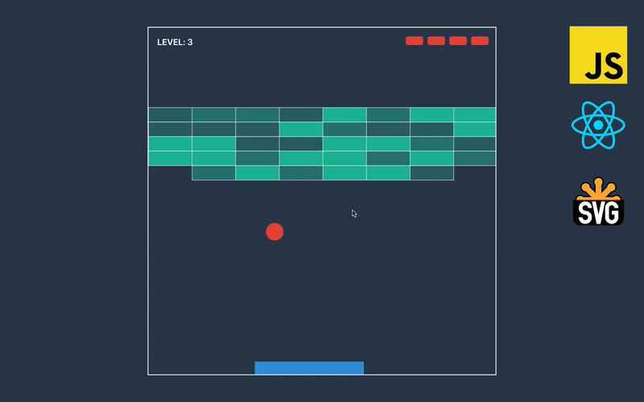
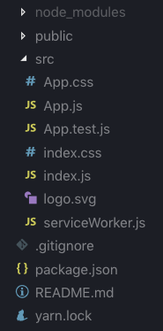
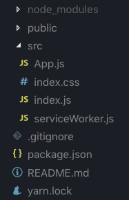
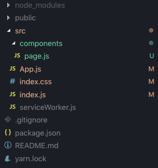
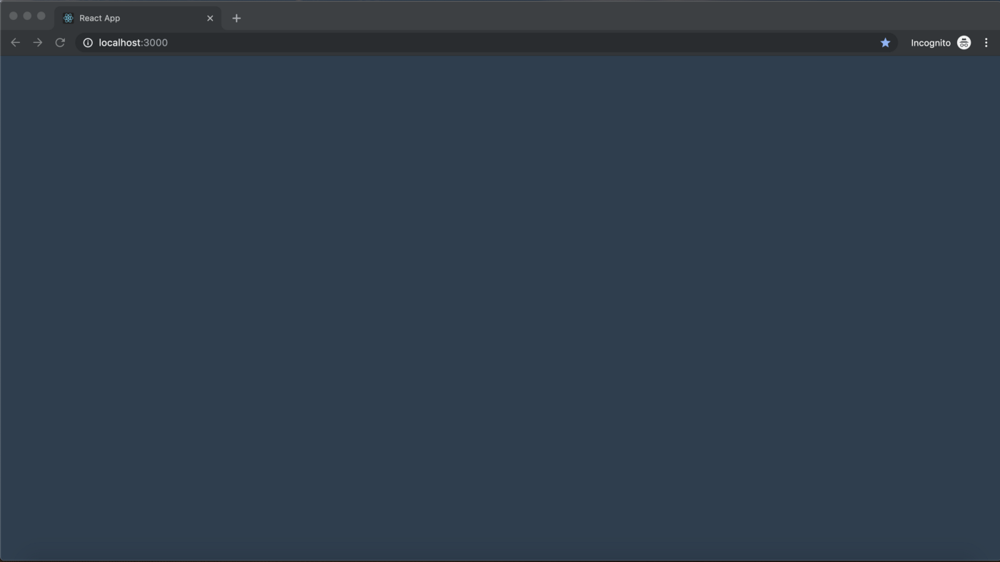
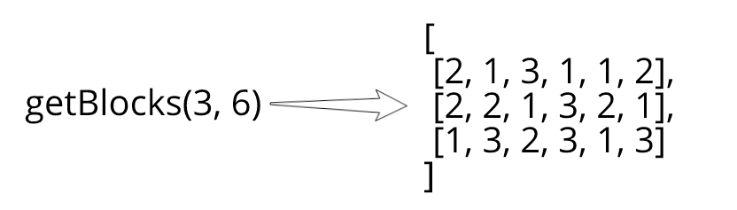
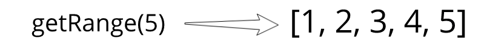

In this course, we will build a Breakout Game with JavaScript, React, and SVG. We will bootstrap game with create-react-app and won’t use any additional libraries, just plain modern JS and React. We will utilize functional, immutable programming, and along the way, we will learn React Hooks, SVG rendering, and basics of game development.

## Create React App

When it comes to bootstrapping React project, the best option is [create-react-app](https://github.com/facebook/create-react-app) starter maintained by Facebook. If you don’t have it locally install it with this command:

```shell{ promptUser: geekrodion }
$ npm install -g create-react-app
```

With this starter in place, we only need to type one command to have ready-to-run React project:

```shell{ promptUser: geekrodion }
$ create-react-app breakout-game
```

After opening the created project in your code editor, you should see similar to this structure:



After removing *App.css*, *App.test.js*, and *logo.svg*, we have this structure:



Let’s start with editing file with styles by declaring global styles and setting the height to 100% for all existing containers, so that we can make a page that we will create a little bit later full-size. For most projects, I would recommend using *styled-components*, but here we decided to go without additional libraries, and we won’t do many styling here anyway.

```css:title=src/index.css
html {
  height: 100%;
}

* {
  box-sizing: border-box;
  outline: 0;
  margin: 0;
}

body {
  height: 100%;
  margin: 0;
  font-family: -apple-system, BlinkMacSystemFont, "Segoe UI", "Roboto", "Oxygen",
    "Ubuntu", "Cantarell", "Fira Sans", "Droid Sans", "Helvetica Neue",
    sans-serif;
  -webkit-font-smoothing: antialiased;
  -moz-osx-font-smoothing: grayscale;
}

#root {
  height: 100%;
}
```

We will keep all the components in one directory, so let’s create it and put a file named *page.js* that will contain the root component there.



For now, let’s make page export only an empty *div* element with a specified class name.

```js:title=src/components/page.js
import React from 'react'

export default () => {
  return (
    <div className='page' />
  )
}
```

Since we specified a class name for the page, let’s come back to styles and add one more.

```js:title=src/index.css
.page {
  width: 100%;
  height: 100%;
  background: #2c3e50;
  padding: 60px;
}
```

With ready to render the root component, we can go to *App.js* and use this file to export it. At this point, there is no use in *App.js* since it doesn’t bring any value, yet in most cases, we would add things like middlewares or wrappers here.

```js:title=src/App.js
import Page from './components/page'

export default Page
```

If we run the app, we should see a dark page. If this is the case, we are in the right direction.



## Levels

Our game will have a few levels. With every new level, we will increase the difficulty of the game by tweaking a few parameters. These parameters are:

1. **Lives** — how many times a player can miss the ball on the level.

1. **Paddle width** that will become smaller with each level.

1. **Speed** — determine how fast paddle and ball are moving.

1. In **blocks**, we keep lists of densities, that determine how many time ball should hit the block to destroy it.

Everything clear with first parameters, set some numbers, and we are ready to go, but how we specify blocks?

To create a list of blocks, we need a function that receives a number of rows and columns as parameters and returns an array of arrays of random numbers in the range from 1 to 3.



But first, we need to have a function that will generate a range of numbers over each we can use the *map*. That helps to not use any *for* loops in this game.



This function can be used all across the game so let’s create file *utils.js* in the root of *src* folder, and put function shown below in it.

```js:title=src/utils.js
export const getRange = length => [...Array(length).keys()]
```

Next, let’s create a folder named game and put inside of its file with the name *levels.js*. Here we import function that generates a range from utils and using it in the function that returns blocks for level.

```js:title=src/game/levels.js
import { getRange } from '../utils'

export const BLOCK_MAX_DENSITY = 3

const getRandomBlock = () => Math.floor(Math.random() * BLOCK_MAX_DENSITY)

const getBlocks = (rows, columns) =>
  getRange(rows).map(() => getRange(columns).map(getRandomBlock))

export const LEVELS = [
  {
    lives: 5,
    paddleWidth: 3.5,
    speed: 1,
    blocks: getBlocks(3, 6)
  },
  {
    lives: 4,
    paddleWidth: 3,
    speed: 1.4,
    blocks: getBlocks(4, 7)
  },
  {
    lives: 3,
    paddleWidth: 2.5,
    speed: 1.8,
    blocks: getBlocks(5, 8)
  },
  {
    lives: 3,
    paddleWidth: 2,
    speed: 2.2,
    blocks: getBlocks(6, 9)
  },
]
```

In this part, we started the development of the game and made a list of objects describing levels.
