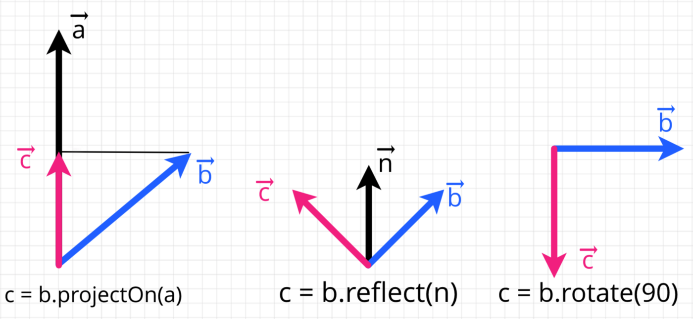
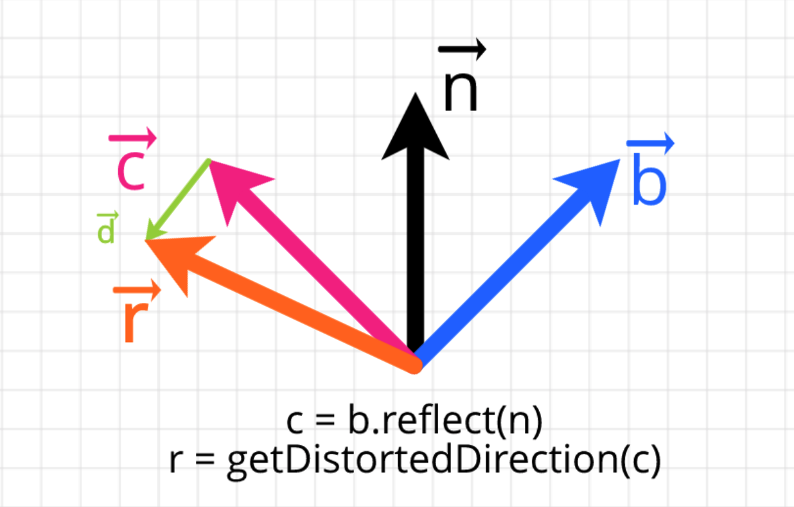
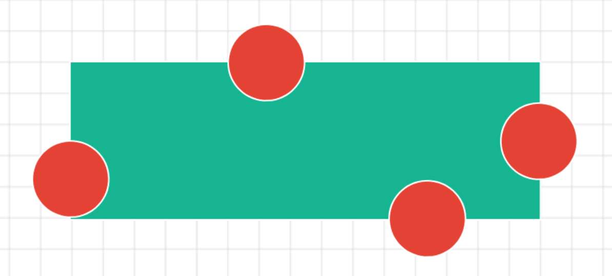
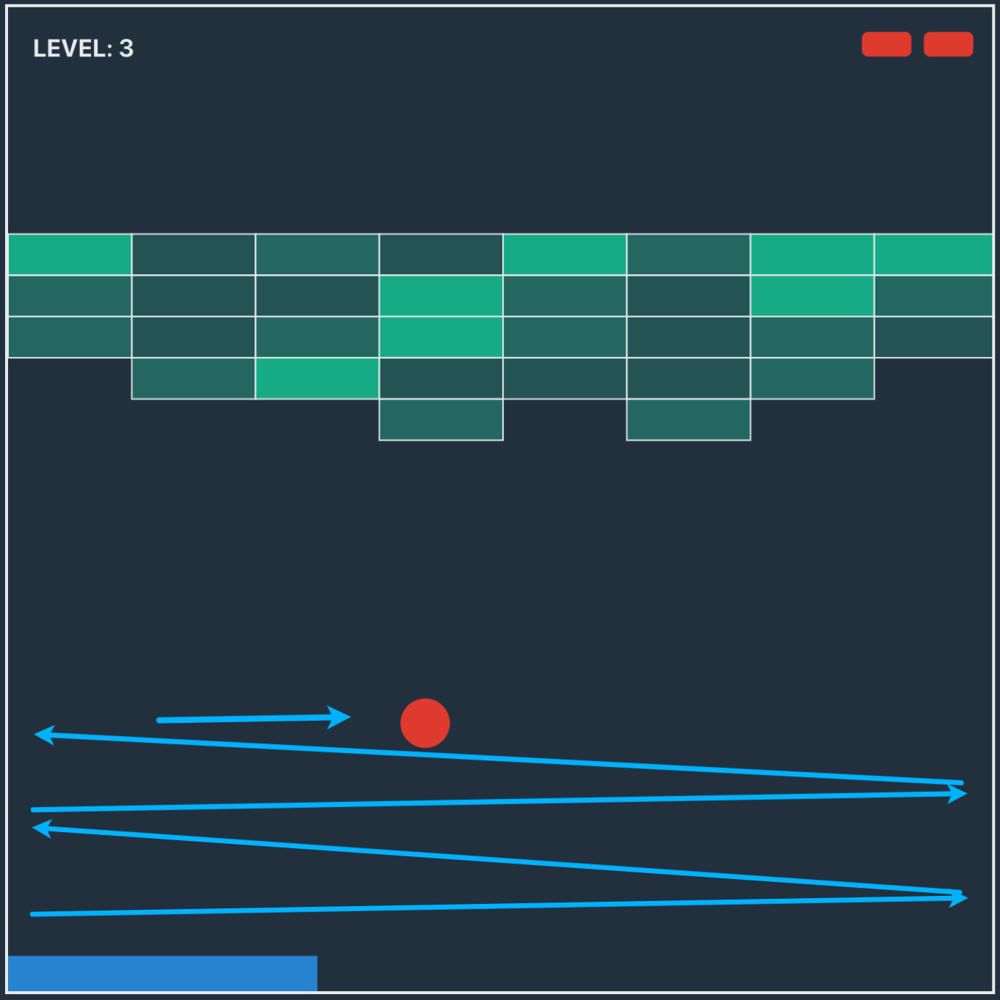

## Utils

First, we need to update *utils.js* with functions for converting degrees to radians and back alongside with two functions for arrays operations.

```js:title=src/utils.js
// ...
export const toDegrees = radians => (radians * 180) / Math.PI
export const toRadians = degrees => (degrees * Math.PI) / 180

export const withoutElement = (array, element) => array.filter(e => e !== element)
export const updateElement = (array, oldElement, newElement) => array.map(e => e === oldElement ? newElement : e)
```

## Vector

We will use vectors heavily to update the state, so we need to have a few more methods in *Vector* class.

```js:title=src/game/vector.js
import { toDegrees, toRadians } from '../utils'

export default class Vector {
  // ...
  subtract({ x, y }) {
    return new Vector(this.x - x, this.y - y)
  }

  dotProduct({ x, y }) {
    return this.x * x + this.y * y
  }

  projectOn(other) {
    const amt = this.dotProduct(other) / other.length()
    return new Vector(amt * other.x, amt * other.y)
  }

  reflect(normal) {
    return this.subtract(this.projectOn(normal).scaleBy(2))
  }

  rotate(degrees) {
    const radians = toRadians(degrees)
    const cos = Math.cos(radians)
    const sin = Math.sin(radians)

    return new Vector(
      this.x * cos - this.y * sin,
      this.x * sin + this.y * cos
    )
  }

  crossProduct({ x, y }) {
    return this.x * y - x * this.y
  }

  angleBetween(other) {
    return toDegrees(
      Math.atan2(this.crossProduct(other), this.dotProduct(other))
    )
  }
}
```

If you are not comfortable with basic vector operations, you can check [this story](https://medium.com/@geekrodion/linear-algebra-vectors-f7610e9a0f23) covering basics with JS examples. In the examples below, you can see what other methods are doing.


## Core

Now we are ready to develop the core. At the start of the file, we declare a few more variables.

```js:title=src/game/core.js
// ...
const DISTANCE_IN_MS = 0.005
export const MOVEMENT = {
  LEFT: 'LEFT',
  RIGHT: 'RIGHT'
}
const DOWN = new Vector(0, 1)
// ...
```

*DISTANCE_IN_MS* tells how far can ball and paddle go in one millisecond with speed equal to one. *MOVEMENT* object is like enum in other languages it helps to reduce the probability of making a typo.

After hitting an object like wall or paddle, we want the direction of the ball to be reflected with some added distortion to make the game more interesting. Distortion will add a small random vector to the direction and then normalize the result.

```js:title=src/game/core.js
// ...
const getDistortedDirection = (vector, distortionLevel = 0.3) => {
  const getComponent = () => Math.random() * distortionLevel - distortionLevel / 2
  const distortion = new Vector(getComponent(), getComponent())
  return vector.add(distortion).normalize()
}
```



On every update, we will check if the player wanted to move the paddle, and in such case, we will calculate a new position. If it doesn’t cross left and right boundaries function will return new vector, otherwise it will return adjusted one.

```js:title=src/game/core.js
// ...
const getNewPaddle = (paddle, size, distance, movement) => {
  if (!movement) return paddle
  const direction = movement === MOVEMENT.LEFT ? LEFT : RIGHT

  const { x } = paddle.position.add(direction.scaleBy(distance))
  const withNewX = x => ({
    ...paddle,
    position: new Vector(x, paddle.position.y)
  })
  if (x < 0) {
    return withNewX(0)
  }
  if (x + paddle.width > size.width) {
    return withNewX(size.width - paddle.width)
  }
  return withNewX(x)
}
```

Next, let’s write a small function that will be used for the ball — block collision detection.



It checks if at least one side of the object inside boundaries. For example, we can pass to it the top and bottom of the ball and block, to check if the lower or upper part of the ball inside of a block.

```js:title=src/game/core.js
```

We want to escape the situation when the ball goes back and forth between walls since it makes the game boring.



This happens when the angle between normal of the wall and direction is close to 0 or *90* or *-90* degrees. Right after calculating the new direction, we will adjust it.

```js:title=src/game/core.js
// ...
const getAdjustedVector = (normal, vector, minAngle = 15) => {
  const angle = normal.angleBetween(vector)
  const maxAngle = 90 - minAngle
  if (angle < 0) {
    if (angle > -minAngle) {
      return normal.rotate(-minAngle)
    }
    if (angle < -maxAngle) {
      return normal.rotate(-maxAngle)
    }
  } else {
    if (angle < minAngle) {
      return normal.rotate(minAngle)
    }
    if (angle > maxAngle) {
      return normal.rotate(maxAngle)
    }
  }
  return vector
}
```

Finally, we are ready to write a function that will create a new state. It receives old state, movement of the paddle, and timespan between last update and now.

```js:title=src/game/core.js
// ...
export const getNewGameState = (state, movement, timespan) => {
  const { size, speed, lives } = state
  const distance = timespan * DISTANCE_IN_MS * speed
  const paddle = getNewPaddle(state.paddle, size, distance, movement)

  const { radius } = state.ball
  const oldDirection = state.ball.direction
  const newBallCenter = state.ball.center.add(oldDirection.scaleBy(distance))
  const ballBottom = newBallCenter.y + radius
  if (ballBottom > size.height) {
    return {
      ...state,
      ...getInitialPaddleAndBall(size.width, size.height, paddle.width),
      lives: lives - 1
    }
  }
  
  const withNewBallProps = props => ({
    ...state,
    paddle,
    ball: {
      ...state.ball,
      ...props
    }
  })

  const withNewBallDirection = normal => {
    const distorted = getDistortedDirection(oldDirection.reflect(normal))
    const direction = getAdjustedVector(normal, distorted)
    return withNewBallProps({ direction })
  }
  const ballLeft = newBallCenter.x - radius
  const ballRight = newBallCenter.x + radius
  const ballTop = newBallCenter.y - radius
  const paddleLeft = paddle.position.x
  const paddleRight = paddleLeft+ paddle.width
  const paddleTop = paddle.position.y

  const ballGoingDown = Math.abs(UP.angleBetween(oldDirection)) > 90
  const hitPaddle = ballGoingDown && ballBottom >= paddleTop && ballRight >= paddleLeft && ballLeft <= paddleRight
  if (hitPaddle) return withNewBallDirection(UP)
  if (ballTop <= 0) return withNewBallDirection(DOWN)
  if (ballLeft <= 0) return withNewBallDirection(RIGHT)
  if (ballRight >= size.width) return withNewBallDirection(LEFT)

  const block = state.blocks.find(({ position, width, height }) => (
    isInBoundaries(ballTop, ballBottom, position.y, position.y + height) &&
    isInBoundaries(ballLeft, ballRight, position.x, position.x + width) 
  ))
  if (block) {
    const density = block.density - 1
    const newBlock = { ...block, density }
    const blocks = density < 0 ? withoutElement(state.blocks, block) : updateElement(state.blocks, block, newBlock)
    
    const getNewBallNormal = () => {
      const blockTop = block.position.y
      const blockBottom = blockTop + block.height
      const blockLeft = block.position.x
      if (ballTop > blockTop - radius && ballBottom < blockBottom + radius) {
        if (ballLeft < blockLeft) return LEFT
        if (ballRight > blockLeft + block.width) return RIGHT
      }
      if (ballTop > blockTop) return DOWN
      if (ballTop <= blockTop) return UP
    }
    return {
      ...withNewBallDirection(getNewBallNormal()),
      blocks
    }
  }
  return withNewBallProps({ center: newBallCenter })
}
```

*4: // *We calculate the distance that both ball and paddle went. Here we can see how the speed parameter affects the game. Then we call the function to get a new version of the paddle.

*8: // *To calculate a new ball position, we add a direction vector scaled by distance. Then if a player missed the ball, we call a function that returns initial paddle and ball.

19: // We declare a few functions by calling which we can return state with an updated ball.

40:// Then we check if a ball hits paddle or one of the wall. In such a case, we only need to pass the direction of normal to withNewBallDirection to return a new state with an updated ball and paddle.

51:// If the ball has a collision with one of the blocks, we return updated blocks and ball with direction bounced from one of the block sides.

In this part, we’ve implemented the core logic of the game.