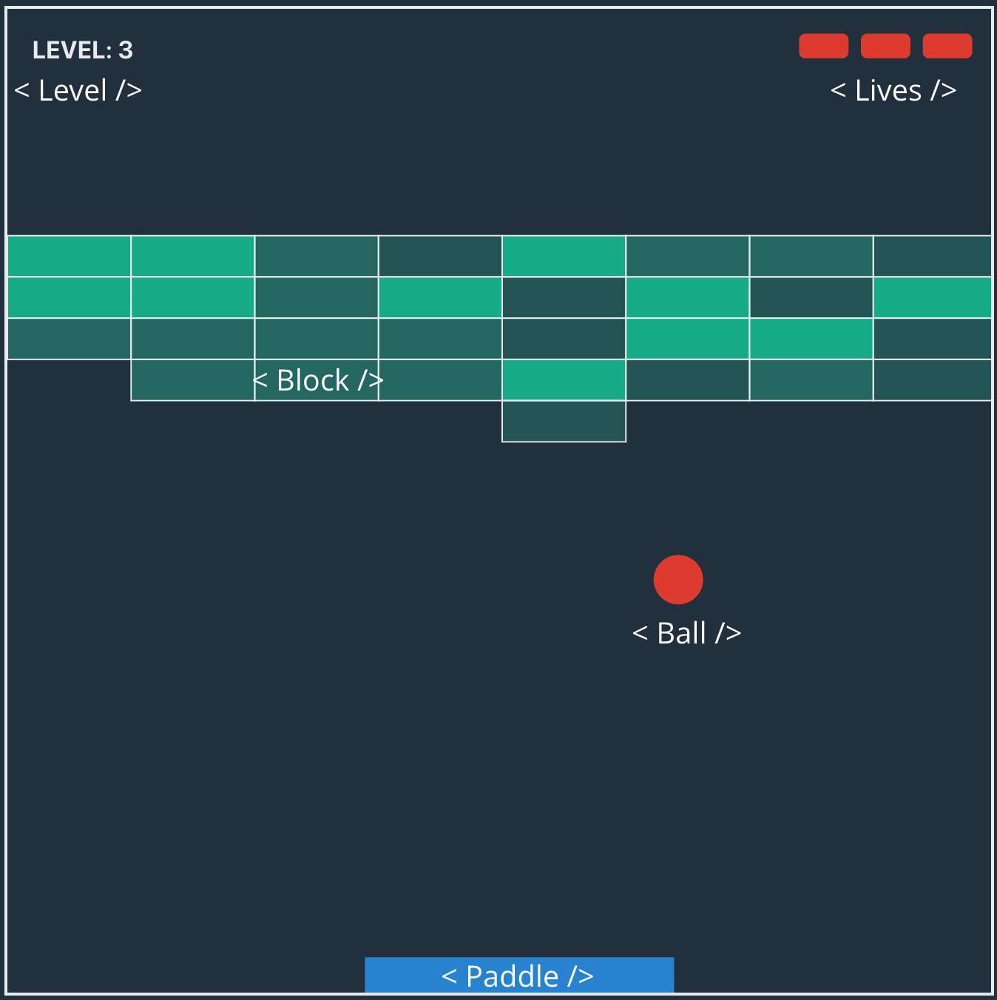
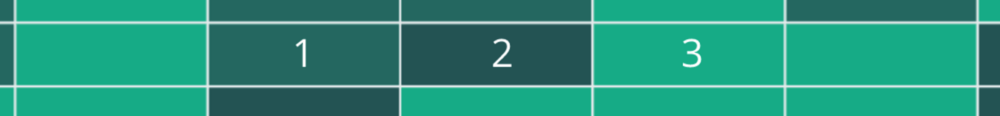
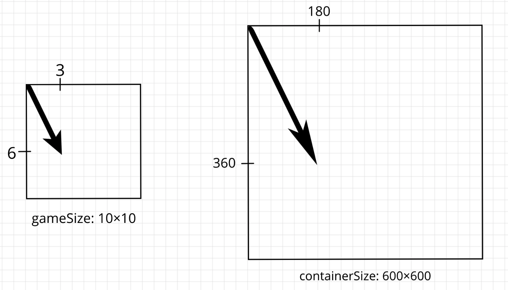
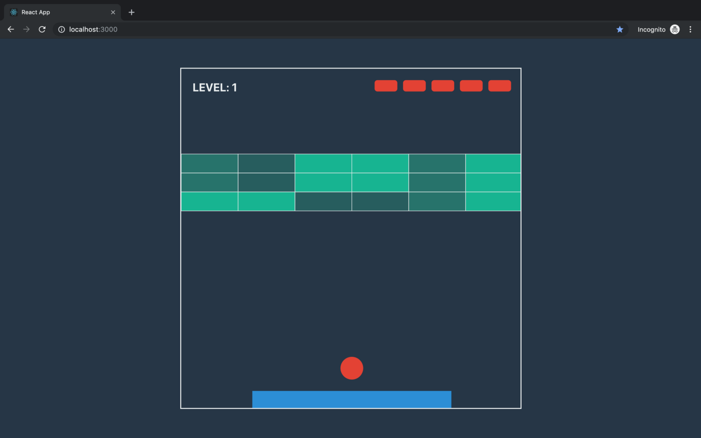

In this course, we are building a Breakout Game with JavaScript, React, and SVG without libraries, just plain modern JS and React. We are utilizing functional, immutable programming, and along the way, we learn React Hooks, SVG rendering, and basics of game development.

## Stateless Components

We only have two components in a whole game that have state — *Scene* and *Page*. All other components are dummy SVG elements.



Let’s start by updating the *index.css* file with variables and few styles to finish with CSS in this series!

```js:title=src/index.css
html {
  // ...
  --text-color: #ecf0f1;
  --action-color: #e74c3c;
}

.scene {
  border: 2px solid var(--text-color);
}

.block {
  stroke-width: 1px;
  stroke: var(--text-color);
}

.paddle {
  fill: #3498db;
}

.ball {
  fill: var(--action-color);
}

.level {
  font-weight: bold;
  fill: var(--text-color);
}

.life {
  fill: var(--action-color);
}
```

*Ball* and *Paddle* components are pretty straightforward. Let’s put them into *ball.js* and *paddle.js* files inside the components folder.

```js:title=src/components/ball.js
import React from 'react'

export default ({ x, y, radius }) => (
  <circle className='ball' cx={x} cy={y} r={radius} />
)
```

```js:title=src/components/paddle.js
import React from 'react'

export default ({ x, y, width, height }) => (
  <rect className='paddle' x={x} y={y} width={width} height={height} />
)
```

*Block* has different opacity depending on its density.



```js:title=src/components/block.js
import React from 'react'
import { getRange } from '../utils';
import { BLOCK_MAX_DENSITY } from '../game/levels';

const colors = getRange(BLOCK_MAX_DENSITY).map(i => `rgba(26, 188, 156, ${1 / (BLOCK_MAX_DENSITY - i)})`)

export default ({ x, y, width, height, density }) => (
  <rect className='block' fill={colors[density]} x={x} y={y} width={width} height={height} />
)
```

The *Level* component display text that placed at top left corner.

```js:title=src/components/level.js
import React from 'react'

export default ({ level, unit }) => {
  return (
    <text x={unit} y={unit * 2} fontSize={unit} className='level'>LEVEL: {level}</text>
  )
}
```

We are not bothering ourselves with making lives in the form of classic red hurts. In our game lives displayed as rounded rectangles at the right top corner. Why not?

```js:title=src/components/lives.js
import React from 'react'

import { getRange } from '../utils'

export default ({ lives, containerWidth, unit }) => {
  const width = unit * 2
  return getRange(lives).map(i => (
    <rect
      className='life'
      rx={unit / 4}
      height={unit}
      width={width}
      y={unit}
      x={containerWidth - unit - width * (i + 1) - (unit / 2) * i}
      key={i}
    />
  ))
}
```

## All Together

We implemented all boring components and ready to put them all together. Let’s open *scene.js* file and import all we need.

```js:title=src/components/scene.js
import React, { useReducer } from 'react'

import { LEVELS } from '../game/levels'
import { getGameStateFromLevel } from '../game/core'

import Level from './level'
import Lives from './lives'
import Block from './block'
import Paddle from './paddle'
import Ball from './ball'
```

Every time the player gets to a new level, we will save the number to local storage, so that next time the user opens the game, he can continue from the last level. Therefore at the start, we will check if there is a level number saved in local storage. To hack the game and get to the last level player can open console and type *localStorage.level = 3*.

```js:title=src/components/scene.js
// ...
const getInitialLevel = () => {
  const inState = localStorage.getItem('level')
  return inState ? parseInt(inState, 10) : 0
}
```

We need to somehow project the game state to the screen. In the example below — the point with coordinates *(3, 6)* in the game state projected on the screen to point at *(180, 360)*.



To do this, we will write a function that receives container size and size of the game field and returns an object with two projectors — for distances and for vectors.

```js:title=src/components/scene.js
// ...
const getProjectors = (containerSize, gameSize) => {
  const widthRatio = containerSize.width / gameSize.width
  const heightRatio = containerSize.height / gameSize.height
  const unitOnScreen = Math.min(widthRatio, heightRatio)

  return {
    projectDistance: distance => distance * unitOnScreen,
    projectVector: vector => vector.scaleBy(unitOnScreen)
  }
}
```

We will use a Redux hook to manage the state of the scene because it will allow us to reduce the amount of unnecessary rerenders. In this part, we only implement a function that will create an initial state for it. And in upcoming parts, we’ll implement actions and handlers.

```js:title=src/components/scene.js
// ...
const getInitialState = containerSize => {
  const level = getInitialLevel()
  const game = getGameStateFromLevel(LEVELS[level])
  const { projectDistance, projectVector } = getProjectors(containerSize, game.size)
  return {
    level,
    game,
    containerSize,
    projectDistance,
    projectVector,
    time: Date.now(),
    stopTime: undefined,
    movement: undefined
  }
}

const reducer = state => state
```

We are familiar with all properties in the returned state object, except *time*, *stopTime*, and *movement*:

* **time** will be used to calculate duration between updates and then determine how far ball and paddle moved during this period.

* when **stopTime** is not undefined, it means that the user stopped the game, and we don’t need to update the game state.

* If **movement** is defined, it means that the user holding the left or right key, and wants to change the position of the paddle.

Let’s finish this part by updating the component. Here we are receiving state via hook. Then we take all the properties that we need from the state and by using projectors render all SVG elements.

```js:title=src/components/scene.js
export default (containerSize) => {
  const [state] = useReducer(reducer, containerSize, getInitialState)
  const {
    projectDistance,
    projectVector,
    level,
    game: {
      blocks,
      paddle,
      ball,
      size: {
        width,
        height
      },
      lives
    }
  } = state

  const viewWidth = projectDistance(width)
  const unit = projectDistance(ball.radius)
  return (
    <svg width={viewWidth} height={projectDistance(height)} className='scene'>
      <Level unit={unit} level={level + 1} />
      <Lives
        lives={lives}
        containerWidth={viewWidth}
        unit={unit}
      />
      {blocks.map(({ density, position, width, height }) => (
        <Block
          density={density}
          key={`${position.x}-${position.y}`}
          width={projectDistance(width)}
          height={projectDistance(height)}
          {...projectVector(position)}
        />)
      )}
      <Paddle width={projectDistance(paddle.width)} height={projectDistance(paddle.height)} {...projectVector(paddle.position)} />
      <Ball {...projectVector(ball.center)} radius={unit} />
    </svg>
  )
}
```

If we run the app and open a browser, we can see that all elements are in place, and we are getting closer to implementing a real game.



In this part, we’ve made all components and made Scene reflect the current state.
