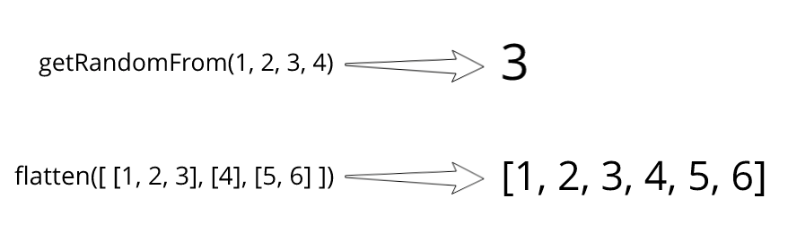
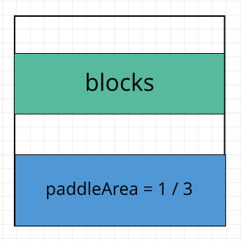
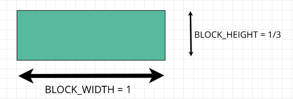
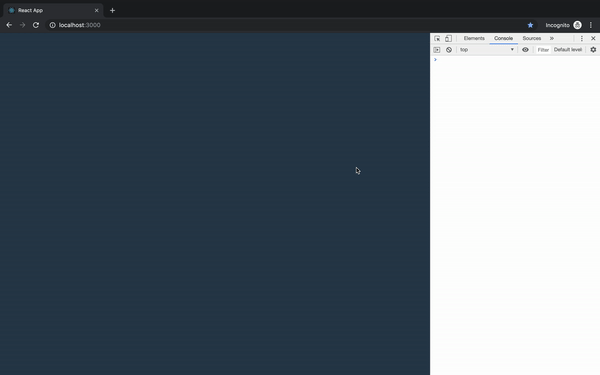

In this course, we are building a Breakout Game with JavaScript, React, and SVG without libraries, just plain modern JS and React. We are utilizing functional, immutable programming, and along the way, we learn React Hooks, SVG rendering, and basics of game development.

## Game State From Level

In the [previous part](/blog/breakout-game/levels), we decided on what parameters each level will include, and now we’ll generate an initial game state from the level object. The game state doesn’t care about what is used for rendering — *SVG* or *Canvas*, or does the user playing on keyboard or touchscreen. The state consists of:

* **Size** has the width and height of the game. Distances measured not in pixels, but in abstract units — in our case, this unit is the width of the block. So we can say, this level has the size of 10x10 blocks.

* **Blocks** are an array of objects, where each object have width, height, density and the position of the top-left corner.

* The **paddle** has the same structure as a block but without density.

* **Ball** has a center, radius, and direction.

* **Lives** and **speed** we are passing right from level to the state.

First, let’s open *utils.js* and add a few functions that we will utilize farther in this part.

```js:title=utils.js
// ...
export const getRandomFrom = (...args) => args[Math.floor(Math.random() * args.length)]
export const flatten = arrays => arrays.reduce((acc, row) => [...acc, ...row], [])
```

You can see what they do in examples below:



Next, we need to create the only class we will use in this game — *Vector*. We will use vectors, both for directions and coordinates. If you are not comfortable with [vectors](/blog/linear-algebra/vectors), check out this article that shows the basics with JS examples. Let’s create a file named *vector.js* and put it into the game folder. For now, it will only have a constructor and a few methods. Along the way, we will extend this class with other methods that also won’t mutate the object.

```js:title=vector.js
export default class Vector {
  constructor(x, y) {
    this.x = x
    this.y = y
  }

  scaleBy(number) {
    return new Vector(this.x * number, this.y * number);
  }

  length() {
    return Math.hypot(this.x, this.y)
  }

  add({ x, y }) {
    return new Vector(this.x + x, this.y + y)
  }

  normalize() {
    return this.scaleBy(1 / this.length())
  }
}
```

Let’s add file *core.js* to the game folder. First, we import Vector and utils and declare sizes of different things in the game.

```js:title=core.js
import Vector from './vector'
import { flatten, getRandomFrom } from '../utils'

const PADDLE_AREA = 1 / 3
const BLOCK_HEIGHT = 1 / 3
const PADDLE_HEIGHT = BLOCK_HEIGHT
const BALL_RADIUS = 1 / 5
```

We give *1/3* of game height to paddle, which means, that blocks will be on the center of the top *2/3* of the game.



Beside paddle area, other constants, like ball radius expressed as fractions of block width, since block width is the unit in our game.



Then we declare directions by using *Vector* class.

```js:title=core.js
// ...
const LEFT = new Vector(-1, 0)
const RIGHT = new Vector(1, 0)
const UP = new Vector(0, -1)

const LEFT_UP = LEFT.add(UP).normalize()
const RIGHT_UP = RIGHT.add(UP).normalize()
```

One thing that may look strange is that the *UP* vector is pointing down. This is also can look controversial since the state doesn’t deal with the screen where coordinate starts in the left top corner, but in this type of game, the choice of Y-direction doesn’t make much of a difference.

Since we also need to get an initial position of paddle and ball when the player misses the ball, it is better to create a separate function that will return the initial state for these objects. As parameters, it receives the width and height of the game field and the width of the paddle. It places the paddle and the ball at the bottom of the field and directs the ball randomly in the left or right direction.

```js:title=core.js
// ...
export const getInitialPaddleAndBall = (width, height, paddleWidth) => {
  const paddleY = height - PADDLE_HEIGHT
  const paddle = {
    position: new Vector((width - paddleWidth) / 2, paddleY),
    width: paddleWidth,
    height: PADDLE_HEIGHT
  }
  const ball = {
    center: new Vector(height / 2, paddleY - BALL_RADIUS * 2),
    radius: BALL_RADIUS,
    direction: getRandomFrom(LEFT_UP, RIGHT_UP)
  }

  return {
    paddle,
    ball
  }
}
```

Finally, we can write a function that receives a level and returns the initial state. The game field always square, we determine it’s size by looking at the length of the first row of blocks. Then we place blocks at the center of 2/3 area of the field.

```js:title=core.js
// ...
export const getGameStateFromLevel = ({ lives, paddleWidth, speed, blocks }) => {
  const width = blocks[0].length
  const height = width

  const blocksStart = ((height - height * PADDLE_AREA) - blocks.length * BLOCK_HEIGHT) / 2

  const rowsOfBlocks = blocks.map((row, i) =>
    row.map((density, j) => ({
      density,
      position: new Vector(j, blocksStart + (i * BLOCK_HEIGHT)),
      width: 1,
      height: BLOCK_HEIGHT
    })
  ))

  const size = {
    width,
    height
  }
  return {
    size,
    blocks: flatten(rowsOfBlocks),
    ...getInitialPaddleAndBall(width, height, paddleWidth),
    lives,
    speed
  }
}
```

## Complete Page Component

Now we are going to finish the *Page* component that we started in the previous part. This component serves as a wrapper around a game scene. It is watching for *window* resize and passes how much free space is available to its children — *Scene*.

Since we will need to add window event listeners, let’s write a function at *utils.js* that will register a listener and will return function via which we can unregister the listener.

```js:title=utils.js
// ...
export const registerListener = (eventName, handler) => {
  window.addEventListener(eventName, handler)
  return () => window.removeEventListener(eventName, handler)
}
```

Next, we need to create a Scene component at the *scene.js* inside of the *components* folder. For now, it will receive container size and console log it out without doing anything.

```js:title=scene.js
import React from 'react'

export default (containerSize) => {
  console.log(`${containerSize.width} x ${containerSize.height}`)
  return <svg/>
}
```

We want the scene on the center of the screen, so let’s add styles for scene container in *index.css*.

```js:title=rawindex.css
// ...
.scene-container {
  width: 100%;
  height: 100%;
  display: flex;
  align-items: center;
  justify-content: center;
}
```

Now, we can open *page.js* and finish it. We are using React hooks here to get access to the container and keep its size in the state. Via *useEffect*, we register an event listener when the component is mounted and unregister listener on unmount.

```js:title=page.js
import React, { useRef, useEffect, useState } from 'react'

import Scene from './scene'
import { registerListener } from '../utils'

export default () => {
  const sceneContainer = useRef()
  const [size, setSize] = useState()

  useEffect(() => {
    const onResize = () => {
      const { width, height } = sceneContainer.current.getBoundingClientRect()
      setSize({ width, height })
    }
    const unregisterResizeListener = registerListener('resize', onResize)
    onResize()
    return unregisterResizeListener
  }, [])

  return (
    <div className='page'>
      <div className='scene-container' ref={sceneContainer}>
        {size && <Scene width={size.width} height={size.height} />}
      </div>
    </div>
  )
}
```

If we run the app and open developer tools, we can see that every time resize happens *Scene* receives a new width and height.



In this part, we’ve made a function that turns raw level description into game state and finished *Page* component.