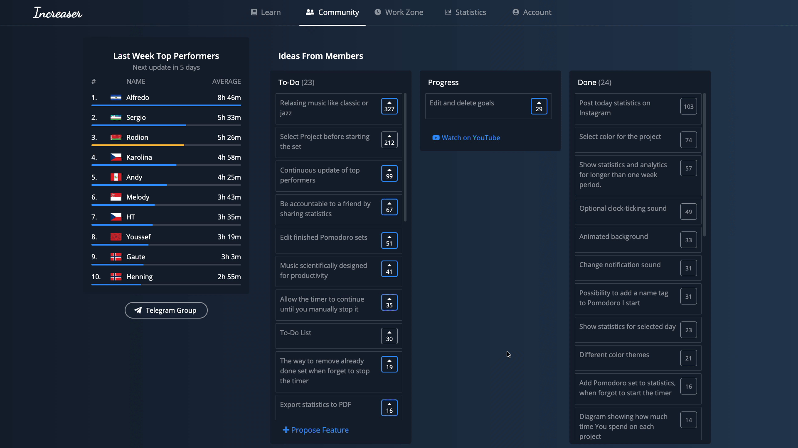
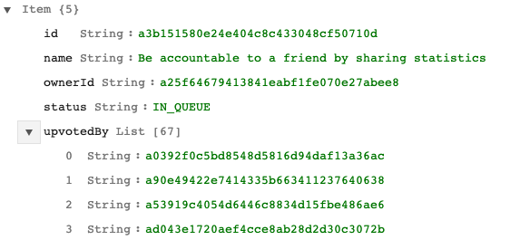
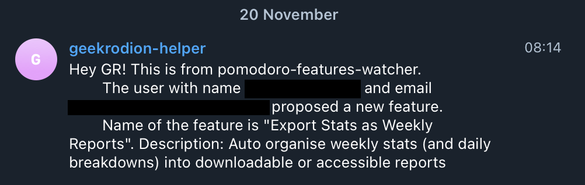

## Why Adding Feature Voting Board

[Increaser](https://increaser.org) always had my contacts somewhere on the about page, and some customers did reach out to me with ideas from time to time. One year after the release, I decided to add a features board so that users could see which ideas are in consideration, features status, upvote ones they like, and propose something they find missing in the product. With a board, customers could see that the app is getting better and that their feedback matters. I could propose my ideas about possible features, and see if people are interested in them or not. Also, it looks cool to new visitors and they could see what features are in the app already, and what they could expect in the future.

## Making Board with React

I made the first board similar to the list view on ProductHunt and then transformed it into something close to the classic Kanban board that customers are familiar with from the tools like Trello or Notion. Besides this, I was always iterating on the design and position of the form. Now it has three columns and a button at the bottom of the TO-DO list that prompts the user to propose a feature.



The whole board is a bunch of [React](https://github.com/facebook/react) components. On the first render, the app requests all the features, and once they arrived it renders them in different columns according to status.

```js:title=src/components/features/features-board.js
const FeaturesBoard = ({ features, width, requestFeatures }) => {
  // ...
  useEffect(() => {
    requestFeatures()
  }, [requestFeatures])

  const withStatuses = statuses =>
    features.filter(({ status }) => statuses.includes(status))

  const shouldShowThreeColumns = width > THREE_COLUMNS
  
  // ...
  return (
    <Container>
      {shouldShowThreeColumns ? (
        <>
          {renderToDoColumn()}
          {renderInProgress()}
        </>
      ) : (
        <div>
          {renderToDoColumn()}
          {renderInProgress()}
        </div>
      )}
      <FeaturesColumn
        features={withStatuses([STATUS.DONE])}
        name={t('features.section.done')}
      />
    </Container>
  )
}
```

To do asynchronous operations I use [redux-saga](https://github.com/redux-saga/redux-saga). There are only four types of requests related to the board.

```js:title=src/sagas/features.js
export function* requestFeatures() {
  const data = yield callApi(REQUEST_FEATURE_MUTATION)
  yield put(receiveFeatures(data.features))
}

export function* upvoteFeature({ payload }) {
  yield callApi(UPVOTE_FEATURE_MUTATION(payload))
}

export function* reupvoteFeature({ payload }) {
  yield callApi(REUPVOTE_FEATURE_MUTATION(payload))
}

export function* submitFeature() {
  const state = yield select()
  const { featureName, featureDescription } = state.features

  const variables = {
    input: {
      name: featureName,
      description: featureDescription
    }
  }
  const { submitFeature } = yield callApi(
    SUBMIT_FEATURE_MUTATION,
    variables
  )
  yield put(receiveFeature(submitFeature))
  yield put(clearFeatureForm())
}
```

## NodeJS + DynamoDB Backend

To store features, I use DynamoDB. Every item has a unique id, name, id of the user who proposed it, status, and list of ids of users that upvoted the feature.



Right now, the GraphQL resolver that returns all the features isn't the most efficient because after querying all the items, it iterates over every item's list of upvotes. It is OK for [Increaser](https://increaser.org) because there are not that many features or upvotes. There always tradeoffs when it comes to the NoSQL database. One of the solutions to make the query more effective is to have duplication of data and store in the user's item the list of features he upvoted.

```js:title=src/graphql/query.js
const features = async (_, __, { userId }) => {
  const allFeatures = await featuresTable.getAll()
  const filteredFeatures = allFeatures.filter(
    ({ status, ownerId }) =>
      !(status === STATUS.WAITING_FOR_CONFIRMATION && ownerId !== userId)
  )

  return filteredFeatures.map(f => ({
    id: f.id,
    status: f.status,
    name: f.name,
    description: f.description,
    upvotesNumber: f.upvotedBy.length,
    upvoted: userId && f.upvotedBy.includes(userId)
  }))
}
```

## Telegram Notifications + Automatic Emails

How will I know when a customer proposed a feature? How to send an email to a user when his idea was approved or implemented? To recognize when something changed in the features table, I have an AWS Lambda function that watches for changes in the table. The [repository](https://github.com/RodionChachura/pomodoro-features-watcher) with the watcher is open, and you could dig into the implementation!

```js:title=src/lambda.js
const { processRecord } = require('./watcher')

exports.handler = async ({ Records }, context, callback) => {
  await Promise.all(Records.map(processRecord))
  callback(null, `Successfully processed ${Records.length} records.`)
}
```

To send emails, I use AWS SES. Previously I was sending a fancy message, but now I stick to a regular text in all my emails to have less chance to appear in the Promotion tab. To get notification about a newly proposed feature, I send a Telegram message to the geekrodion-helper channel.



## Conclusions

As I look at the features added to the app, most of them were proposed by me and, I wasn't relying on upvotes to decide if they should be implemented or not.

Two of the features in the "Done" actually were removed from the app after some time. I haven't thought very well how they could fit in the product and ended up wasting time. At the same time, there were a few features that were proposed by people, got implemented, and enhanced the app.

The thing is that your customers won't think for a long time about a feature and how it fits in the product - that's our job. I think it is good to pay attention to signals that come from the user, yet we should try to understand why they want that feature and does it makes sense to invest energy to bring the proposed idea to the product. Extra features do not always make the app better - they could make your product harder to understand and mess up your positions, so be careful.