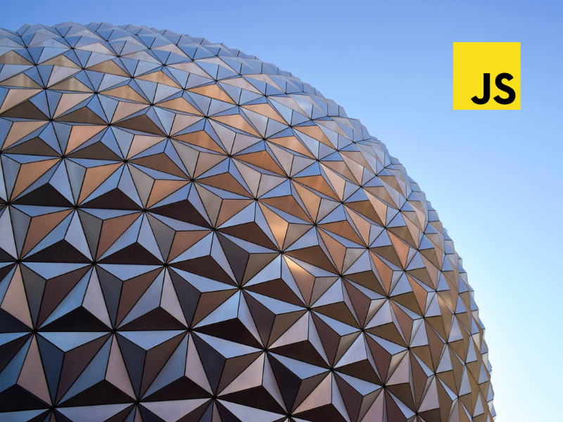

Recently I finished a story about linear transformations with JavaScript, two-dimensional examples rendered on *SVG* grid(was covered in this [part](/blog/linear-algebra/animating) served well, but something was missing — examples in three-dimensional space…

## Goal

In this part, we want to make a component that will visualize the linear transformation of object in three-dimensional space. The final result of this part you can see in the demo.


## Component

The first library that comes to mind when we think about doing 3D in the browser is [three.js](https://threejs.org/). So let’s install it and also, library to allow user move camera.

```shell{ promptUser: geekrodion }
npm install --save three three-orbitcontrols
```

We are building a component that will receive matrix in properties from the parent component and will render an animated transformation of the cube. You can see the structure of the component below. We wrap our component with functions from *styled-components* and *react-sizeme* to have access to the theme with colors and to detect when the size of the component changed.

```js:title=scelet.js
import React from 'react'
import { withTheme } from 'styled-components'
import { withSize } from 'react-sizeme'

class ThreeScene extends React.Component {
  constructor(props) {}
  render() {}

  componentDidMount() {}

  componentWillUnmount() {}

  animate = () => {}

  componentWillReceiveProps({ size: { width, height } }) {}
}

const WrappedScene = withTheme(withSize({ monitorHeight: true })(ThreeScene))
```

In the **constructor**, we initialize state that contains the size of the view, so that we can compare it with a new one in *componentWillReceiveProps *method. Since we will need to access the actual *DOM* element to inject *ThreeJS* *renderer*, we are using *ref* in **render** method.

```js:title=constructor-n-render.js
const View = styled.div`
  width: 100%;
  height: 100%;
`
class ThreeScene extends React.Component {
  // ...
  constructor(props) {
    super(props)
    this.state = {
      width: 0,
      height: 0
    }
  }
  
  render() {
    return <View ref={el => (this.view = el)} />
  }
  // ...
}
```

In **componentDidMount**, we initialize everything we need to animate cube transformation. First, we create a scene and position camera. Then we create the *renderer*, set color and size and append it to *View* component.

Then we create objects that will be rendered — axes, cube and cube edges. Since we will change matrix by ourselves, we set the *matrixAutoUpdate* property on cube and edges to false. When we are done with objects creation, we add them to the scene. To allow user move camera with the mouse, we are using *OrbitControls*.

Then we convert matrices from our library to *ThreeJS* ones and getting functions that will return color and transformation matrix depending on time. In **componentWillUnmount**, we cancel the animation frame and remove *renderer* from the *DOM*.

```js:title=mount-n-unmount.js
class ThreeScene extends React.Component {
  // ...
  componentDidMount() {
    const {
      size: { width, height },
      matrix,
      theme
    } = this.props
    this.setState({ width, height })
    this.scene = new THREE.Scene()
    this.camera = new THREE.PerspectiveCamera(100, width / height)
    this.camera.position.set(1, 1, 4)

    this.renderer = new THREE.WebGLRenderer({ antialias: true })
    this.renderer.setClearColor(theme.color.background)
    this.renderer.setSize(width, height)
    this.view.appendChild(this.renderer.domElement)

    const initialColor = theme.color.red
    const axes = new THREE.AxesHelper(4)
    const geometry = new THREE.BoxGeometry(1, 1, 1)
    this.segments = new THREE.LineSegments(
      new THREE.EdgesGeometry(geometry),
      new THREE.LineBasicMaterial({ color: theme.color.mainText })
    )
    this.cube = new THREE.Mesh(
      geometry,
      new THREE.MeshBasicMaterial({ color: initialColor })
    )
    this.objects = [this.cube, this.segments]
    this.objects.forEach(obj => (obj.matrixAutoUpdate = false))
    this.scene.add(this.cube, axes, this.segments)

    this.controls = new OrbitControls(this.camera)

    this.getAnimatedColor = getGetAnimatedColor(
      initialColor,
      theme.color.blue,
      PERIOD
    )
    const fromMatrix = fromMatrix4(this.cube.matrix)
    const toMatrix = matrix.toDimension(4)
    this.getAnimatedTransformation = getGetAnimatedTransformation(
      fromMatrix,
      toMatrix,
      PERIOD
    )
    this.frameId = requestAnimationFrame(this.animate)
  }
  
  componentWillUnmount() {
    cancelAnimationFrame(this.frameId)
    this.view.removeChild(this.renderer.domElement)
  }
  // ...
}
```

Without the **animate** function, nothing will be rendered. First, we update the transformation matrix of both the cube and its edges and update the color of the cube. Then we render everything and request animation frame.

In **componentWillReceiveProps**, we receive the current size of the component, and if it differs from the previous one, we update the state, change the size of renderer and camera aspect.

```js:title=animate-n-component-will-receive.js
class ThreeScene extends React.Component {
  // ...
  animate = () => {
    const transformation = this.getAnimatedTransformation()
    const matrix4 = toMatrix4(transformation)
    this.cube.material.color.set(this.getAnimatedColor())
    this.objects.forEach(obj => obj.matrix.set(...matrix4.toArray()))
    this.renderer.render(this.scene, this.camera)
    this.frameId = window.requestAnimationFrame(this.animate)
  }

  componentWillReceiveProps({ size: { width, height } }) {
    if (this.state.width !== width || this.state.height !== height) {
      this.setState({ width, height })
      this.renderer.setSize(width, height)
      this.camera.aspect = width / height
      this.camera.updateProjectionMatrix()
    }
  }
}
```

## Animations

To animate color change and transformation we need to write functions that will return animation functions. Before we cover them let’s look at some converters — functions from StackOverflow that convert RGB to hex and back and functions that convert matrix from our library to *ThreeJS* one and back.

```js:title=generic.js
import * as THREE from 'three'
import { Matrix } from 'linear-algebra/matrix'

export const toMatrix4 = matrix => {
  const matrix4 = new THREE.Matrix4()
  matrix4.set(...matrix.components())
  return matrix4
}

export const fromMatrix4 = matrix4 => {
  const components = matrix4.toArray()
  const rows = new Array(4)
    .fill(0)
    .map((_, i) => components.slice(i * 4, (i + 1) * 4))
  return new Matrix(...rows)
}
```

### Color

First, we need to calculate the distances between each part of the colors(red, green, blue). The function that will return new color sets timestamp on the first call. Then by knowing the distances between the pair of colors and time spend from the first call, it calculates a new *RGB* color.

```js:title=get-get-animated-color.js
import { hexToRgb, rgbToHex } from './generic'

export const getGetAnimatedColor = (fromColor, toColor, period) => {
  const fromRgb = hexToRgb(fromColor)
  const toRgb = hexToRgb(toColor)
  const distances = fromRgb.map((fromPart, index) => {
    const toPart = toRgb[index]
    return fromPart <= toPart ? toPart - fromPart : 255 - fromPart + toPart
  })
  let start
  return () => {
    if (!start) {
      start = Date.now()
    }
    const now = Date.now()
    const timePassed = now - start
    if (timePassed > period) return toColor

    const animatedDistance = timePassed / period
    const rgb = fromRgb.map((fromPart, index) => {
      const distance = distances[index]
      const step = distance * animatedDistance
      return Math.round((fromPart + step) % 255)
    })
    return rgbToHex(...rgb)
  }
}
```

### Linear Transformation

To animate linear transformation, we are doing the same steps. We find the difference between matrices and in animation function we update each component with relation to time from the first call.

```js:title=get-animated-transformation.js
export const getGetAnimatedTransformation = (fromMatrix, toMatrix, period) => {
  const distances = toMatrix.subtract(fromMatrix)
  let start
  return () => {
    if (!start) {
      start = Date.now()
    }
    const now = Date.now()
    const timePassed = now - start
    if (timePassed > period) return toMatrix

    const animatedDistance = timePassed / period
    const newMatrix = fromMatrix.map((fromComponent, i, j) => {
      const distance = distances.rows[i][j]
      const step = distance * animatedDistance
      return fromComponent + step
    })
    return newMatrix
  }
}
```
