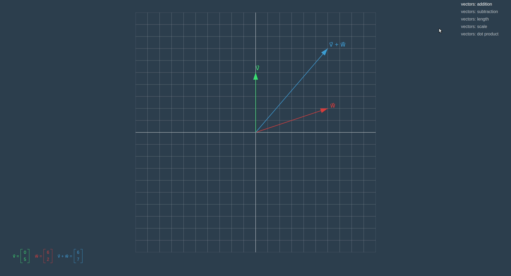
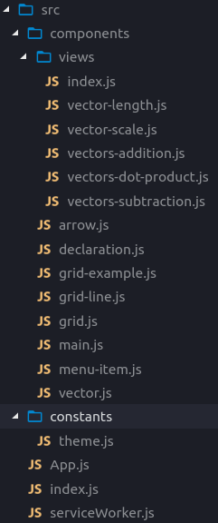

Just recently I finished [the first post](/blog/linear-algebra/vectors) in upcoming series about linear algebra. And right before starting the new one I had a thought that would be cool to develop a React project showcasing examples from the series… 

## Goal

Since on the moment of writing, there is only one story that covers basic operations on vectors in series. It would be enough for now to implement components that will help us to render two-dimensional grid and vectors as arrows..



## Create React App

There is an entire story about best practices of how to start to react project, but for this case, we will go with as little libraries as possible and with simplest setup possible.

```shell{ promptUser: geekrodion }
create-react-app linear-algebra-demo
cd linear-algebra-demo
npm install --save react-sizeme styled-components
```

The first library will be used to re render the *Grid* component when its size changes and the second one to make styling of components easier. To use *linear-algebra* library we are developing in series, we need to reference it in *package.json*.

```json:title=package.json
"dependencies": {
  "linear-algebra": "file:../library",
  ...
}
```

## Project Structure



For each example we have it is own component in views folder. From *index.js* we export an object where the key is the name of an example and value is component.

```js:title=index.js
import { default as VectorLength } from './vector-length'
import { default as VectorScale } from './vector-scale'
import { default as VectorsAddition } from './vectors-addition'
import { default as VectorsSubtraction } from './vectors-subtraction'
import { default as VectorsDotProduct } from './vectors-dot-product'

export default {
  'vectors: addition': VectorsAddition,
  'vectors: subtraction': VectorsSubtraction,
  'vectors: length': VectorLength,
  'vectors: scale': VectorScale,
  'vectors: dot product': VectorsDotProduct
}
```

Then we can import this object in the main component and list all of its keys in the menu. After the user selects an example in the menu, the component state will be updated, and the new view will be rendered.

```js:title=main.js
import React from 'react'
import styled from 'styled-components'

import views from './views'
import MenuItem from './menu-item'

const Container = styled.div`
  ...
`

const Menu = styled.div`
  ...
`

class Main extends React.Component {
  constructor(props) {
    super(props)
    this.state = {
      view: Object.keys(views)[0]
    }
  }

  render() {
    const { view } = this.state
    const View = views[view]
    const viewsNames = Object.keys(views)
    const MenuItems = () =>
      viewsNames.map(name => (
        <MenuItem
          key={name}
          selected={name === view}
          text={name}
          onClick={() => this.setState({ view: name })}
        />
      ))
    return (
      <Container>
        <View />
        <Menu>
          <MenuItems />
        </Menu>
      </Container>
    )
  }
}

export default Main
```

## Grid

To render vectors and other stuff from upcoming stories we need to have a nice component that will provide the function to project coordinates from the format we are accustomed to — when *(0,0)* on the center of the view and the y-axis pointing up to *SVG* coordinates where *(0,0)* is in top-left corner and y- axis pointing down.

```js:title=update-projection.js
this.props.updateProject(vector => {
  // we don't have transformation method in vector class yet, so:
  const scaled = vector.scaleBy(step)
  const withNegatedY = new Vector(
    scaled.components[0],
    -scaled.components[1]
  )
  const middle = getSide(size) / 2
  return withNegatedY.add(new Vector(middle, middle))
})
```

To catch the moment when the container of the *Grid* changes its size we wrap our component with function from the *react-size* library.

```js:title=grid.js
...
import { withSize } from 'react-sizeme'
...

class Grid extends React.Component {
  updateProject = (size, cells) => {
    const step = getStepLen(size, cells)
    this.props.updateProject(() => /...)
  }

  componentWillReceiveProps({ size, cells }) {
    if (this.props.updateProject) {
      const newStepLen = getStepLen(size, cells)
      const oldStepLen = getStepLen(this.props.size, cells)
      if (newStepLen !== oldStepLen) {
        this.updateProject(size, cells)
      }
    }
  }

  componentDidMount() {
    if (this.props.updateProject) {
      this.updateProject(this.props.size, this.props.cells)
    }
  }
}

export default withSize({ monitorHeight: true })(Grid)
```

To make it easier to use the grid in different examples we write a *GridExample* component that receives two parameters — function that will render information, such as names and components of vectors, and function, that will render content on the grid, such as arrows.

```js:title=grid-example.js
...
import Grid from './grid'
...
class Main extends React.Component {
  constructor(props) {
    super(props)
    this.state = {
      project: undefined
    }
  }
  render() {
    const { project } = this.state
    const { renderInformation, renderGridContent } = this.props
    const Content = () => {
      if (project && renderGridContent) {
        return renderGridContent({ project })
      }
      return null
    }
    const Information = () => {
      if (renderInformation) {
        return renderInformation()
      }
      return null
    }
    return (
      <Container>
        <Grid cells={10} updateProject={project => this.setState({ project })}>
          <Content />
        </Grid>
        <InfoContainer>
          <Information />
        </InfoContainer>
      </Container>
    )
  }
}

export default Main
```

Then we can use this component in our views. Let’s take a look at an example showing vectors addition.

```js:title=vectors-addition.js
import React from 'react'
import { withTheme } from 'styled-components'
import { Vector } from 'linear-algebra/vector'

import GridExample from '../grid-example'
import Arrow from '../arrow'
import VectorView from '../vector'

const VectorsAddition = ({ theme }) => {
  const one = new Vector(0, 5)
  const other = new Vector(6, 2)
  const oneName = 'v⃗'
  const otherName = 'w⃗'
  const oneColor = theme.color.green
  const otherColor = theme.color.red
  const sum = one.add(other)
  const sumColor = theme.color.blue
  const sumText = `${oneName} + ${otherName}`

  const renderInformation = () => (
    <>
      <VectorView components={one.components} name={oneName} color={oneColor} />
      <VectorView
        components={other.components}
        name={otherName}
        color={otherColor}
      />
      <VectorView components={sum.components} name={sumText} color={sumColor} />
    </>
  )
  const renderGridContent = ({ project }) => (
    <>
      <Arrow project={project} vector={one} text={oneName} color={oneColor} />
      <Arrow
        project={project}
        vector={other}
        text={otherName}
        color={otherColor}
      />
      <Arrow project={project} vector={sum} text={sumText} color={sumColor} />
    </>
  )
  const props = { renderInformation, renderGridContent }

  return <GridExample {...props} />
}

export default withTheme(VectorsAddition)
```

## Arrow

Arrow consists of three *SVG* element — *line* to represent arrow, *polygon* to represent the head of an arrow, and *text* to show the name of a vector. To place an arrow the right way relative to the grid we receive the *project* function.

```js:title=arrow.js
import React from 'react'
import styled from 'styled-components'
import { Vector } from 'linear-algebra/vector'

const Arrow = styled.line`
  stroke-width: 2px;
  stroke: ${p => p.color};
`

const Head = styled.polygon`
  fill: ${p => p.color};
`

const Text = styled.text`
  font-size: 24px;
  fill: ${p => p.color};
`

export default ({ vector, text, color, project }) => {
  const direction = vector.normalize()

  const headStart = direction.scaleBy(vector.length() - 0.6)
  const headSide = new Vector(
    direction.components[1],
    -direction.components[0]
  ).scaleBy(0.2)
  const headPoints = [
    headStart.add(headSide),
    headStart.subtract(headSide),
    vector
  ]
    .map(project)
    .map(v => v.components)

  const projectedStart = project(new Vector(0, 0))
  const projectedEnd = project(vector)

  const PositionedText = () => {
    if (!text) return null
    const { components } = project(vector.withLength(vector.length() + 0.2))
    return (
      <Text color={color} x={components[0]} y={components[1]}>
        {text}
      </Text>
    )
  }
  return (
    <g>
      <Arrow
        color={color}
        x1={projectedStart.components[0]}
        y1={projectedStart.components[1]}
        x2={projectedEnd.components[0]}
        y2={projectedEnd.components[1]}
      />
      <Head color={color} points={headPoints} />
      <PositionedText />
    </g>
  )
}
```

A lot of interesting stuff can be done by combining *React* and *SVG*, and in this series, we are going to add more features to this project to visualize examples that are coming next. There is also a similar article, about making of sophisticated bar charts with *React* and *SVG*, you can check out it [here](/blog/barchart-react).

