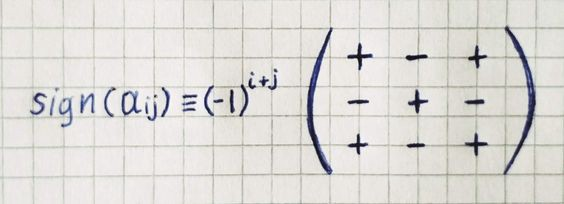

One of the main reasons that linear algebra is more broadly applicable, and required just about any technical discipline is that it solves certain systems of equations.


The typical way to organize this sort of special equations is to gather all the variables on the left and put any lingering constants on the right.


This is the **system of linear equations**. We are looking for a vector *x⃗ *which after applying the transformation lands on *v⃗*.

Determinant(covered in the [previous part](/blog/linear-algebra/transformation)) playing an important role in the system of linear equations. **if the determinant is non-zero**, there will always be one and only one vector that lands on *v⃗*, and we can find it by playing the transformation in reverse. To play transformation in reverse, we need to find the **inverse matrix** that undoes whatever A did.


The cumulative effect of multiplying by A and its inverse is equivalent to the **identity transformation** — a transformation that does nothing.

```js:title=inverse.js
const matrix = new Matrix(
  [0, -1],
  [1,  0]
)
const inverse = new Matrix(
  [ 0, 1],
  [-1, 0]
)
console.log(matrix.multiply(inverse))
// Matrix {
//   rows: [
//     [ 1, 0 ],
//     [ 0, 1 ]
//   ]
// }
```

**If the determinant is zero**, we cannot un-squish a line to turn it into a plane. The solution can still exist, but we have to be lucky enough that the vector *v⃗* lives somewhere on that line.

One of the most popular ways of solving a system of linear equations is the **Gauss-Jordan elimination** procedure that converts any matrix into its reduced row echelon form, from which we can easily find the solution (or solutions) of the system of equations. Maybe this algorithm will be covered in one of the next parts, but not now.

## Finding Inverse Matrix

A general formula for obtaining the inverse based on the **adjugate matrix**:


The adjugate matrix is kind of complicated, so let’s proceed step by step. We’ll first define a few prerequisite concepts.

For each entry *aᵢⱼ*, the **minor** *Mᵢⱼ* is the determinant of the matrix that remains after we remove the *i-th* row and the *j-th *column of a given matrix.

```js:title=rawminor.js
const withoutElementAtIndex = (arr, index) => [ ...arr.slice(0, index), ...arr.slice(index + 1) ]

class Matrix {
  // ...
  minor(i, j) {
    const newRows = withoutElementAtIndex(this.rows, i)
      .map(row => withoutElementAtIndex(row, j))
    
    const matrix = new Matrix(...newRows)
    return matrix.determinant()
  }
}

const matrix = new Matrix(
  [1, 2, 3],
  [4, 5, 6],
  [7, 8, 9]
)
console.log(matrix.minor(0, 1))
// -6
```

The **sign** of each entry *aᵢⱼ* is defined as:



The **cofactor** *cᵢⱼ *for the entry a*ᵢⱼ* is the product of this entry’s sign and its minor:

```js:title=cofactor.js
class Matrix {
  // ...
  cofactor(i, j) {
    const sign = Math.pow(-1, i + j)
    const minor = this.minor(i, j)
    return sign * minor
  }
}

const matrix = new Matrix(
  [1, 2, 3],
  [4, 5, 6],
  [7, 8, 9]
)
console.log(matrix.cofactor(0, 1))
// 6
```

Now we’re ready to describe the adjugate matrix. **The adjugate matrix is defined as the transpose of the matrix of cofactors *C***. The matrix of cofactors is a matrix of the same dimensions as the original matrix *A* that is constructed by replacing each entry a*ᵢⱼ* by its cofactor *cᵢⱼ*.

```js:title=adjugate.js
class Matrix {
  // ...
  map(func) {
    return new Matrix(
      ...this.rows.map((row, i) => row.map((element, j) => func(element, i, j)))
    )
  }
  adjugate() {
    return this
      .map((_, i, j) => this.cofactor(i, j))
      .transpose()
  }
}

const matrix = new Matrix(
  [1, 2, 0],
  [0, 1, 2],
  [2, 0, 1]
)
console.log(matrix.adjugate())
// Matrix {
//   rows: [
//     [ 1, -2, 4 ],
//     [ 4, 1, -2 ],
//     [ -2, 4, 1 ]
//   ]
// }
```

Finally, we are ready to implement a method that will return the inverse matrix by combining the methods we implemented earlier.

```js:title=inverse.js
class Matrix {
  // ...
  inverse() {
    const determinant = this.determinant()
    if (determinant === 0) {
      throw new Error("Determinant can't be  zero.")
    }
    const adjugate = this.adjugate()
    return adjugate.scaleBy(1 / determinant)
  }
}


const matrix = new Matrix(
  [2, 3, 1],
  [4, 7, 2],
  [3, 1, 1]
)
console.log(matrix.inverse())
// Matrix {
//   rows: [
//     [ -5, 2, 1 ],
//     [ -2, 1, 0 ],
//     [ 17, -7, -2 ]
//   ]
// }
```

We already have animated examples of linear transformations in the [linear-algebra-demo](https://rodionchachura.github.io/linear-algebra/) project, now we can make them more interesting by applying a transformation to the initial matrix, and when an animation is finished applying inverse one.

In the example below, we transform red cube to blue parallelepiped by using “shear right” transformation, and then by using its inverse — “shear left” we turn parallelepiped, to the cube.


We apply the same approach in the example below with “scale”/”shrink” transformations.


