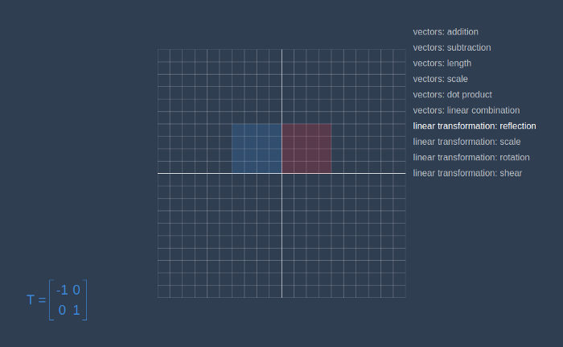

A **matrix** is a rectangular array of real numbers with *m* rows and *n* columns. For example, a *3×2* matrix looks like this:


Let’s go right to the code. The constructor of the *Matrix* class will receive rows as a parameter. We will access a particular element in the matrix by first taking row by row index and then element by column index.

```js:title=matrix.js
class Matrix {
  constructor(...rows) {
    this.rows = rows
  }
}

const matrix = new Matrix(
  [0, 1],
  [2, 3],
  [4, 5]
)
console.log(matrix)
// Matrix { rows: [ [ 0, 1 ], [ 2, 3 ], [ 4, 5 ] ] }
console.log(matrix.rows[1])
// [ 2, 3 ]
console.log(matrix.rows[1][1])
// 3
```

## Matrix-vector product

The **matrix-vector product** *Ax⃗* produces a linear combination of the columns of the matrix *A* with coefficients *x⃗*. For example, the product of a *3×2* matrix A and a *2D* vector *x⃗ *results in a *3D* vector, which we’ll denote *y⃗: y⃗=Ax⃗*


Consider some set of vectors *{e⃗₁, e⃗₂}*, and a third vector *y⃗* that is a **linear combination** of the vectors *e⃗₁* and *e⃗₂: y⃗=αe⃗₁ + βe⃗₂.* The numbers *α, β ∈ R* are the coefficients in this linear combination.

The matrix-vector product is defined expressly for the purpose of studying linear combinations. We can describe the above linear combination as the following matrix vector product: *y⃗=Ex⃗*. The matrix *E* has *e⃗₁* and *e⃗₂* as columns. The dimensions of the matrix will be *n×2*, where *n* is the dimension of the vectors *e⃗₁, e⃗₂* and *y⃗*.

In the picture below we can see vector *v⃗* represented as a linear combination of vectors* î* and ĵ.


```js:title=linear-combination
const i = new Vector(1, 0)
const j = new Vector(0, 1)
const firstCoeff = 2
const secondCoeff = 5
const linearCombination = i.scaleBy(firstCoeff).add(j.scaleBy(secondCoeff))
console.log(linearCombination)
// Vector { components: [ 2, 5 ] }
```

## Linear Transformation

The matrix-vector product corresponds to the abstract notion of a *linear transformation*, which is one of the key notions in the study of linear algebra. Multiplication by a matrix can be thought of as computing a linear transformation that takes n-dimensional vector as an input and produces m-dimensional vector as an output. We can say matrix is a certain transformation of vector in space.

It will become more clear on examples, but first, let’s add a method to Matrix class that will return columns of the matrix.

```js:title=columns.js
class Matrix {
  constructor(...rows) {
    this.rows = rows
  }
  columns() {
    return this.rows[0].map((_, i) => this.rows.map(r => r[i]))
  }
}

const matrix = new Matrix(
  [1, 2, 3],
  [4, 5, 6],
  [7, 8, 9]
)
console.log(matrix.columns())
// [ [ 1, 4, 7 ], [ 2, 5, 8 ], [ 3, 6, 9 ] ]
```

In the code sample below you can examples of different vector-matrix products. The dimension of the resulting vector will always be equal to the number of matrix rows. If we multiply a *2D* vector to a *3×2* matrix, we will receive a *3D* vector, and when we multiply a *3D* vector to a *2×3* matrix, we will receive a *2D* vector. If a number of columns in the matrix not equal to vector dimension, we throw an error.

```js:title=linear-transformation.js
const sum = arr => arr.reduce((acc, value) => acc + value, 0)

class Vector {
  // ...
  transform(matrix) {
    const columns = matrix.columns()
    if(columns.length !== this.components.length) {
      throw new Error('Matrix columns length should be equal to vector components length.')
    }

    const multiplied = columns
      .map((column, i) => column.map(c => c * this.components[i]))
    const newComponents = multiplied[0].map((_, i) => sum(multiplied.map(column => column[i])))
    return new Vector(...newComponents)
  }
}

const vector2D = new Vector(3, 5)
const vector3D = new Vector(3, 5, 2)
const matrix2x2D = new Matrix(
  [1, 2],
  [3, 4]
)
const matrix2x3D = new Matrix(
  [1, 2, 3],
  [4, 5, 6]
)
const matrix3x2D = new Matrix(
  [1, 2],
  [3, 4],
  [5, 6]
)

// 2D => 2D
console.log(vector2D.transform(matrix2x2D))
// Vector { components: [ 13, 29 ] }

// 3D => 2D
console.log(vector3D.transform(matrix2x3D))
// Vector { components: [ 19, 49 ] }

// 2D => 3D
console.log(vector2D.transform(matrix3x2D))
// Vector { components: [ 13, 29, 45 ] }
console.log(vector2D.transform(matrix2x3D))
// Error: Matrix columns length should be equal to vector components length.
```

## Examples

Now let’s try to move and change the two-dimensional object by using linear transformations. First, we will create a new class — *Contour* that will receive a list of vectors in the constructor and for now, will have only one method — *transform*, that will transform all coordinates of the contour and will return a new one.

```js:title=contour.js
class Contour {
  constructor(vectors) {
    this.vectors = vectors
  }

  transform(matrix) {
    const newVectors = this.vectors.map(v => v.transform(matrix))
    return new Contour(newVectors)
  }
}

const contour = new Contour([
  new Vector(0, 0),
  new Vector(0, 4),
  new Vector(4, 4),
  new Vector(4, 0)
])
```

Now, let’s go to the [linear-algebra-demo](https://rodionchachura.github.io/linear-algebra/) project and try out different transformation matrices. Red square is an initial contour, and the blue one is a result of applying the transformation.




This way we can make a matrix that will rotate a given vector on a certain angle.

```js:title=rotation.js
const angle = toRadians(45)

const matrix = new Matrix(
  [Math.cos(angle), -Math.sin(angle)],
  [Math.sin(angle), Math.cos(angle)]
)
```


Transformation works the same way for objects in 3D space, below you can see the animated transformation from the red cube, to blue parallelepiped.


