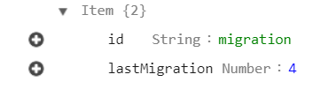

When you work with frameworks such as ASP.NET or Django, ORM (Entity Framework, Django ORM) magically creates migration, and with DynamoDB, it may seem strange that you need to write migrations by yourself. But it is the price of using NoSQL and rejecting ORMs, but don't worry, managing migrations by yourself isn't that scary.

## Current State

Before we jump into migrations, I want to show you how we know the current state of tables. 

`gist:8af50436e57df5071baab85ec073e774`

The function that turns the table name and primary key into parameters for DynamoDB comes from this [tiny library](https://github.com/RodionChachura/awsdynamoutils) with common utils.

## Create and Delete Tables

First, we want to delete tables we don't need anymore and create new ones. To do this, we compare the existing DynamoDB tables' names with our tables parameters. If there is a mismatch, we execute appropriate operations to delete and create tables accordingly to the current state.

`gist:0f86b729b448b6312708aac1d6eff1a6#prepareDB1.js`

## Running Migrations

To know which migration was executed last time, we have the table with migration information. It looks like this:

All our migrations are simply an array of asynchronous functions that perform operations on tables items.

`gist:ba371a44a92c91f77159b20361d101bc`

To run these migrations, we take the index of the last executed one and run all migrations, starting from the index. If there was no migration item in the management table, it means that tables are empty, and there is no need to run migrations.

`gist:562d565dd5deab10b7441fadc73f5bb5`

Finally, we will have a script for database preparation. We can run it automatically in our CI/CD pipeline before deploying the new version of the back-end.

`gist:f7844131660c31029ee5594a1f6e0130`

It is a simple implementation of migrations mechanism :) If you would like to know about any other topic related to this, please let me know!
