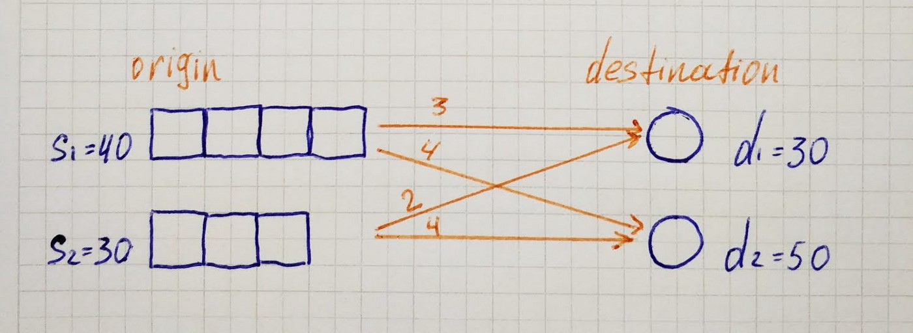
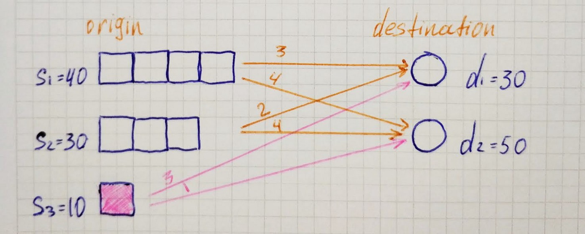
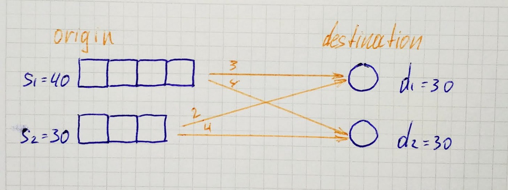
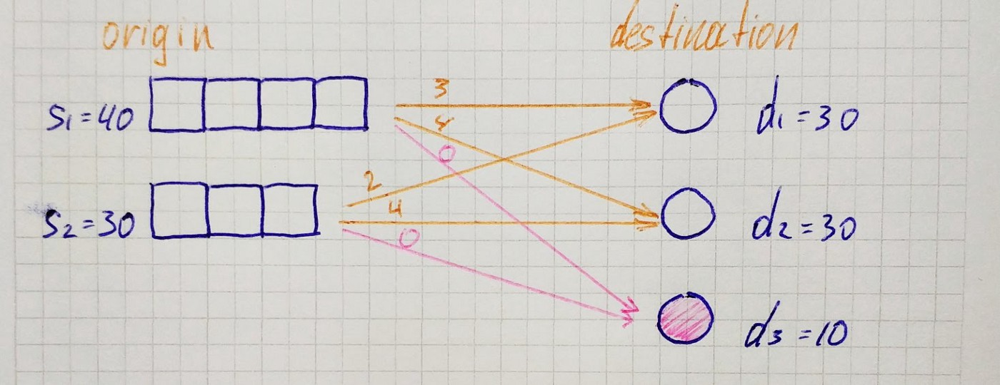

## Introduction

Transportation Simplex Method works with a **balanced transportation problem**. Therefore we need to learn how to make problem balanced if it is not such. And it means to cover two cases — when supply is less than demand and otherwise.

## Supply Less Than Demand

Here we can see that supply is less than demand. In such a case, we add a fake origin *(d₃=10)* so that supply became equal to demand. Values *c₃₁*, *c₃₂* represent financial loss related to unmet demand.

## Demand Less Than Supply

Here we can see that demand is less than supply. In such a case we add a fake destination *(s₃ = 1)* so that supply became equal to demand. for unused capacity there no cost involved therefor values *c₁₃* and *c₂₃* are equal to *0*.

## Programming

Let’s write a simple function that receives a transportation problem and returns its balanced version. When supply less than demand we also need to pass penalties(financial losses related to unmet demands).

`gist:c23449623eca290677c2273a5e1d890e`
