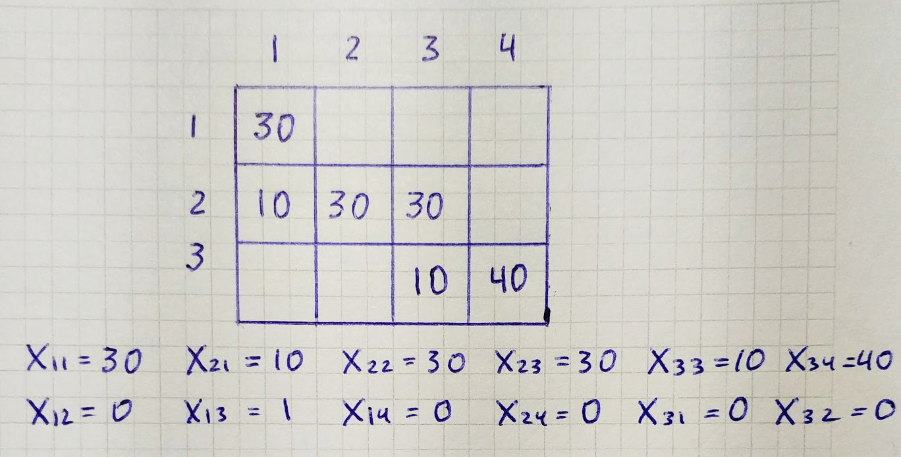

## Introduction

In Simplex Method we were introducing slack variables to have an initial basic feasible solution, but in transportation problems, we can use one to find it:

* **North West Corner Rule**

* Row Minima Method

* Column Minima Method

* Least Cost Method or Matrix Minima Method

* Vogel’s Approximation Method

## North West Corner Rule

In this part, we will look at the **North West Corner Rule to find an initial basic feasible solution**. It has three steps:

1. Find the north west corner cell of the transportation tableau. Allocate as much as possible to the selected cell, and adjust the associated amounts of supply and demand by subtracting the allocated amount.

1. Cross out the row or column with *0* supply or demand. If both a row and a column have a *0*, cross out randomly row or column.

1. If one cell is left uncrossed, cross out the cell and stop. Otherwise, go to step *1*.

## Example

We start with an empty matrix with demands at the bottom and supplies at the right.

We take the north west corner cell, and its value becomes a minimum of *d₁* and s*₁*. Since *s₁* less than *d₁*, we cross out the first row.

In the following iterations, we are doing the same steps.

We end up with such table and basic feasible solution.

## Programming

We write a function that receives supply and demand. At the start, we copy arguments, since function update supply and demand on each iteration, then we make *i* and *j* equal to zero. On each iteration, we add one to *i* or *j* and put a new variable in the resulting list. When we crossed all rows and columns, we return basic variables in the form of a tuple containing position and value.

`gist:6a1b88c8c0da1c2a61bc0696d0ad9714`
