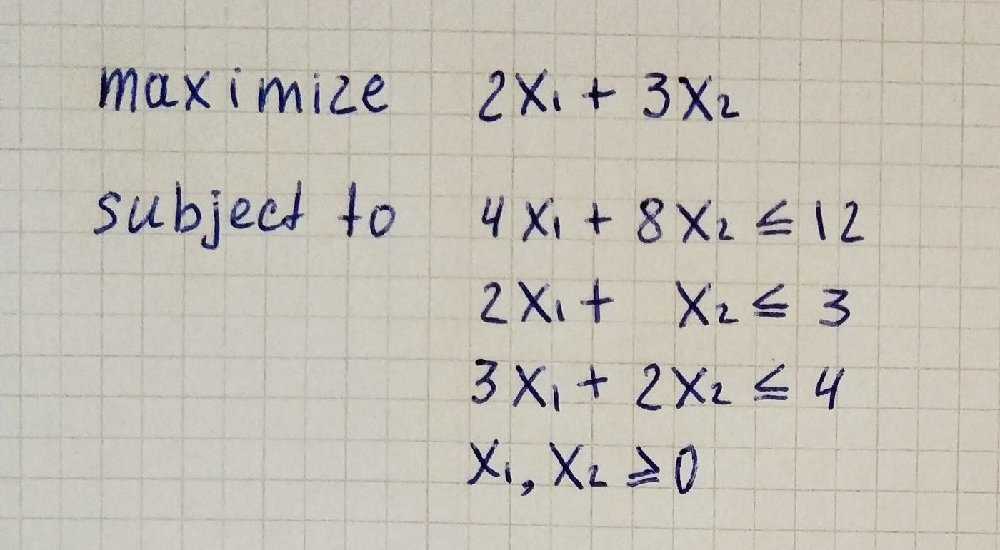
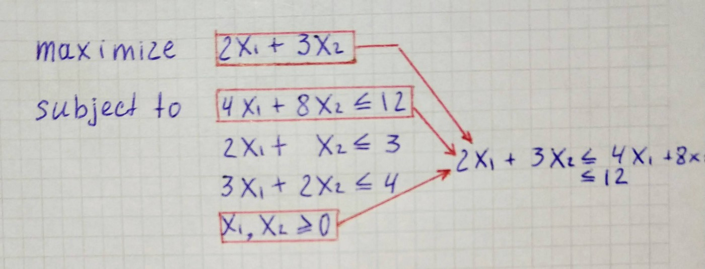
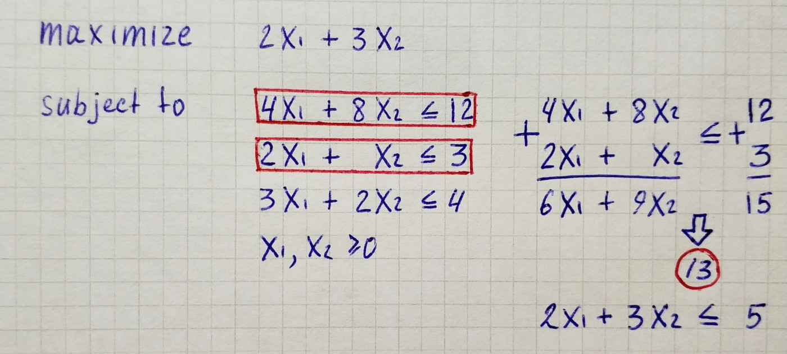
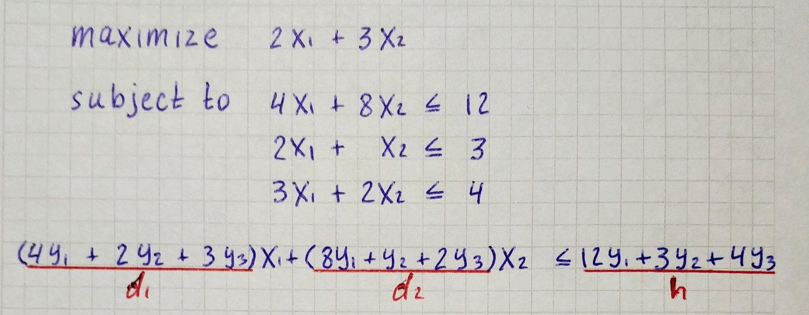
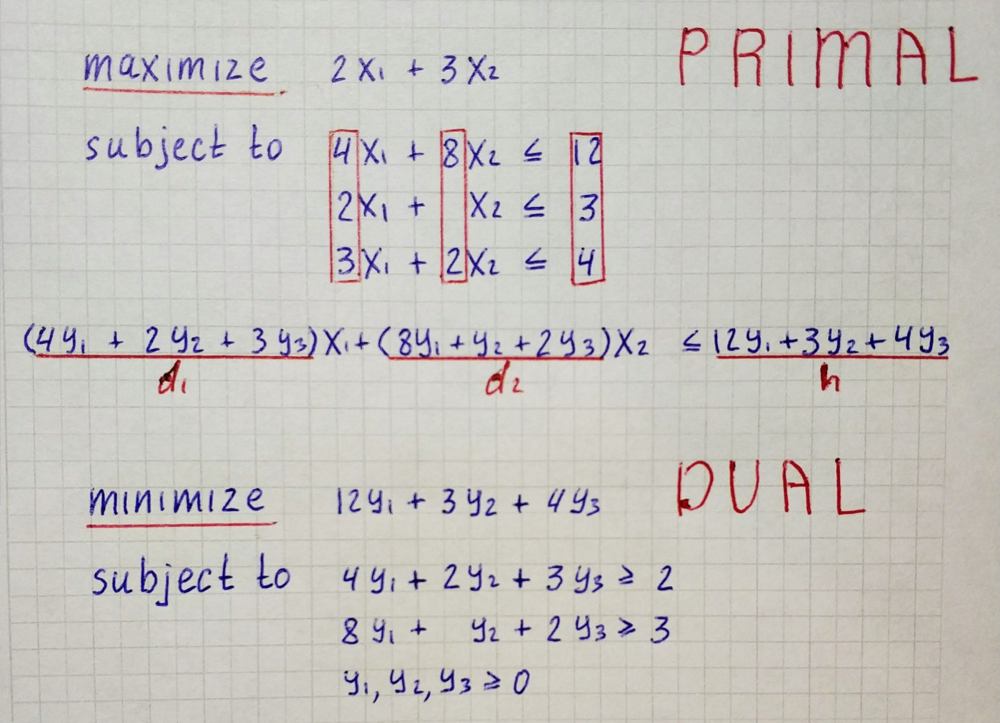
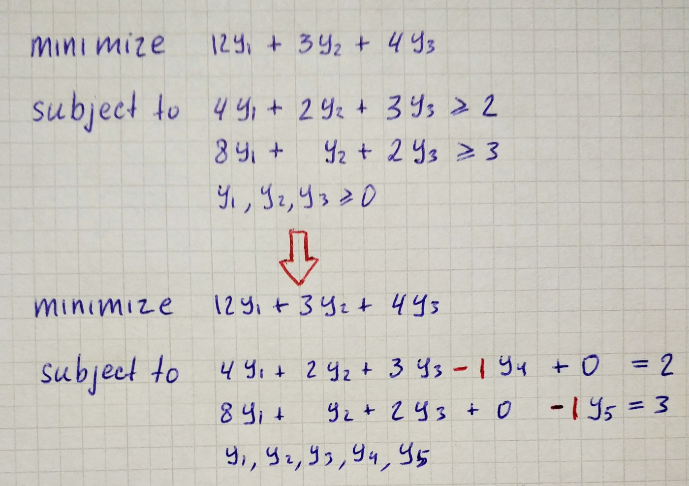
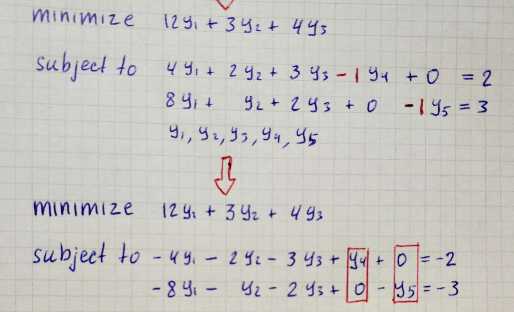
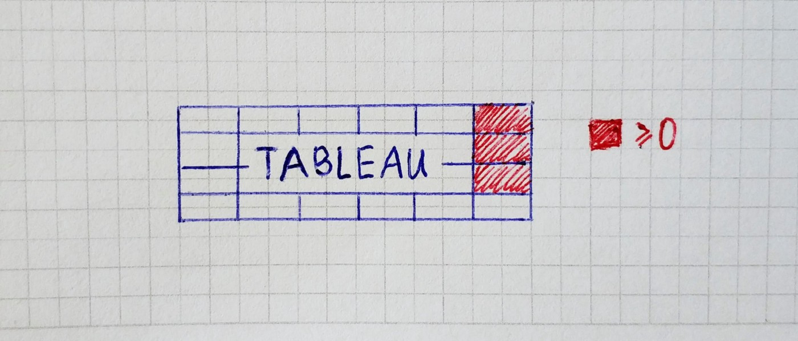
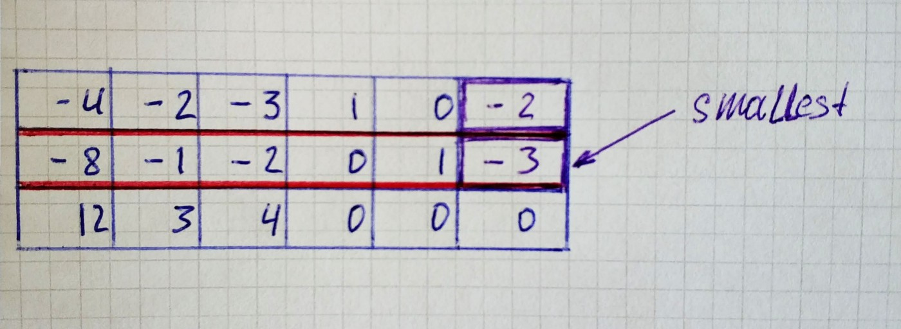
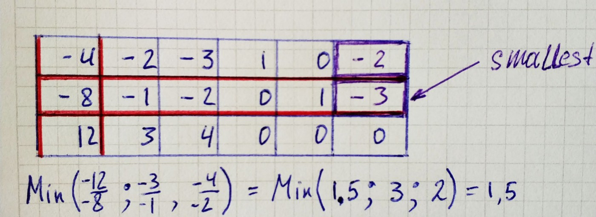

## Introduction

In the previous parts, we covered the simplex method for solving linear programs, and this is not the only algorithm out there. Tens of different algorithms have been suggested for linear programming over the years, for example, the *ellipsoid method*, and the entire group of *interior point methods*.

Several other algorithms, closely related to the simplex method, are used for linear programming as well. In this part, we will cover the **dual simplex method**. It can roughly be described as the simplex method applied to the dual linear program. But before we dive into the dual simplex method, we should understand what the dual linear program is.

## Dual Linear Program

Let us consider the linear program.



Right from the start, we can see the maximum of the objective function is not larger than *12*.



An even better upper bound if we first divide the first inequality by two.

```
2x₁ + 3x₂ ≤ 2x₁ + 4x₂ ≤ 6
```

An even better upper bound result if we add the first two inequalities together and divide by three, which leads to the inequality below, and hence the objective function cannot be larger than *5*.



Basically, from the constraints, we are trying to derive an inequality of the form:

```
d₁x₁ + d₂x₂ ≤ h
where d₁ ≥ 2, d₂ ≥ 3, h as small as possible.
```

Then we can claim that:

```
for all *x₁, x₂ ≥ 0 we have
2x₁ + 3x₂ ≤ d₁x₁ + d₂x₂ ≤ h
```

Therefore, *h* is an upper bound on the maximum of the objective function. We can derive such inequalities by combining the three inequalities in the linear program with some nonnegative coefficients *y₁, y₂, y₃*.



How do we choose the best coefficients *y₁, y₂, y₃*? By solving a linear program:



It is called the linear program dual to the linear program we started with. The **dual linear program** “guards” the original program from above, in the sense that every feasible solution *(y₁, y₂, y₃)* of the dual linear program provides an upper bound on the maximum of the objective function.

## Dual Simplex Method

Dual Simplex Algorithm structured the same way as the Simplex Method. We only need to update three places to turn a Simplex method into the Dual Simplex Method. We will make additional work upon arguments to make them suitable for the algorithm, then implement two custom for Dual Simplex Method functions: *can_be_improved* and *get_pivot_position*.

As in preparation for the Simplex Algorithm, we turn inequalities into equations by adding slack variables.



Here we can see that something not right. We can’t pass such equations to the algorithm since our basic variables have negative coefficients in respective rows. To fix this, we multiply both sides of the equations by *-1*.



The Simplex algorithm that we’ve made in the previous part receives three arguments, and we can already declare them.

```py
c = [12, 3, 4, 0, 0]
A = [
    [-4, -2, -3,  1,  0],
    [-8, -1, -2,  0,  1]
]
b = [-2, -3]
```

Next thing that differs from the original algorithm is the *can_be_improved* function. In the Dual Simplex method, we stop if all entries on the right-hand side are nonnegative.



```py
def can_be_improved_for_dual(tableau):
    rhs_entries = [row[-1] for row in tableau[:-1]]
    return any([entry < 0 for entry in rhs_entries])
```

To find a pivot position, we search fort he smallest value on the right-hand side.



To determine the column we grab the elements in the selected row that are strictly less than zero. Then we go over each corresponding element in the last row and find the minimum between it and the element from the raw we selected.



```py
def can_be_improved_for_dual(tableau):
    rhs_entries = [row[-1] for row in tableau[:-1]]
    return any([entry < 0 for entry in rhs_entries])
```

We are ready to put everything together and run the algorithm for our linear program.

`gist:41bdbaa8d15473216e9bb94eeceecdb9`

## Duality Theorem of Linear Programming

```
For the linear programs
Maximize cᵀx subject to Ax ≤ b and x≥0      (P)
and
Minimize bᵀy subject to Aᵀy ≥ c and y ≥ 0   (D)
```

exactly one of the following possibilities occurs:

1. Nether *(P)* nor *(D)* has a feasible solution.

1. *(P)* is unbounded and *(D)* has no feasible solution.

1. *(P)* has no feasible solution and *(D)* is unbounded.

1. Both *(P)* and *(D)* have a feasible solution. Then both have an optimal solution, and if *x* is an optimal solution of *(P)* and *y* is an optimal solution of *(D)*, then *cᵀx* = *bᵀy*

That is, **the maximum of (P) equals the minimum of (D).**

And we can see this by running the Simplex Algorithm for the primal linear program and Dual Simplex Algorithm for dual to primal one.

`gist:52aa64b20d51f7b8755961c847e8b683`
