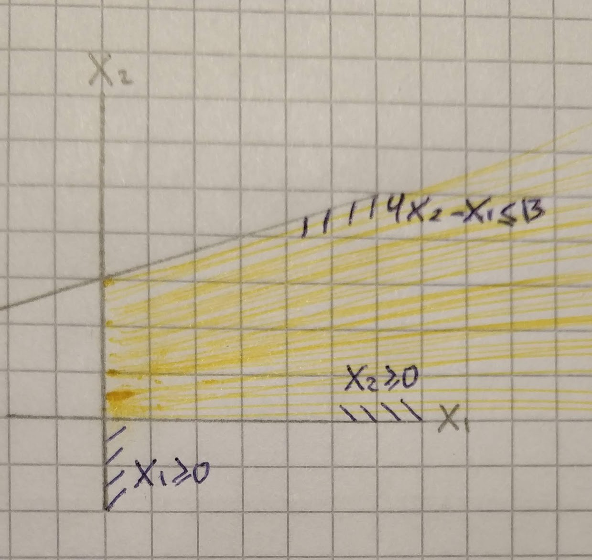

Linear programming applied for planning all kinds of economic activities, such as transport of material and product, sowing plants or optimizing the electric power system design. It also frequently appears in computer science, for example — packing problems or applications of network flows.

## A Linear Program

Let’s start with a simple linear programming problem.

```
Maximize the value x₁ + x₂ among all vector (x₁, x₂) ∈ R²,
satisfying the constraints:
  x₁ ≥ 0
  x₂ ≥ 0
  4x₂ - x₁ ≤ 13
  x₂ + 2x₁ ≤ 10
```

By drawing the set of all vectors satisfying constraints, we will obtain convex polygon.


In the linear program, we want to find a vector *x ⃰∈ R*ⁿ maximizing(or minimizing) the value of given linear function among all vectors *x ∈ R*ⁿ. In our example, vector *(3, 4)* will give the best result.

## Basic Concepts

The linear function to be maximized, or sometimes minimized, is called the **objective function**. it has the form *cᵀx=c₁x₁+…+cₙxₙ,* where c*∈ R*ⁿ is a given vector.

The linear equations and inequalities in the linear program are called the **constraints**. It is customary to denote the number of constraints by *m*.

A linear program is often written using matrices and vectors, in a way similar to the notation *Ax = b* for a system of linear equations in linear algebra. To make such a notation simpler, we can replace each equation in the linear program by two opposite inequalities. The direction of the inequalities can be reversed by changing the signs and thus we can assume that all inequality signs are “*≤”*, say, with all variables appearing on the left-hand side. Finally, minimizing an objective function *cᵀx *is equivalent to maximizing *-cᵀx*, and hence we can always pass to a maximization problem. After such modifications each linear program can be expressed as follows:

```
Maximize the value of cᵀx among all vectors x ∈ R*ⁿ satisfying Ax *≤ b,
w*here A is a given m×n real matrix and c∈ Rⁿ, b∈ Rⁿ are given vectors.
```

Any vector *x ∈ R*ⁿ satisfying all constraints for a given linear program is a **feasible solution.**

Each *x ⃰∈ Rⁿ* that gives the maximum possible value of *cᵀx *among all feasible **x** is called an **optimal solution**(optimum).

A program that has no feasible solution, and hence no optimal solution either called **infeasible**.


An optimal solution need not exist even when there are feasible solutions. This happens when the objective function can attain arbitrary large values (such a linear program is called **unbounded**).



## Programming

In this course, we will use Python and Jupiter Notebook/Jupiter Lab to try things out.

Since we will show linear programs geometrically in the next parts, we better create a function that will render convex polygon from given inequalities. This function will receive inequalities, point contained in polygon and bounds.

`gist:e0c6c236e051d515b392b7fd60317136`

We will improve this function in the next parts since now we can use it only after we draw inequalities manually on a piece of paper. As soon as we learn how to solve linear equations, we will be able to render polygon without providing a *feasible point*.
