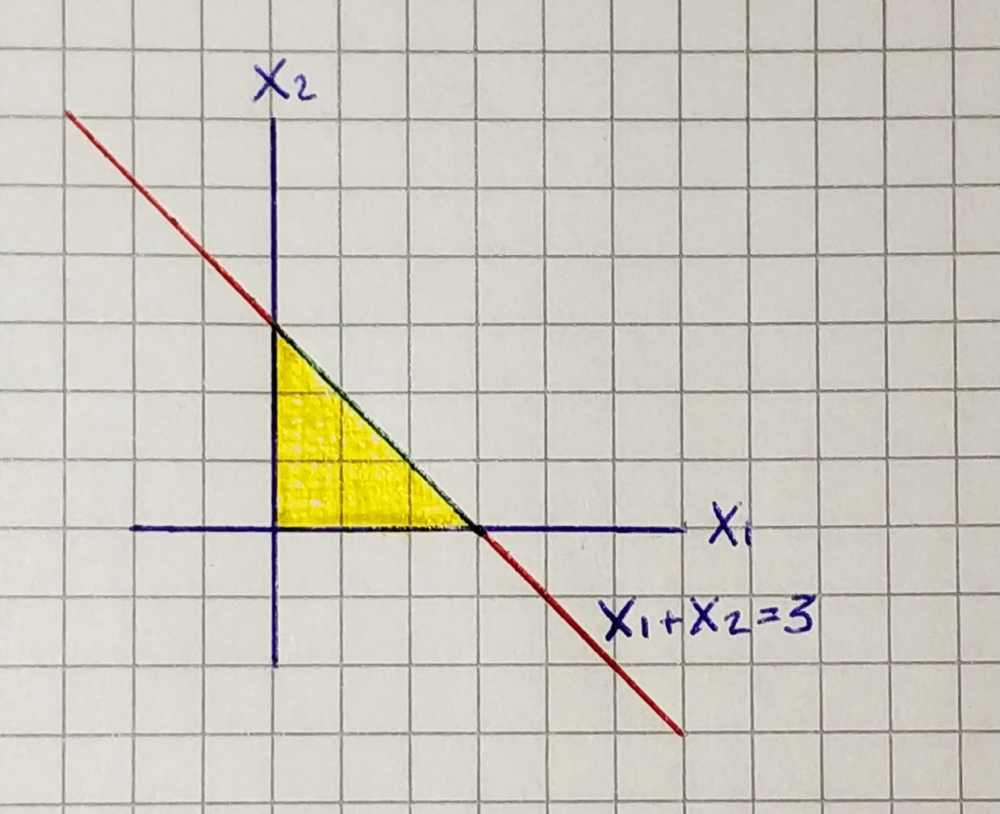
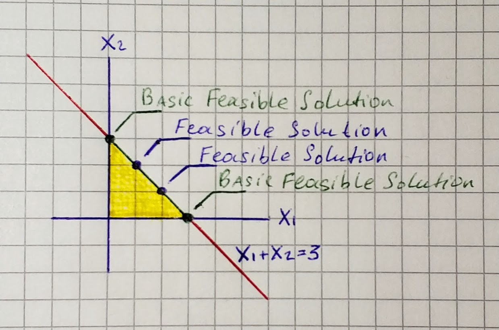
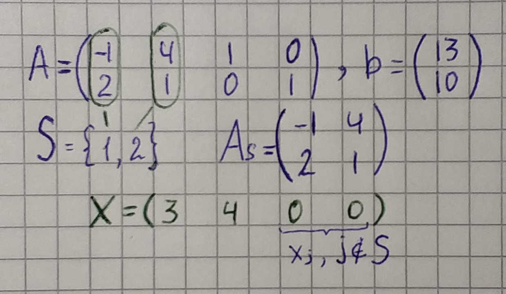

Before we go to the simplex method, we need to learn how to represent the linear program in an **equational form **and** **what are **basic feasible solutions**.

## Equational Form

The simplex method requires an equational form of linear program representation. It looks like this:

```
Maximize cᵀx subject to Ax=b, x≥0
```

*x* is the vector of variables, *A* is a given *m×n* matrix, *c∈ Rⁿ*, *b∈ Rᵐ* are given vectors, and *0* is the zero vector, in this case with *n* components. All variables in the equational form have to satisfy the nonnegativity constraints.

## Transform to equational form

Let’s grab the linear program from the previous part and represent it in equational form.

```
Maximize the value x₁ + x₂ among all vector (x₁, x₂) ∈ R², satisfying the constraints:
  x₁ ≥ 0
  x₂ ≥ 0
  4x₂ - x₁ ≤ 13
  x₂ + 2x₁ ≤ 10
```

1. In order to convert the inequality *4x₂ -x₁ ≤ 13* we introduce a new variable x₃, together with the nonnegativity constraint x₃ *≥ 0, *and we replace the considered inequality by the equation* -x₁ + 4x₂ + x₃ = 13*. The additional variable(**slack variable**) *x₃*, which won’t appear anywhere else in the transformed linear program, represents the difference between the right-hand side and the left-hand side of the inequality.

1. We need to do the same with *x₂ + 2x₁≤ 10*. We introduce a new slack variable x₃, together with the nonnegativity constraint *x₄ ≥ 0*. As a result, we have this equation *2x₁ + x₂ + x₄ = 10*.

1. The resulting equational form of our linear program looks this way:
```
Maximize x₁ + x₂ subject to
  -x₁ + 4x₂ + x₃ = 13
  2x₁ +x₂ + x₄ = 10
  x₁ ≥ 0, x₂ ≥ 0, x₃ ≥ 0, x₄ ≥ 0
```

### Geometry

As is derived in linear algebra, the set of all solutions of the system *Ax = b* is an affine subspace *F* of the space *Rⁿ*. Hence the set of all feasible solutions of the linear program is the intersection of *F* with the nonnegative orthant, which is the set of all points in *Rⁿ* with all coordinates nonnegative.

### 2D

Let’s come back to the previous example. We have two equations that describe lines. In such case after solving system, we will obtain the only solution — point.

`gist:9a5cedd15df5e96d3dbe4e77faf7138b`

Let’s take a look at another example.

```
Maximize x₁ + x₂ subject to
  x₁ + x₂ = 3
  x₁ ≥ 0, x₂ ≥ 0
```



In this linear program we have only one equation and therefore the set of all solutions — line(red) and the set of all feasible solutions — segment(green).

### 3D

If we have *n=3* variables and *m=1* equation, for example *x₁ + x₂ + x₃ = 3* we will have this picture:

`gist:9a02f7522cea159204aa0681e8737ca0`

The set of all possible solutions of *Ax = b* in this example is a plane. If we apply nonnegativity rule(*x₁ ≥ 0, x₂ ≥ 0, *x₃ *≥ 0)*, we will obtain the set of all feasible solutions(orange triangle).

With an understanding of what is the equational form, we can state the requirements for a linear program.

```
We will consider only linear program in equational form such that
1. The system of equations Ax=b has at least one solution.
2. The rows of the matrix A are linearly independent.
```

If the system *Ax = b* has no solution linear program has no feasible solution either. If some row of A is a linear combination of the other rows, then the corresponding equation is redundant and it can be deleted from the system without changing the set of equations.

## Basic Feasible Solutions

Among all feasible solutions of a linear program, a privileged status is granted to basic feasible solutions. Expressed geometrically a basic feasible solution is a tip (corner, spike) of the set of feasible solutions.



```
A basic feasible solution of the linear program
    maximize cᵀx subject to Ax=b, x≥0
is a feasible solution x∈ Rⁿ for which there exists an m-element set S *⊆ {1, 2, . . . , n} such that
1. The (square) matrix Aₛ is nonsingular, i.e., the columns indexed by B are linearly independent.
2. xⱼ=0 for all J ∉ S.
```



If such a *S* is fixed, we call the variables *xⱼ* with* j ∈ S* the **basic variables**, while the remaining variables are called **nonbasic**.
