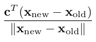

In the previous part we implemented and tested the simplex method on a simple example, and it has executed without any problems. But in some linear programs, we can face troubles.

## Unboundedness

In the [first part](/blog/operations/linearintro), we have seen an example of the unbounded linear program. What will happen if we apply the simplex algorithm for it?

```py
c = [1, 1, 0]
A = [
    [-1, 4, 1]
]
b = [13]
simplex(c, A, b)
```

It will go forever since the *can_be_imroved* function will always return *True*. To make our algorithm more robust, we will detect unboundedness and throw the error. To do this, we need to go to the *get_pivot_position* function and check if all elements in restrictions are infinity.

```py
import math

def get_pivot_position(tableau):
    z = tableau[-1]
    column = next(i for i, x in enumerate(z[:-1]) if x > 0)
    
    restrictions = []
    for eq in tableau[:-1]:
        el = eq[column]
        restrictions.append(math.inf if el <= 0 else eq[-1] / el)
        
    if (all([r == math.inf for r in restrictions])):
        raise Exception("Linear program is unbounded.")

    row = restrictions.index(min(restrictions))
    return row, column
```

Now if we run the simplex method for this linear program, we will receive this result.

```py
c = [1, 1, 0]
A = [
    [-1, 4, 1]
]
b = [13]
try: 
    simplex(c, A, b)
except Exception as e:
    print(e)
#  Linear program is unbounded.
```

## Degeneracy

Degeneracy happens when the equations in a tableau do not permit any increment of the selected nonbasic variable, and it may actually be impossible to increase the objective function *z* in a single pivot step.

To see if there was a moment of degeneracy in our program we will render a chart showing how objective function value changed on each step. Let’s test it on an example from the previous part.

`gist:491f8d6afc73cfcf21dffaa7cdd1d8eb`

On this example, we can see that the program had two iterations and on each one objective function value increased. Now let’s run the simplex method for another program.

`gist:ded4eb1f9a7b74e1fbd405453062ee39`

On this example, we can see that on first iteration objective function value made no gains. In general, there might be longer runs of degenerate pivot steps. It may even happen that some tableau is repeated in a sequence of degenerate pivot steps. It may even happen that some tableau is repeated in a sequence of degenerate pivot steps, and so the algorithm might pass through an infinite sequence of tableau without any progress. This phenomenon is called **cycling**.

## Pivot Rules

A pivot rule is a rule for selecting the entering variable if there are several possibilities, which is usually the case(in our algorithm *get_pivot_position* determine this element).

The number of pivot steps needed for solving a linear program depends substantially on the pivot rule. The problem is, of course, that we do not know in advance which choices will be good in the long run. Let’s list some of the common pivot rules:

* **Largest coefficient.** Choose an improving variable with the largest coefficient in the row of the objective function *z*.

* **Largest increase.** Choose an improving variable that leads to the largest absolute improvement in *z*.

* **Steepest edge.** This rule is a champion among pivot rules in practice. Choose and improving variable whose entering into the basis moves the current basic feasible solution in a direction closest to the direction of the vector *c*. Written by a formula, the ratio should be maximized.



* **Bland’s rule.** Choose the improving variable with the smallest index, and if there are several possibilities for the leaving variable, also take the one with the smallest index.

* **Random edge.** Select the entering variable uniformly at random among all improving variables. Randomized rules are also very important theoretically since they lead to the current best provable bounds for the number of pivot steps of the simplex method.

## Cycling

It may happen that for some linear programs the simplex method cycles and theoretically, this is the only possibility of how it may fail. Such a situation is encountered very rarely in practice, if at all, and thus may implementations simply ignore the possibility of cycling. There are several ways that probably avoid cycling. One of them is the already mentioned Bland’s rule, but it is one of the slowest pivot rules and it is almost never used in practice.
