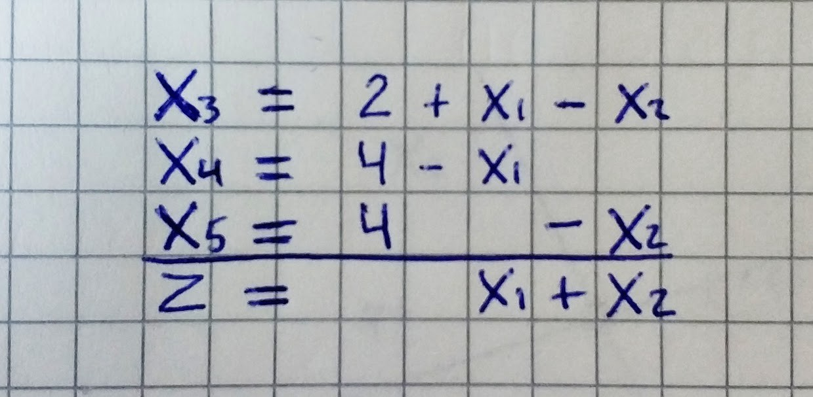
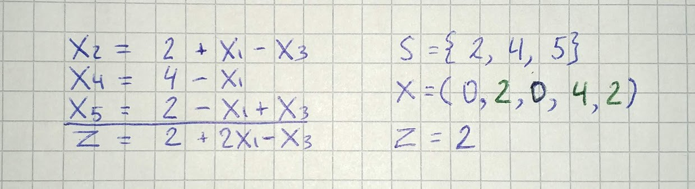
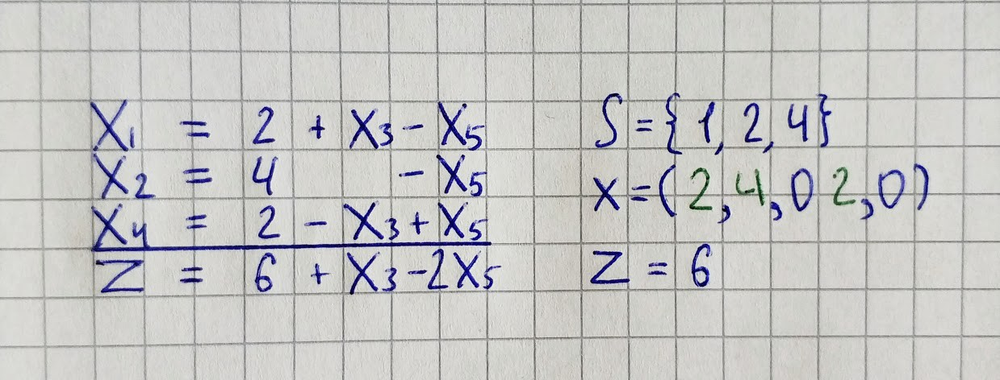
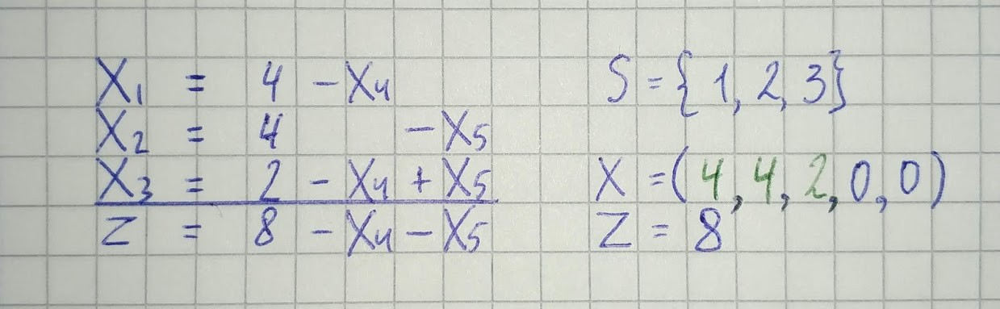
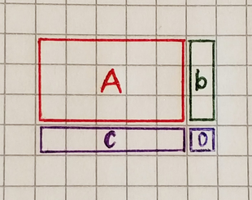
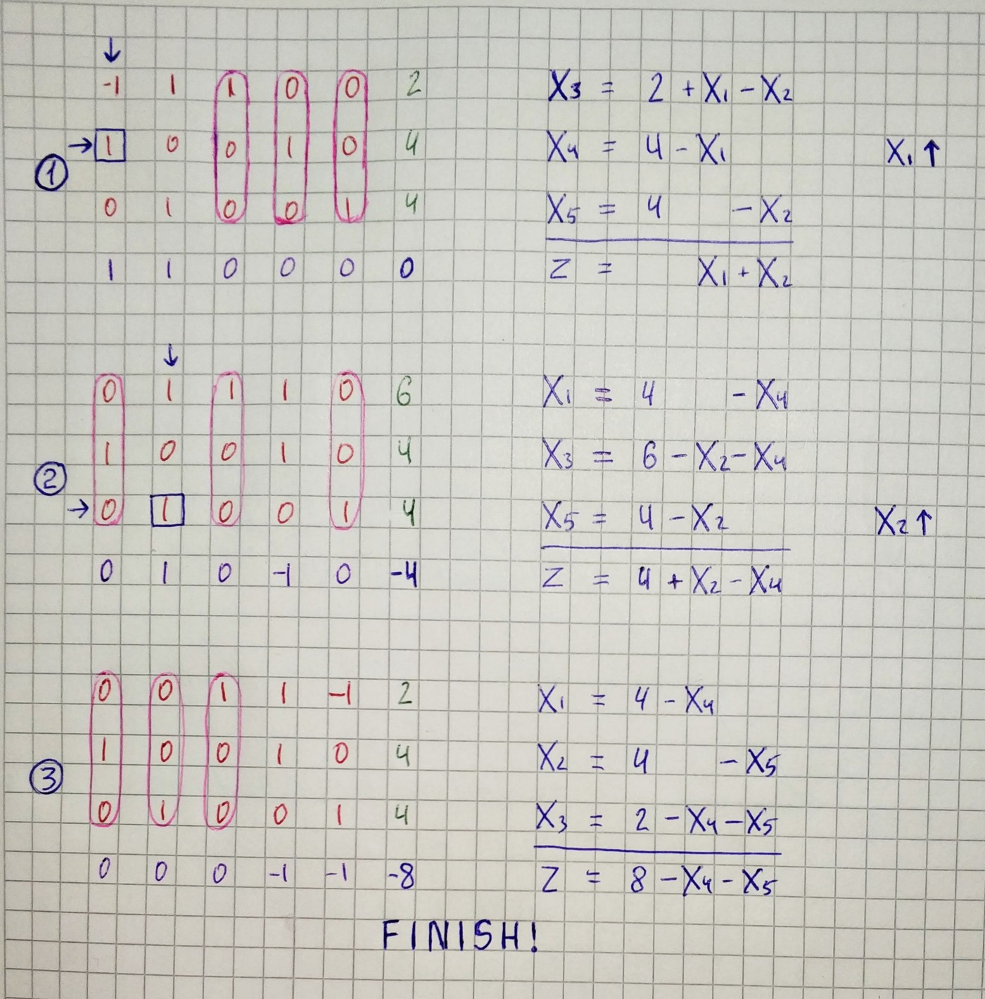

## Introduction

Let’s start by trying the simplex method on a small example.

```
Maximize x₁ + x₂ subject to
x₁ ≥ 0
x₂ ≥ 0
-x₁ + x₂ ≤ 2
x₁ ≤ 4
x₂ ≤ 4
```

`gist:79ae6bec7d70d1b1b35a3c46ac47e639`

As we know from the [previous part](/blog/operations/preparation) we need to represent a linear program in an equational form for the simplex method.

```
Maximize x₁ + x₂ subject to
 -x₁ + x₂ + x₃           = 2
  x₁           + x₄      = 4
       x₂           + x₅ = 4
x₁, x₂, ..., x₅ ≥ 0
```

From an equational form, we express each linear program in the form of a simplex tableau.



The first three rows consist of the equations of the linear program, in which the slack variables have been carried over to the left-hand side and the remaining terms are on the right-hand side. The last row, separated by a line, contains a new variable *z*, which expresses the objective function.

Each simplex tableau is associated with a certain basic feasible solution. In our case we substitute 0 for the variables *x₁* and *x₂* from the right-hand side, and without calculation we see that *x₃ = 2, x₄ = 4, x₅ = 4*. This feasible solution is indeed basic with S= {3, 4, 5}. The variables *x₃, x₄, x₅* from the left-hand side are basic and the variables *x₁, x₂* from the right-hand side are nonbasic. The value of the objective function z = 0 corresponding to this basic feasible solution can be read off from the last row of the tableau.

From the initial simplex tableau we will construct a sequence of tableaus of a similar form, by gradually rewriting them according to the certain rules. Each tableau will contain the same information about the linear program, only written differently. The procedure terminates with a tableau that represents the information so that the desired optimal solution can be read off directly.

Let us go to the next step. We try to increase the value of the objective
function by increasing one of the nonbasic variables *x₁* or *x₂*. Since we want to maintain feasibility, we have to be careful to let any of the basic variables go below zero. Let’s increase value of *x₂* from *0* to *2*. The most stringent restriction follows from the first equation, therefore we will express *x₂* through it *(x₂ = 2 + x₁ -x₃)*.



This process of rewriting one simplex tableau into another is called a **pivot step**. In each pivot step some nonbasic variable, in our case *x₂*, enters the basis, while some basic variable, in our case *x₃*, leaves the basis.

In the new tableau we can further increase the value of the objective function by increasing *x₁*, while increasing *x₃*, would lead to a smaller *z*-value. The maximum possible value for *x₁* is *2*. The most stringent restriction follows from the last equation *(x₁ = 2 + x₃ -x₅)*.



In the same fashion, we will make the next step.



We reached the moment where nonbasic values can’t be increased without making the objective function value smaller. That means we found an optimal solution.

## Programming

With a basic understanding of how the simplex algorithm works let’s write the first version of the algorithm.

We will pass to the algorithm linear program in equational representation that looks like this.

```py
c = [1, 1, 0, 0, 0]
A = [
    [-1, 1, 1, 0, 0],
    [ 1, 0, 0, 1, 0],
    [ 0, 1, 0, 0, 1]
]
b = [2, 4, 4]
```

The algorithm itself will consist of these steps:

1. Convert equational form to the tableau.

1. Until we reached the solution find pivot position and make pivot step.

1. Convert tableau to the solution of the linear program.

```py
def simplex(c, A, b):
    tableau = to_tableau(c, A, b)

    while can_be_improved(tableau):
        pivot_position = get_pivot_position(tableau)
        tableau = pivot_step(tableau, pivot_position)

    return get_solution(tableau)
```

Tableau in the algorithm will contain all the information about the linear program, therefore, it will look different from what we had on paper. We will use this function to convert the equational form to the tableau.

```py

def to_tableau(c, A, b):
    xb = [eq + [x] for eq, x in zip(A, b)]
    z = c + [0]
    return xb + [z]
```



In the next function, we check where nonbasic values can be increased without making the objective function value smaller.

```py
def can_be_improved(tableau):
    z = tableau[-1]
    return any(x > 0 for x in z[:-1])
```

If the value of an objective function can be improved we search for a pivot position.

```py
import math

def get_pivot_position(tableau):
    z = tableau[-1]
    column = next(i for i, x in enumerate(z[:-1]) if x > 0)
    
    restrictions = []
    for eq in tableau[:-1]:
        el = eq[column]
        restrictions.append(math.inf if el <= 0 else eq[-1] / el)

    row = restrictions.index(min(restrictions))
    return row, column
```

Next, we call function that will make pivot step and return new tableau.

```py
def pivot_step(tableau, pivot_position):
    new_tableau = [[] for eq in tableau]
    
    i, j = pivot_position
    pivot_value = tableau[i][j]
    new_tableau[i] = np.array(tableau[i]) / pivot_value
    
    for eq_i, eq in enumerate(tableau):
        if eq_i != i:
            multiplier = np.array(new_tableau[i]) * tableau[eq_i][j]
            new_tableau[eq_i] = np.array(tableau[eq_i]) - multiplier
   
    return new_tableau
```

This function may seem a little bit confusing so let’s take a piece of paper and look at how tableau will change on each iteration.



The final step in our algorithm is to extract the solution vector from the tableau. In the picture, we can see that columns where there is only one element equal to one and all other to zero have the same index as a basic variable in the right-hand tableau example.

```py
def is_basic(column):
    return sum(column) == 1 and len([c for c in column if c == 0]) == len(column) - 1

def get_solution(tableau):
    columns = np.array(tableau).T
    solutions = []
    for column in columns[:-1]:
        solution = 0
        if is_basic(column):
            one_index = column.tolist().index(1)
            solution = columns[-1][one_index]
        solutions.append(solution)
        
    return solutions
```

Now, let’s run the algorithm.

`gist:bf67adcc40fe5bbbcee0a8fd1c57f0c1`

In our example, we have a 2D linear program. So if we will save solution on each iteration, we will be able to draw arrows showing how algorithm reach a solution.

`gist:954faa91e5d0fcda19ddaa648561ce3e`