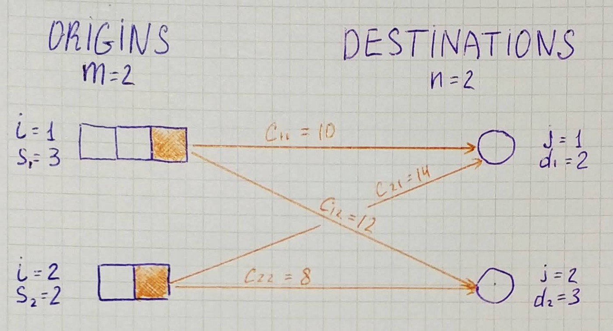
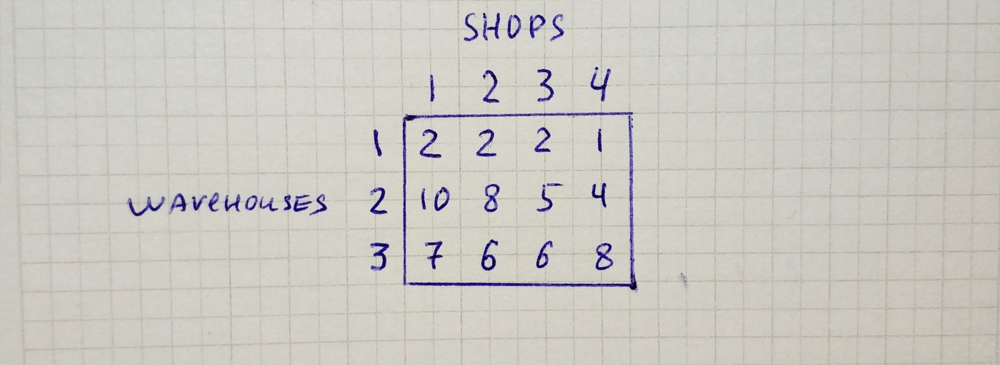
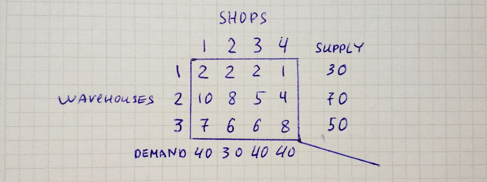
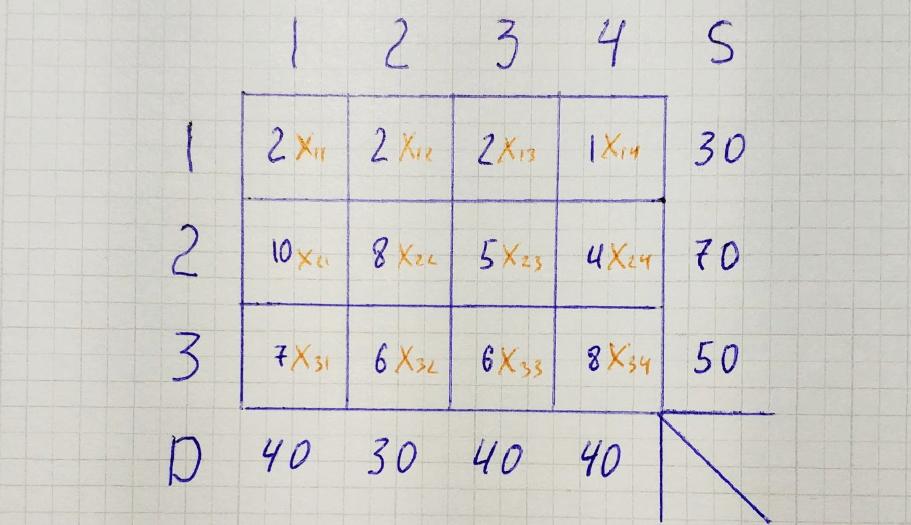
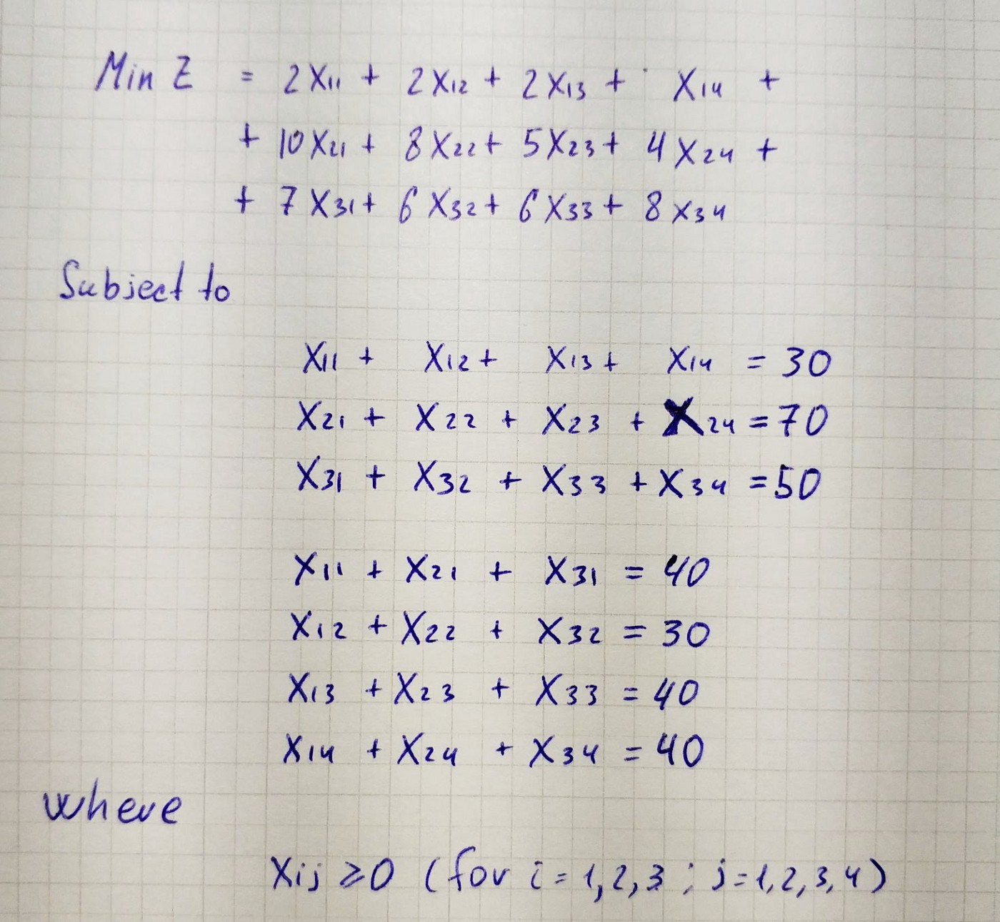
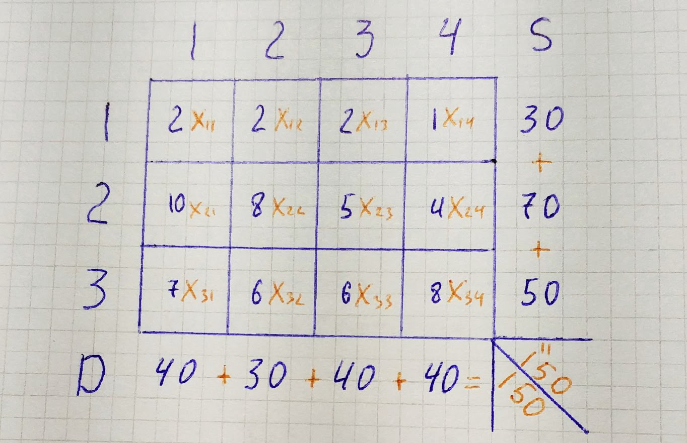
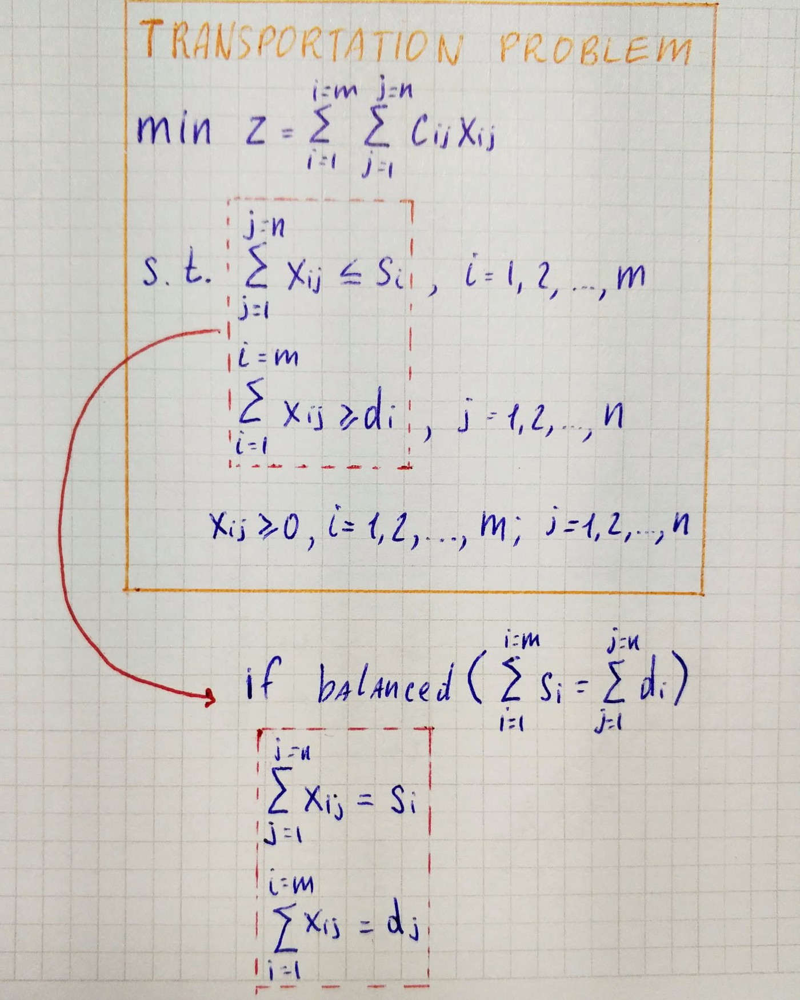
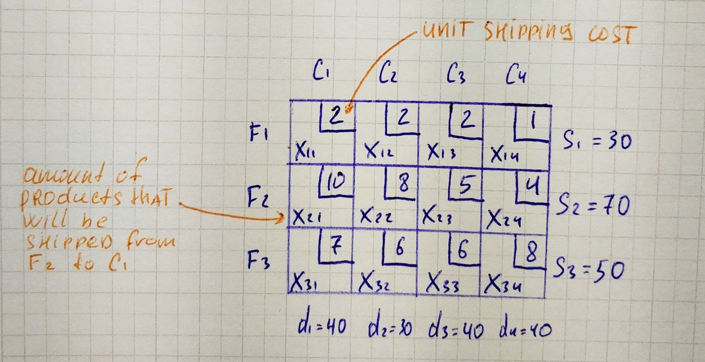

## Introduction

The term “transportation” is somewhat deceptive, it appears to be restricted only by transportation systems, but the case is different. In fact, many of the resource allocation problems arising in production systems can be treated as transportation problems. Typical examples are production scheduling and transportation scheduling.

## Transportation Problem

Consider *m* **origins** (production centers/warehouses) and *n* **destinations** (market places) in a transportation system.

The origin *i (i = 1, 2, …, m)* has *sᵢ (sᵢ > 0)* units of single product of **supply** available to be transported/shipped, whereas the destination *j (j = 1,2,…, n)* drrequires the **demands** *(dⱼ > 0) dⱼ* units of the same product.

Assume that the cost of transporting from the origin *i* to the destination *j* is directly proportional to the amount of units transported and the unit **transportation cost** from each origin to each destination *cᵢⱼ* is known and constant.

Then the model requires to determine the number of units for the product to be transported from origin *i* to destination *j*, for all *i* and *j*, so that the total transportation cost can be minimized subject to the supply and demand constraints.

Let *xᵢⱼ (xᵢⱼ ≥ 0)* denotes the number of units transported from the *i*th origin to the *j*th destination for all *i* and *j*. The relationship between the different elements of a transportation problem can be given in a tabular form.

Let’s take a look at an example. A company has *3* warehouses and *4* shops. The warehouses’ capacities are *30*, *70* and *50*. The market demands are *40*, *30*, *40* and *40*. The unit cost of shipping is given by the following table.

If we add demands at the bottom and supplies at the right we have a transportation model.

If we add to the table variables, it will look this way.

From the table above we can see that transportation problem can be formulated as a linear program.

In *subject to* we have equations rather than inequalities, and this is because our example is **balanced transportation problem** — the problem where the total supply equal to the total demand.

General formulation of the transportation problem and balanced transportation problem:

In a lot of resources, transportation problem also can be found in tableau form.

