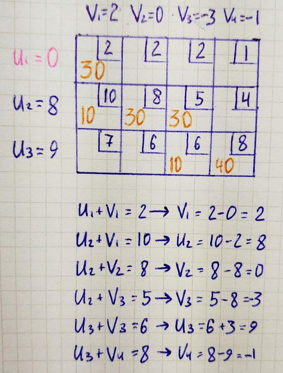
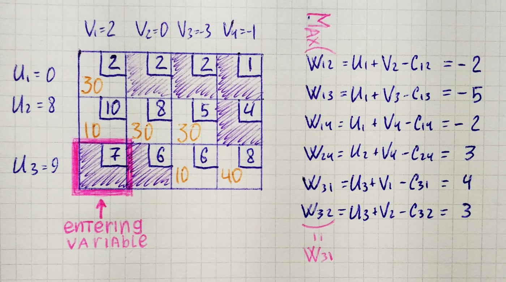
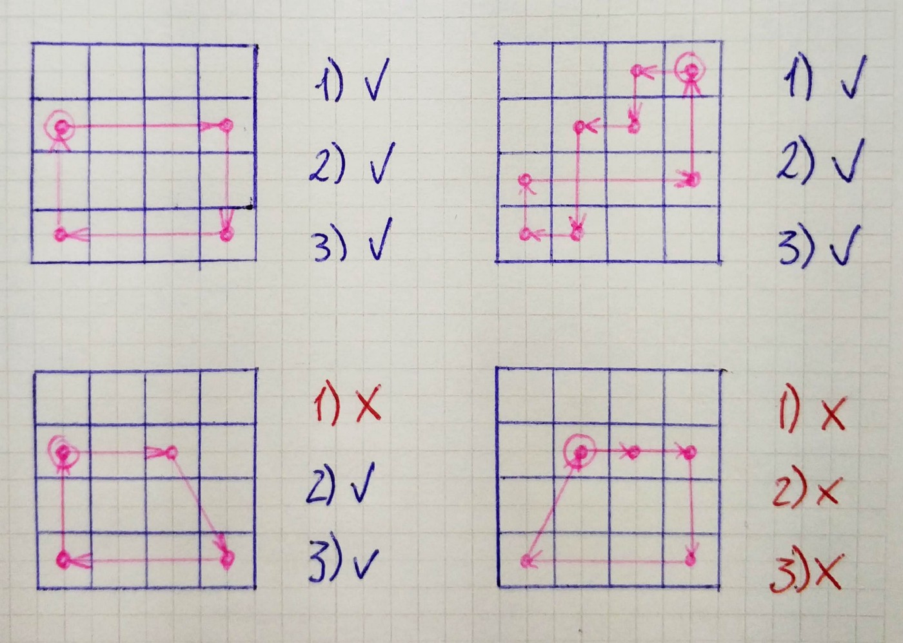
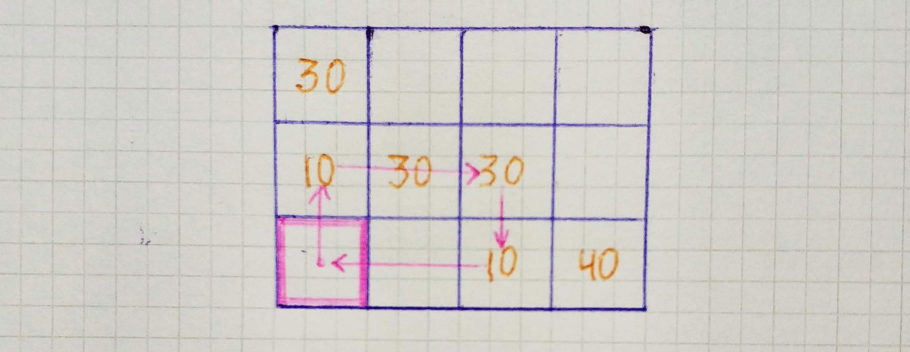
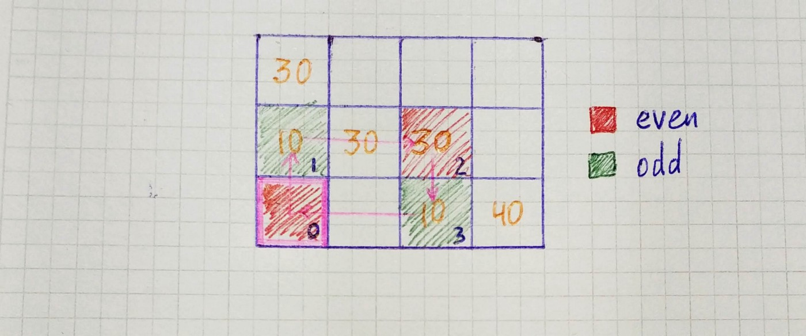
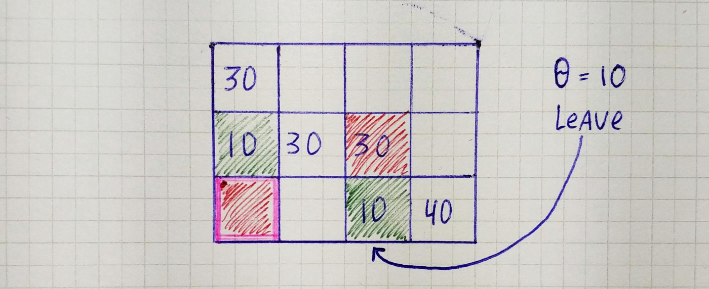
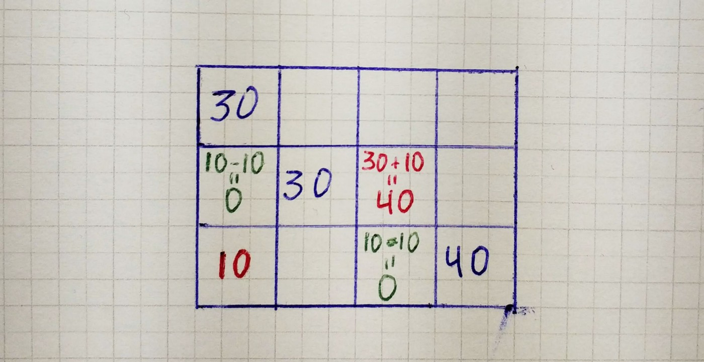
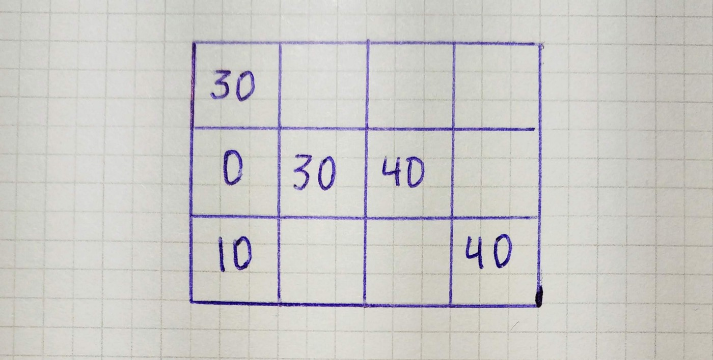

## Algorithm

Transportation simplex method can be described in four steps.

1. [Balance the problem.](/blog/operations/balancing)

1. Find an initial basic feasible solution with one of the methods, for example with [northwest corner rule.](/blog/operations/corner)

1. For all basic variables use *u₁ = 0* and *uᵢ + vⱼ = cᵢⱼ* to calculate *uᵢ* and *vⱼ*. For all non-basic variables calculate *wᵢⱼ = uᵢ + vⱼ -ciⱼ*. If *wᵢⱼ ≤ 0*, the current basic feasible solution is optimal. Otherwise, choose the variable with the most positive *wᵢⱼ* as the entering variable.

1. Obtain a new basic feasible solution using loop pivoting, and go to step *3*.

We already covered the [first](/blog/operations/balancing) and [second](/blog/operations/corner) steps in the previous articles, and now we will look at how to implement steps 3 and 4.

## Select Entering Variable

After we had received an initial basic feasible solution, we can calculate each *uᵢ* and *vⱼ* by going through each cell containing a basic variable.

Next, we calculate *wᵢⱼ* for all non-basic variables. Since there are some *wᵢⱼ* that are more than zero, it means we have not reached an optimal solution. Therefore we select a variable that will enter the next basic feasible solution.

With an understanding of how to select a variable that will enter the basic feasible solution, we can write a code for this. First, let’s create the function that will calculate *uᵢ* and *vⱼ *for each cell with a basic variable. It receives two parameters — basic feasible solution and costs, go over each basic variable and fill lists containing *uᵢ* and *vⱼ*.

`gist:1b23eae4438d8fe8d6eae09e01b2a165`

Then we write a function that receives basic variables, costs, us, vs and returns list with *wᵢⱼ*. It calculates *wᵢⱼ* for each non-basic variable using a simple formula(*wᵢⱼ = uᵢ + vⱼ -ciⱼ),* *wᵢⱼ *represented as a tuple containing its position and value.

`gist:e1004324d18e78647b6be0e171ec8949`

If this is some *wᵢⱼ* that more than zero, it means the solution can be improved.

`gist:fe4f3b07d1284d69d2a7b54b3e5ed04c`

If a solution can be improved, we select a variable to enter by finding *wᵢⱼ *with the largest value and return its position.

`gist:845033eb8ceae194b640fa6cb75a22dc`

## Loop Pivoting

**Loop** is an ordered sequence of at least four different cells that satisfy all three conditions:

1. Any two consecutive cells lie in either the same row or same column.

1. No three or more consecutive cells lie in the same row or column.

1. The last cell is in the same row or column as the first cell.

We are using **loop pivoting** to improve the basic feasible solution, and its process can be described in four steps.

1. Find the only loop involving the entering variable and some of the basic feasible variables.

1. Count the cells in the loop (starting from 0), label them as odd cells or even cells.

1. Find the odd cell with the smallest value. Call this value θ. This cell corresponds to the leaving variable.

1. Decrease each odd cell in the loop by θ and increase each even cell in the loop by θ.

We already knew the position of the entering variable and can find the only possible loop. At the start, we move up from the entering variable(here we choose direction randomly) then we go right to the last basic variable in the row since we can’t have three consecutive cells in the row and then one cell down.

Then we mark loop cells as even and odd.

After that, we find an odd cell with the smallest value.

Then we go over each cell in the loop and add θ to the value if the cell is even and subtract if odd.

At the end of the pivoting operation, we have a new basic feasible solution.

Now, let’s code the pivoting part. First, we write a function that returns possible next nodes for a given loop. It is pretty straightforward.

`gist:9188ddde209ea692ed9c96de4e346805`

Then we need a function that returns loop for a given list with basic variables positions and position of entering variable. We are using recursion in this function. If a loop can be closed we pass to the get_possible_next_nodes position of the entering variable only. If the loop can’t be closed, we recursively go over each possible next node.

`gist:f1afa0d5307335e212a3b1287feb1a02`

The function that makes pivoting operation receives a previous basic feasible solution and loop. First, we gather even and odd cells, then take the leaving variable and return new basic variables.

`gist:379f671b49083de3dac88a1d689f325c`

## Final Algorithm

Now we can put everything together.

`gist:d64b872019395dcc979ceb2fc61dae6e`

To calculate the total sum we need to go over each cost, take the number of units from the solution, multiply the cost of transportation and number of units that will be shipped and add it to the total cost.

`gist:29e9a7739f1ba1c95b467cc5ed2400ea`
