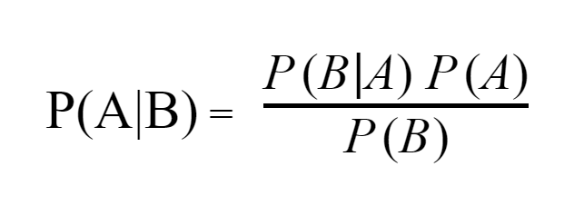
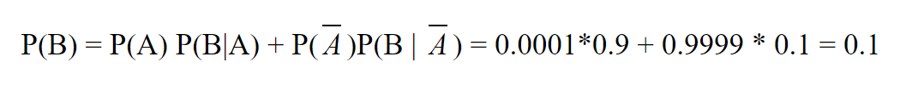

Bayes’ theorem looks like this:



Where *A* and *B* are events.

*P(A|B)* —the likelihood of event *A* occurring after *B* is tested

*P(B|A)* — the likelihood of event *B *occurring after *A* is tested

*P(A)* and *P(B)* — probabilities of events *A* and *B*

One of the most popular examples is calculating the probability of having a rear disease. Let’s imagine that some person comes back from an exotic country and want to check, does he have this country rear disease. He took a test and got 0.9 that he has a disease, given that the test has 0.99 probability of giving the right result. Also, this disease is very unlikely to occur, since only 0.0001 people returning from the country have the disease.

*P(A|B)* — the probability that a person has a disease—?

*P(B|A)* — the probability that person has a disease(after he took a test)— 0.9

*P(A)* — the probability that a person can have a disease — 0.0001

*P(B)* —the probability that the test gave a true result — ?

Let’s calculate* P(B)* with [“The Law Of Total Probability”](/blog/probability/total):



Now we can calculate *P(A|B)*:


After calculating real probability we can see that real probability quite differs from probability, given by disease test. Now, in order to find a better probability, the person can go to other disease test providers and try to find a more precise probability. Because now he will use 0.0009 rather than 0.0001 as *P(A)*.

```py
def bayes_probability(p_b_a, p_a, p_b):
    return p_b_a * p_a / p_b

first_probability = bayes_probability(0.9, 0.0001, 0.1)
# 0.0009
second_probability = bayes_probability(0.9, 0.0009, 0.1)
# 0.0081
```
