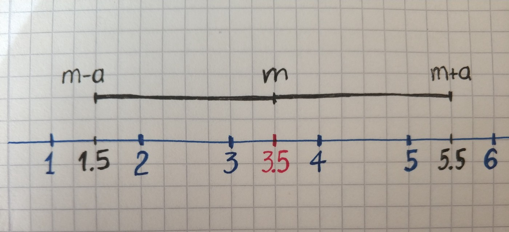
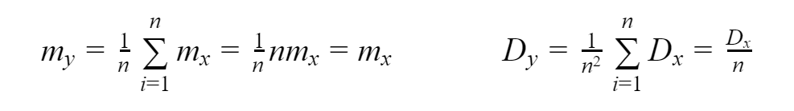

Before introducing the law of large number it is better to understand Chebyshev’s inequality first.

**Chebyshev’s inequality** shows that for any positive number a probability of random variable *X* to deviate from an expected value not less than by a is equal to:


For example, what is the probability that after rolling dice result will deviate from an expected value not less than two? At first, we will calculate the expected value.

```py
def expected_value(values, probabilities):
    return sum([v * p for v, p in zip(values, probabilities)])

xs = [1, 2, 3, 4, 5, 6]
probabilities = [1/len(xs)] * len(xs)

expected_value(xs, probabilities)
# 3.5
```

It is equal to *3.5*. Now we can draw all possible values and interval *(m-a, m+a)*.



For our example, we need to find the probability of getting values out of the range — the probability of getting *1* or *6*.

```py
def expected_value(values, probabilities):
    return sum([v * p for v, p in zip(values, probabilities)])

def variance(values, probabilities):
    m = expected_value(values, probabilities)
    return sum([(v - m)**2 * p for v, p in zip(values, probabilities)])

a = 2
xs = [1, 2, 3, 4, 5, 6]
probabilities = [1/len(xs)] * len(xs)

e_v = expected_value(xs, probabilities)
interval_start = e_v - a
interval_end = e_v + a

probability = sum([p for x, p in zip(xs, probabilities) if x < interval_start or x > interval_end ])
print(probability, ' ≤ ', variance(xs, probabilities)/a**2)
# 0.3333333333333333  ≤  0.7291666666666666
```

As you can see Chebyshev’s inequality gives an only upper limit of probability deviation. Probability can’t be more than this value no matter what.

**The law of large numbers** is a theorem that describes the result of performing the same experiment a large number of times. According to the law, the average of the results obtained from a large number of trials should be close to the expected value.

The law of large numbers can be proven by using Chebyshev’s inequality. There is a random variable *X*. Above this value performed n independent experiments and calculated average. As a result, we have random variable Y.


Let’s find the expected value and variance of an obtained random variable.



As you can see expected value is independent of a number of experiments and equal to an expected value of X. Variance decrease as a number of experiments growth. Because variance becomes very small random variable *Y* becomes not random. Since there is no randomness when you have variance almost equals to zero. Now we came to this inequality.


And we can apply Chebyshev’s inequality for random variable Y.


Let’s take a look at an example. As X would be used a continuous random variable with uniform distribution.

`gist:2f4c265b65819e48726e10b0e8dbefa0`
