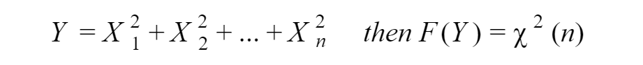

**The Chi-Squared distribution** is a continuous probability distribution that is widely used in statistical inference. And it related to the standard normal distribution. If a random variable *X *has the standard normal distribution, then *X²* has the the Chi-Squared distribution with one degree of freedom.

`gist:72516b38296c0e836aed47d751cb04b7`

A relation between standard normal distribution and Chi-Squared distribution goes father than this. If we have *n* independent standard normal random variables, then their sum has a Chi-Squared distribution with *n* **degrees of freedom**.

Now let’s plot Chi-Squared distribution with different degrees of freedom.

`gist:fdfe1f084eccbaeaec4a1f6ad1f16b73`

The mean and variance of Chi-Squared distribution:

