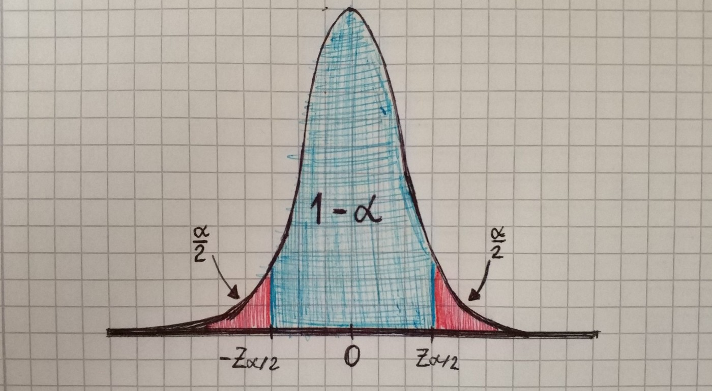
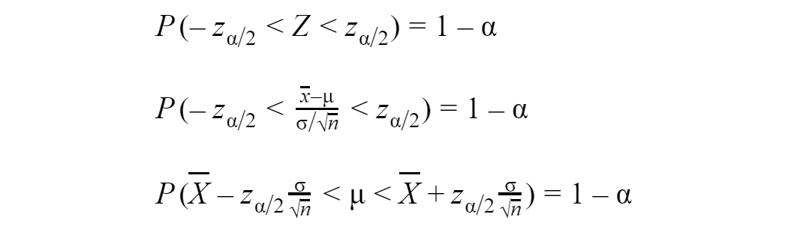

## Confidence interval

The confidence interval gives a range of possible values for a parameter computed from the observed data. Confidence intervals often appear in media. For example: “The last survey found with 95% confidence that 74.6% ±3% of software developers have Bachelor’s degree”. From this example, we can construct the confidence interval: (71.6%, 77.6%) by subtracting and adding 3%. The desired level of confidence is set by the researcher(not determined by data). Most commonly, the 95% confidence level is used. The ±3% is a margin of error — a statistic expressing the amount of random sampling error in survey’s results. The larger margin of error, the less confidence one should have that the results are close to the real parameters.

## Confidence interval for mean(sigma known)

Let’s take a look at how we can find the confidence interval for mean when sampling from a normally distributed population with known standard deviation. The confidence interval for the mean will be of the form:

Suppose we are having a random sample of n independent observations from a normally distributed population with mean μ and standard deviation σ. In this case, a sample mean is a normally distributed random variable with a mean μ and standard deviation of

We can standardize this random variable, make it have the standard normal distribution.

For standard normal distribution we can write such formula:

Then we can find a confidence interval:

Now let’s try to make some simulations — generate normally distributed population, take a sample, find the sample mean and then find confidence interval.

`gist:9948b0d2f75b92ce465a7d12f25fbc03`

There is few thing that affect margin of error:

* variance of the population

* sample size

* confidence level

`gist:664192238f8a26b74601de010af8cfb3`
