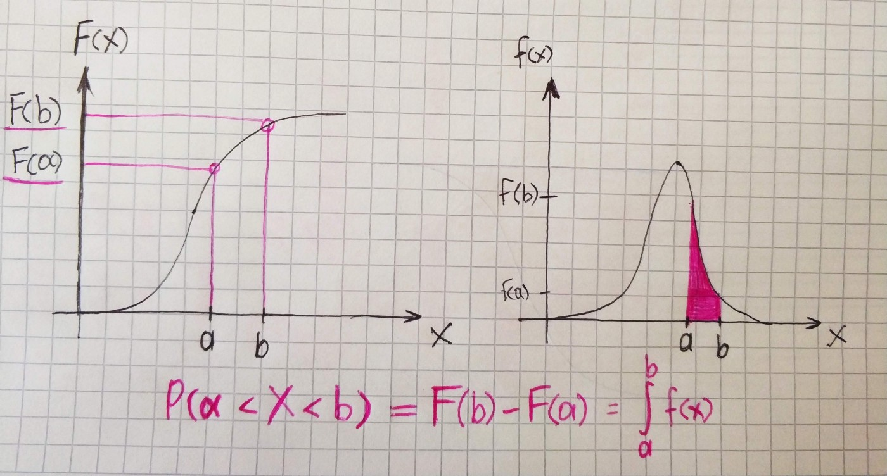

The probability density function is a derivative of the distribution function, which characterizes the density with which the values of the random variable are distributed at a given point.

Let’s take a look at the simple example. We have distribution function and we should find the probability of falling in the interval between a and b. This probability is simply area lying under the curve from a to b. In order to find definite integral, we will use a magic function from numerical analysis domain:)

`gist:3ca61dfccb62f37780eba6da7e3d7070`

If we have distribution function only we also can find the probability of falling into the interval.

