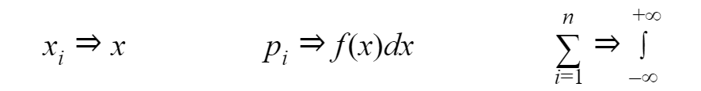
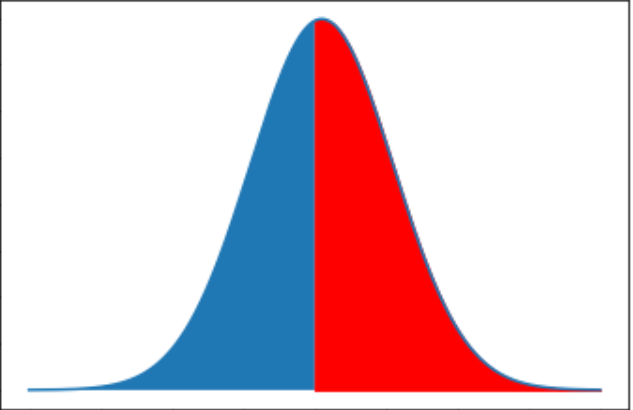

At this part, we will look at characteristics that show the position of a random variable on the numerical axis. All these characteristics have there are own real-life applications. And you will see them very often not only in probability theory domain but also in statistics, machine learning, and other fields.

One of the most important characteristics is the **expected value** — the sum of the products of all possible values of a random variable by the probabilities of these values.


```py
def expected_value(values, probabilities):
    return sum([v * p for v, p in zip(values, probabilities)])

expected_value([1, 2, 3], [0.2, 0.3, 0.5])
# 2.3
```

The expected value for a continuous random variable is integral, where f(x) is probability density function:


This formula is obtained from the formula listed above. We just replace components:



For mixed random variables, we have a formula, where sum used for all breakpoints and integral for all parts where the distribution function is continuous:


Next characteristic is **Mode**. for a discrete random variable mode is the most probable value, and for continuous is a value where probability density is the biggest.

`gist:3194638158ecc4ede65c2c376c7624b3`

The last characteristic we cover in this article is the **Median**. Median of a continuous discrete random variable is such a value *m*, for which:


If we look at the curve of continuous random variable it will be the place which separate curve on two parts with the same area:


