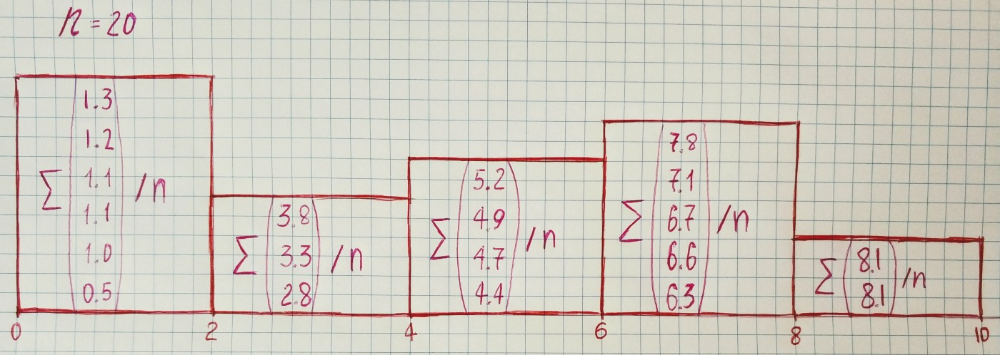

In [the previous article](/blog/probability/empirical), we have seen one form of data representation — empirical distribution function. This time we will see more convenient representation for a large amount of data — **histogram**.

Suppose that we have the results of observation of a random variable *X*. In our example, we assume that a variable can take any value in the interval from *0* to *10*. The sorted result of our observations:
```
[0.5,
  1.0,
  1.1,
  1.1,
  1.2,
  1.3,
  2.8,
  3.3,
  3.8,
  4.4,
  4.7,
  4.9,
  5.2,
  6.3,
  6.6,
  6.7,
  7.1,
  7.8,
  8.1,
  8.1]
```
Then we divide the whole range of observed values into intervals and calculate the number of values in each interval and divide it by the total number of observations. The length of the interval depends on how you want to represent the data. Let’s take the length of the interval equal to *2*.



Now let’s draw histograms with a different number of intervals by using *matplotlib*:

`gist:5012b31c0fb1e416b89587133f30e934`
