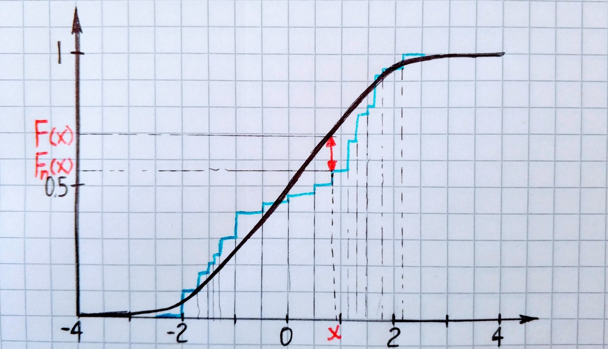

Previously we have seen tests that can be used only with normally distributed data. But what if we don’t have normality assumptions about the data? In this article, we will cover one of the most popular among nonparametric tests — the **Kolmogorov-Smirnov test**(K-S test).

## Statistic

At first, let’s introduce a statistic of K-S test.

It means we go through each point of the empirical distribution function of our sample and calculate the absolute difference between it and a corresponding value of population distribution function. The maximum of those differences is the value of the statistic.

Now let’s make a simulation. Exists gamma-distributed population and we have a sample from it. What is the *K-S statistic*?

`gist:dbd98b2e424b912a16f6e8cb4cf0acbf`

## Kolmogorov distribution function

As you may remember from [the previous article](/blog/probability/pearson), we use appropriated distribution to get critical value. Then we can make a conclusion. The Kolmogorov distribution it is the tricky one, but anyway :) The Kolmogorov distribution is the distribution of the random variable, where *B(t)* is the Brownian bridge

`gist:ae67e9b8d63aeefbe4a3f4bd3900d63f`

The tricky part is to get critical value for the specified significance level from this distribution. Therefore, I will take the critical value for the significance level of *0.05* and a sample size of 80 from the table, it equal to *0.152*. The null hypothesis is rejected if:

