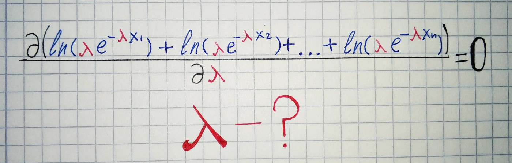

In the [previous part](/blog/probability/method), we saw one of the methods of estimation of population parameters — *Method of moments*. In some respects, when estimating parameters of a known family of probability distributions, this method was superseded by the *Method of maximum likelihood*, because maximum likelihood estimators have a higher probability of being close to the quantities to be estimated and are more often unbiased. The method which will be covered in this article determines values for the parameters of population distribution by searching the parameters values that maximize the likelihood function, given the observations. The resulting estimate is called a *maximum likelihood estimate*.

## Example

Exists population with exponential distribution and we should estimate *λ(rate) parameter* of the actual population by having a sample from this population.

`gist:adeb73dab9358c394828f8b0feffa576`

In order to do this, first, we need to calculate the total probability of observing the data(i.e. the probability of observing *x1, x2, …xn* given parameter *λ*).

Resulting function called the likelihood function. By maximizing this function we can get maximum likelihood estimates — estimated parameters for population distribution. In order to maximize this function, we need to use the technique from calculus — *differentiation*. First, we need to find the derivative of the function, set the derivative function to zero and then rearrange them to make the parameter of interest the subject of the equation. Before starting this process we need to make the function easier to differentiate by taking the natural logarithm of the expression. Doing so we can replace the multiplication by the sum, since:

By applying this rule, we will obtain the log-likelihood function:

For our example with exponential distribution we have this problem:

There is a lot of better ways to find to maxima of the function in python, but we will use the simplest approach here:

`gist:51fe4cd467ea09e7dd73684763ad5603`
