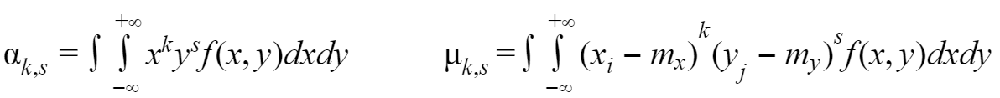

The numerical characteristics of the random variable were already introduced in [one of the articles](/blog/probability/moments/). Now we will look at **moments of a vector of random variables**.

**The initial moment of the *k, s* order of a system *(X,Y)*** is expected value of multiplication of *X *in *k-th* degree and *Y *in *s-th* degree:

**The central moment of the *k, s *order of a vector *(X,Y)*** is expected value of multiplication of *X *central in *k-th* degree and *Y* central in *s-th* degree:

In order to calculate those moments for a vector of **discrete **random variables by knowing their distribution low and expected value we can use formulas:

In order to calculate moments for a vector of **continuous **random variables by knowing probability density and expected values we can use formulas:

The first initial moments represent** the expected values** of random variable X and Y of the vector:

The combination of expected values is **characteristic of the position of the vector**. Geometrically, these are the coordinates of the midpoint for the plane around which scattered the point *(X, Y)*.

The second initial moments represent **variances **of random variable X and Y of the vector:

A combination of variances c**haracterizes the scattering of a random variable in the direction of the axes**.

Let’s take a look at the example. We have the vector *(X, Y) *of discrete random variables and distribution low. What is the expected value and variance of the vector? For this example, we will use the “homemade” function which will return probability for given *x *and *y*.

`gist:7c503c24809a4b85b82b9018704cd746`

In this example, probabilities go up with values of x and y. I show this on the plot by increasing the size and opacity of points according to probabilities. The red point is the combination of expected values of the vector and the black one is the combination of variances.

Now is the time to look at specific for the vector of random variables characteristic — correlation moment.

Correlation moment describes not only scattering of variables X and Y, but also their relations. If the correlation moment of two random variables is different from zero, this is a sign of the existence of a relation between them. If we want to look only at the characteristic of relations between variables we need to use different characteristic — correlation coefficient, since if one of the variables very close to expected value the correlation moment will be very low, no matter how close dependence.

Let’s find a correlation coefficient for the previous example.

`gist:71be25807736647f1f8251b1f1537fc7`

When *r < 0* we have a negative correlation and if *r > 0 *— positive. A positive correlation between random variables means that as one of them increases, the other tends to decrease on average and negative means that as one of the random variable increases, the other tends to decrease on average. As you can see from the example we have a negative correlation.
