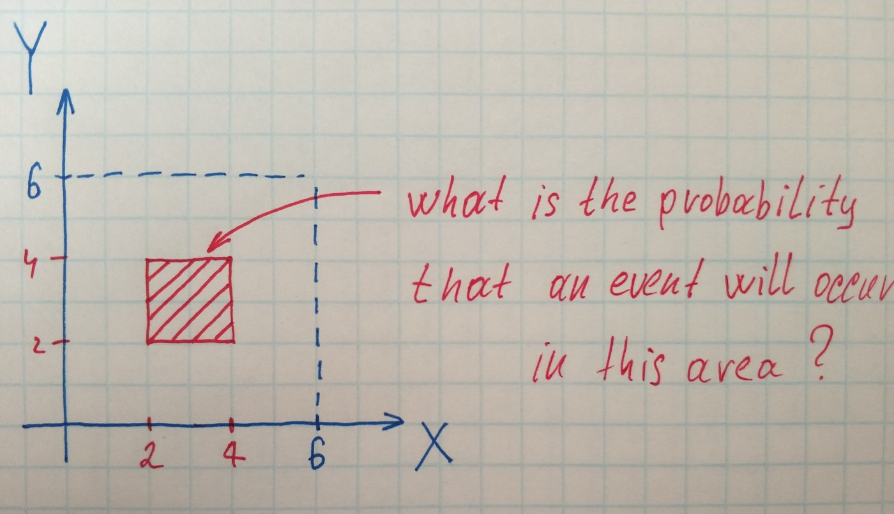
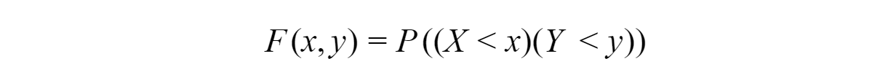
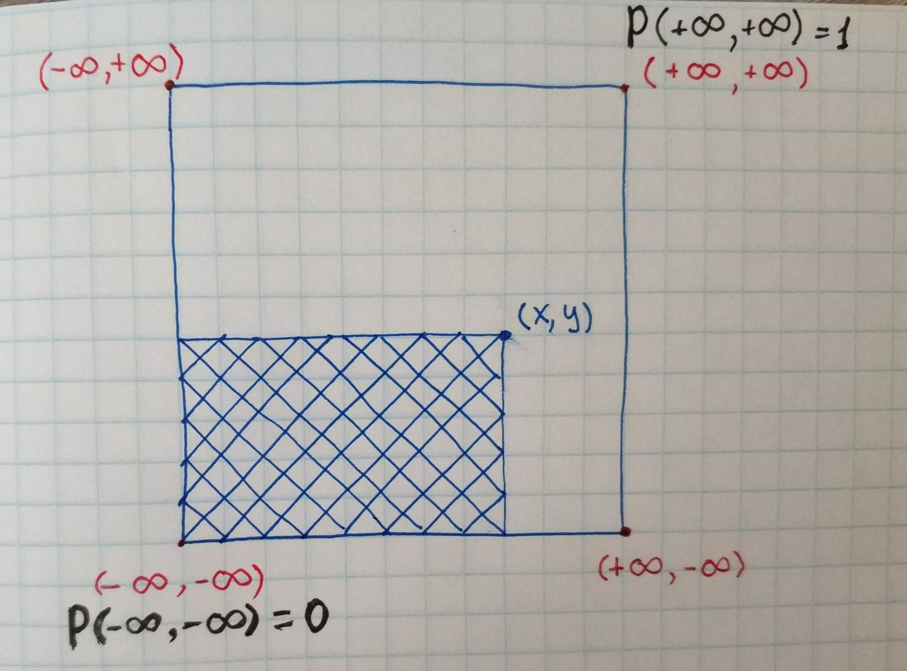
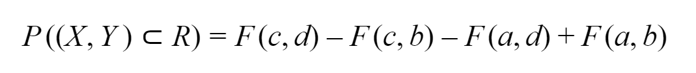
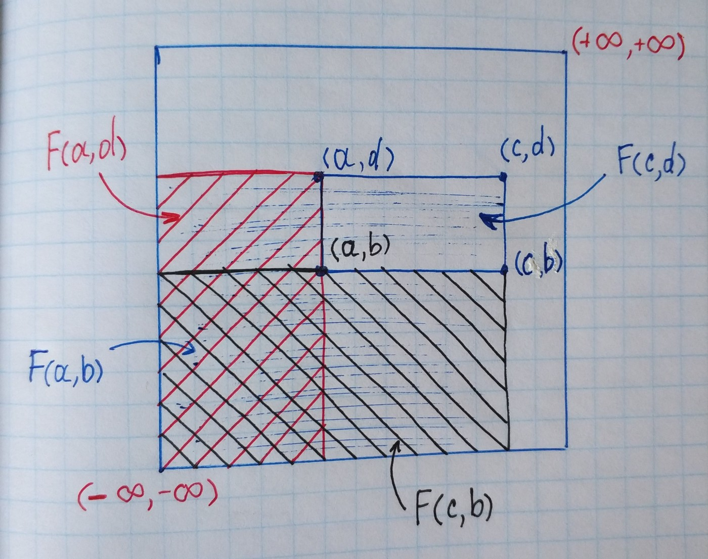

In practical applications of probability theory, one often encounters problems in which the result of an experiment is described not by one random variable but by two or more random variables that form a **multivariable random variable**(system of random variables or random vector). For example, a position of some point thrown on the plane will be a vector of two random variables — *X* and *Y*. It is easier to imagine systems of random variables in the geometric context.

## The Distribution Function

The distribution function of two random variables is the probability of fulfillment of both inequalities:

If we imagine 2D space as one large square with bottom left corner *(-∞, -∞) *and upper right corner*(+∞, +∞)* and look at previous formula we will see that the distribution function is simply the probability of falling into rectangle with bottom left corner *(-∞, -∞)* and upper right corner *(x, y)*.

But what if we want to find the probability of falling into some shape area? Let’s find out on the simplest example — a rectangle with the bottom left corner *(a,b)* and upper right corner *(c,d)*.

Since we can find *F(x,y)* it is quite easy to represent the probability of falling into the rectangle as sum and difference of distribution functions.

