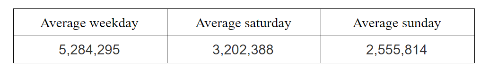
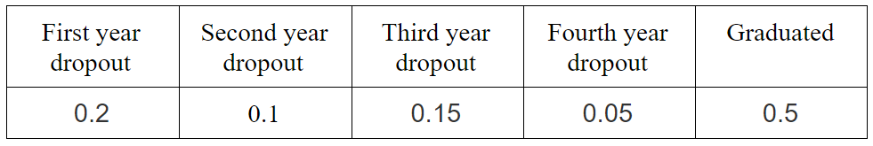
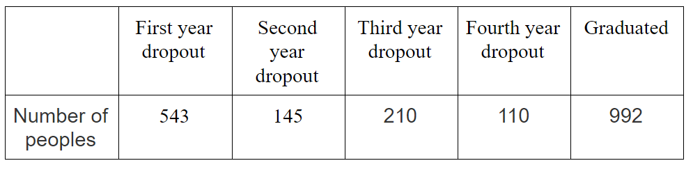
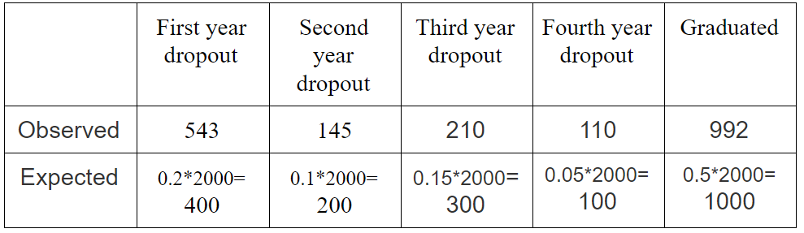
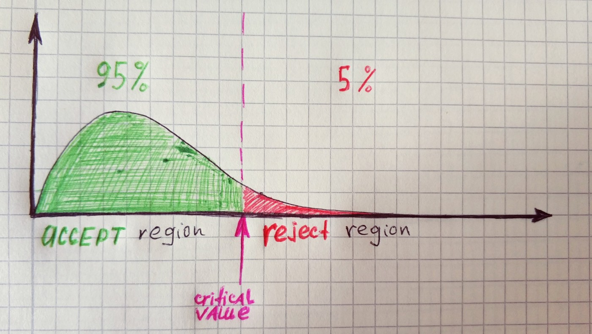

**Pearson’s chi-squared test** is a statistical test applied to sets of categorical data to evaluate how likely it is that any observed difference between the sets arose by chance. **Categorical data** is statistical data consisting of categorical variables(a variable that can take on one of the limited possible values). Example of categorical data will be subway usage on specific days:



In simple words, by using Pearson’s chi-squared test we can accept or reject the null hypothesis. Usually, a null hypothesis represented in the way of an **expected** set of data and alternative hypothesis as some newly **observed** data.

Let’s take a look at the example. We have data about students dropout/graduation rates(null hypothesis).



Recently we decided to make research on this topic and as a result, received this data:



Assuming the old data was correct what how would expected data look for given sample size?



With this table in place we can calculate Chi-Square statistic using this formula:


```py
def get_chi_square_statistic(observed, expected):
    return sum([((o - e)**2)/e for o, e in zip(observed, expected)])

observed = [543, 145, 210, 110, 992]
expected = [400, 200, 300, 100, 1000]

chi_square_statistic = get_chi_square_statistic(observed, expected)
# 94.3115
```

Now, when we have Chi-square statistic it is the right time to accept or reject the null hypothesis. But first, we need to choose significance level. The most common choice for [significance level](/blog/probability/power) is *0.05*, so we will use it in our example.



As you might guess we will use [Chi-squared distribution function](https://geekrodion.com/blog/probability/chi). The degree of freedom for distribution in Pearson test equal to *n-1*, where *n* is the number of categories. In our example, there are *5* categories, therefore the degree of freedom equal to *4*.

`gist:f5dae383c970464489e167c3b2a1a705`

As you can see our value is much larger than the critical value, therefore, we will reject the null hypothesis.

