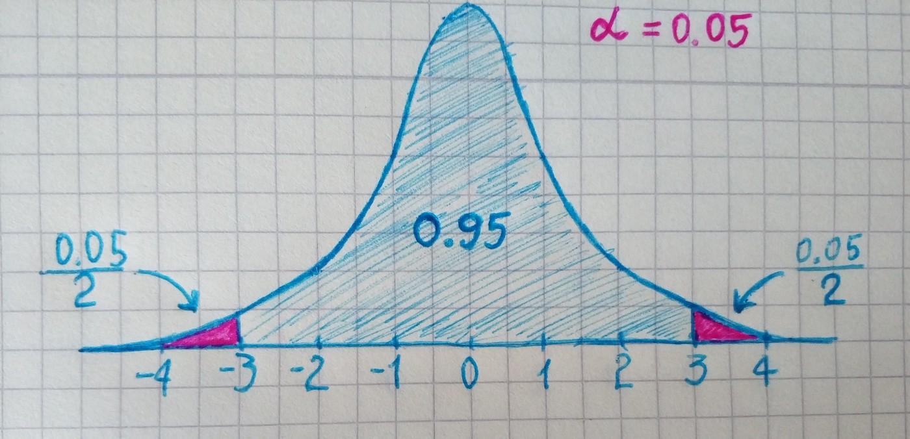
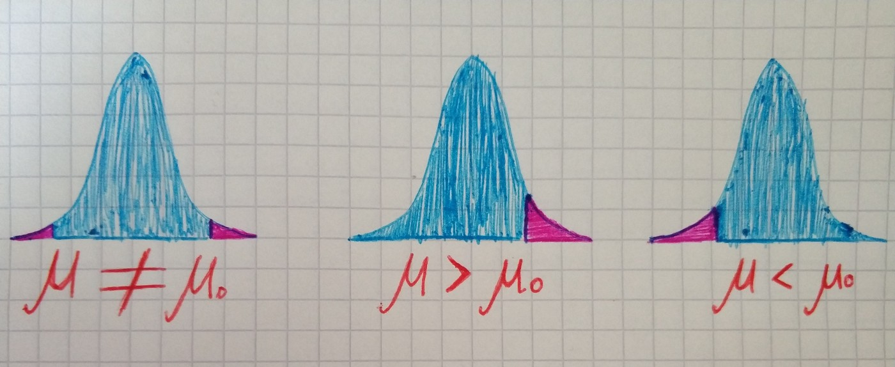

In the previous part, we settled on Type I and Type II errors. In this part, we will look at the Power of test and underlying concepts.

**The significance leve**l of the test(*α*) — the probability of a Type I error, given that null hypothesis, is true. Formal representation looks this way:

Imagine we have a large normally distributed population, for example, all people on the earth. The sample will be a group of *100 *randomly selected people. Then we make *50 *more samples. Then for each sample, we calculate the mean. And from this means we can construct sample distribution of means. By taking α = 0.5:

From this drawing, we see that *.95 *of all sample means are hypothesized to be in this region. And *.5* of experiments will commit type I error. Now we can make the conclusion — if we choose a very small value of *α*, we will be making it very difficult to reject the null hypothesis. If we choose a larger value of *α*, Type II errors will be less common. Visualization looks different depending on the sign in alternative hypothesis.

The probability of a Type II error is represented by *β*. The value of *β* depends on a number of factors, including the choice of *α*, the sample size, and the true value of the parameter.

The power of a test is the probability of rejecting the null hypothesis, given is false. It ranges from *0 *to *1 *and as its value increases, the probability of making a Type II error decreases.

