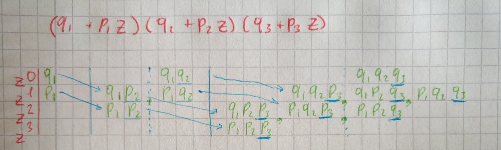

In the practical application of probability theory, one often has to meet with problems in which the same or similar experiments are repeated many times. As a result of each experiment, some event may or may not occur, and we are not interested in the result of each individual experiment, but in the total number of occurrences of the event as a result of a series of experiments. Depend on the [type of events](/blog/probability/basic) you will use different approaches to find the probability.

## Probability of repetitive experiments (independent events)

We have *n* experiments. In every experiment, the event can occur or not with probabilities p and q = 1-p. We should find probability *Pm,n —*the* *probability of event *A* occurring *m *times in *n *experiments. We can represent this event as a sum of all possible combinations of products of events. A number of such combinations can be calculated using combinatorics formula:


The probability of each such combination, by the multiplication theorem for independent events, is:


Now we can construct the formula:


```py
from math import factorial

def probability_of_repetitive_independent_events(p, m, n):
    c = factorial(n) / (factorial(m) * factorial(n - m))
    return c * pow(p, m) * pow(1 - p, n - m)

probability_of_repetitive_independent_events(0.3, 2, 4)
# 0.2646
```

## Probability of repetitive (dependent experiments)

When we have dependent experiments different approach needed. The event that event A will appear m times during n experiments still will be represented as a sum of products of events. A Number of combinations also will be the same, but combinations will not have the same probability. Since independent events have a number of different probabilities. In order to find such a probability, we use a magic function. The probability that an event A in n independent experiments will appear exactly m times is equal to the coefficient


in the expression for the generating function:


It seems like magic, but it actually works, if you look at the example below you will find that coefficients represent a sum of products of events:


Now we can write code for this. At first, we create the list of list of products of events for each coefficient. In each iteration number of total products will be increased in two times, since we need to multiply existing products on corresponding *q* and *p*.



```py
def repetitive_dependent_experiments(probabilities):
    zs = [[]] * (len(probabilities) + 1)
    zs[0] = [1 - probabilities[0]]
    zs[1] = [probabilities[0]]
    for i, p in enumerate(probabilities[1:]):
        q = 1 - p
        new_zs = [[]] * (len(probabilities) + 1)
        for z_i, z in enumerate(zs):
            new_zs[z_i] = list(map(lambda x: x * q, zs[z_i]))
        for z_i, z in enumerate(zs[:-1]):
            new_zs[z_i + 1] += list(map(lambda x: x * p, zs[z_i]))
        zs = new_zs

    return list(map(lambda z: sum(z), zs))

repetitive_dependent_experiments([0.3, 0.5, 0.7])
# [0.105, 0.395, 0.395, 0.105]
```
