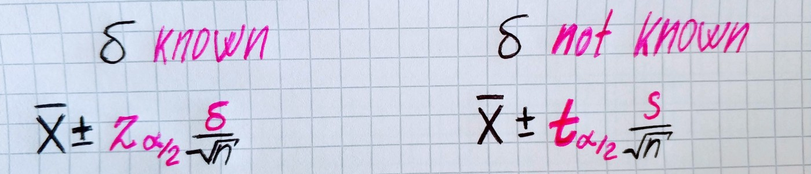

In the previous article, we look at how confidence interval for the mean can be found when we know the value of sigma. But more often we don’t have this value.

## Differences

Let’s look at differences in inequalities for confidence intervals when we know sigma and when we don’t.

The differences are:

1. we use sample sigma rather than population sigma

1. we use t-value rather than z-value

We already knew how to find sample variance. But how to find t-value?

T-value have the same meaning as z-value, the only difference is that it uses t-distribution rather then normal distribution.

Let’s look at how T-distribution with different degrees of freedom compares with the normal distribution.

`gist:81306ac6d9ab712a59ac33010ae6ff34`

The first thing that catches your eye is that as more we increase the degree of freedom t-distribution become more close to normal distribution. And it has a good sense when you keep in mind the law of large numbers. For interest let’s build a chart that shows the difference between z-value and t-value for the fixed significance level of 0.05.

`gist:d0eea63fd8e5ab6570c5cf176193b4d1`

Now let’s try to make some simulations — generate normally distributed population, take a sample, find the sample mean and then find confidence interval. Degrees of freedom will be equal to sample size minus one.

`gist:60fbcc951760336d4cd2b2ac460a7501`
