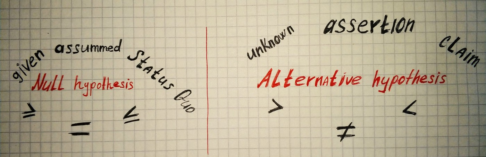
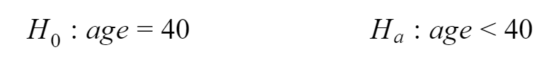

Hypothesis testing is a large part of inferential statistics and in this article, we will go through the basics. Hypothesis testing is all about rejecting or accepting some claim. For example: “We assume that the bus arrives at 6 AM., the claim is that since yesterday bus arriving at 7 AM”, “We assume that software developer salary growth with work experience as the logarithmic function, the claim is that growth looks like the exponential function”, “We assume that after the month of doing only abs exercises each day we will have visible six-pack abs, claim that this is not true”. Two first examples have wrong claims and last one true. From each of these examples, we can extract the **null hypothesis** and **alternative hypothesis**. Null hypothesis always associated with words: *assumed*, *status quo*, *given*. And alternative hypothesis: *unknown*, *assertion*, *claim*. If our hypothesis statement is more formal null hypothesis will be associated with signs containing equality: *=*, *≥*, *≤*. And alternative with *≠*, *>*, *<*.

Let’s draw out hypothesis from the statement and make it more formal with an example: “Given that average age of peoples going to the gym, according to testing conducted in 2017, is 40 years old. We assume that the average age in 2018 become less than it was back in 2017”. At first, let’s find out what is the null hypothesis. We don’t know what the average age now since there was no recent testing, the only source of truth is testing results from 2017. So the null hypothesis is — “average age of peoples going to the gym is 40 years old”. The alternative assumption is: the average age in 2018 become less than it was back in 2017. Let’s write formally:

Since now we have a basic understanding of what the null hypothesis and alternative hypothesis are, let’s continue by looking and **Type I and Type II errors**.

We have the hypothesis the sample from the population, it means we can make an analysis of the sample and then reach conclusion about the hypothesis(reject or fail to reject the null hypothesis). But does our conclusion reflect the real state of reality? And here arrives Type I and Type II errors. **Type I error** is the rejection of the assumption(null hypothesis) when it should not be rejected. **Type II error** is a failure to reject the assumption(null hypothesis) when it should be rejected. From the previous example with average gym member age Type I error is the claim that average age decreased in comparison with the previous year(rejecting the null hypothesis), although, in fact, it remains the same. Type II error is the claim that average age remains the same(fail to reject the null hypothesis), while in reality, it decreased in comparison with the previous year.

The most popular cause of those errors is not representative of the population sample. Assume that we have normally distributed sample and only by chance, we took the majority of values from the tail of the distribution, in such a situation, we will have a bad sample. Yes, there is exists other causes, such as flawed sampling techniques or flawed assumptions in the null hypothesis. yes, there are other reasons, such as flawed sampling techniques or flawed assumptions in the null hypothesis, but anyway, the most common cause is the chance of taking a not representative sample.
