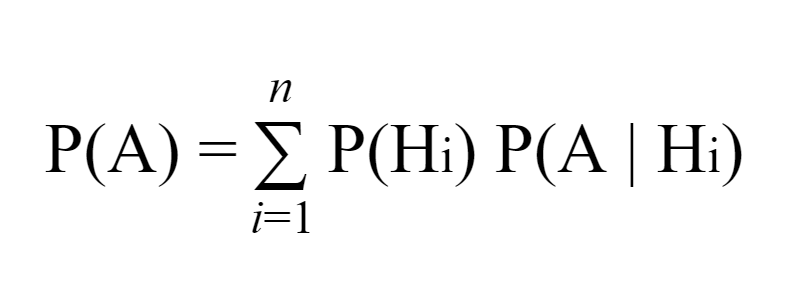
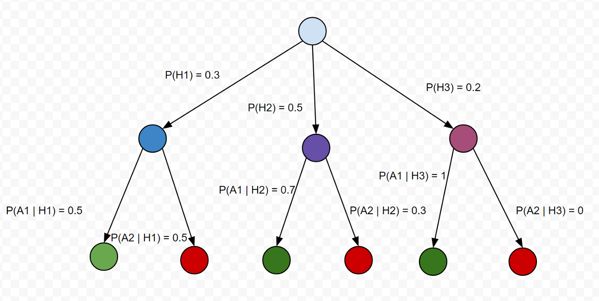
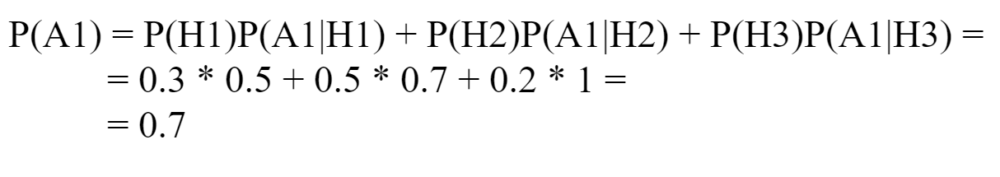

Let it be required to determine the probability of the event A, which can occur with one of the events *H1, H2,…, Hn* forming a complete group of mutually exclusive events. This is **“The Law Of Total Probability”:**



In order to show how this concept works, we will represent events like a tree. Let’s imagine that we want to calculate the probability of some event *A1*.



Let’s calculate the probability of the event *A1 *using the previous formula:



Now we can write a function which will take the tree of probabilities and name of the event and will return probability. We will represent root as the list of trees and will walk recursively through those trees calculating probability on the way.

```py
def probability_of_event(nodes, name):
    probability = 0
    
    def node_probability(node, name):
        if node.name == name:
            return [node.probability]

        if len(node.childrens) == 0:
            return []
        
        probabilities = []
        for children in node.childrens:
            for probability in node_probability(children, name):
                probabilities.append(node.probability * probability)
        
        return probabilities
    
    for node in nodes:
        probability += sum(node_probability(node, name))

    return probability

class Node:
    def __init__(self, name, probability, childrens=[]):
        self.name = name
        self.probability = probability
        self.childrens = childrens

a1_h1 = Node('A1', 0.5)
a2_h1 = Node('A2', 0.5)
h1 = Node('H1', 0.3, [ a1_h1, a2_h1 ])

a1_h2 = Node('A1', 0.7)
a2_h2 = Node('A2', 0.3)
h2 = Node('H2', 0.5, [ a1_h2, a2_h2 ])

a1_h3 = Node('A1', 1)
a2_h3 = Node('A2', 0)
h3 = Node('H2', 0.2, [ a1_h3, a2_h3 ])

a1_probability = probability_of_event([ h1, h2, h3 ], 'A1')
# 0.7
```