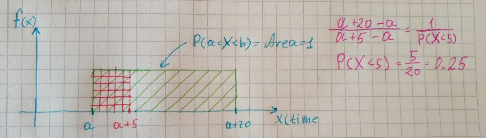

**The uniform distribution** is one of the simplest distributions. It exists for both discrete and continuous variable. For discrete one it is a distribution whereby a finite number of values are equally likely to be observed. An example of the discrete uniform distribution is throwing a fair dice. The possible values are 1, …, 6, and each time the dice is thrown the probability of a given score is 1/6.

If all possible values of a continuous random variable inside some interval and all of them have the same probability. Then this variable has the uniform distribution. Since all values of such random variable inside an interval and have the same probabilities we have the probability density function equal to:

Where *a* is the start of interval and *b* is the end.

Let’s take an example. The bus arrives at station one time in 20 minutes. Some passenger came to the station at random time, what the probability that passenger gets on the bus in 5 minutes interval? This time I will show this without code.

Let’s take a look at the characteristics of the Uniform distribution. The mean and the variance:

