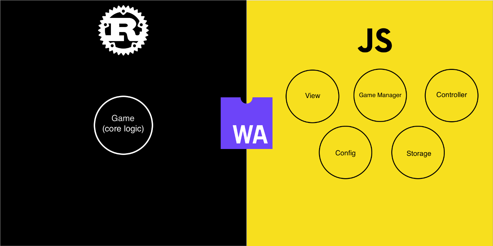
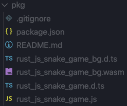
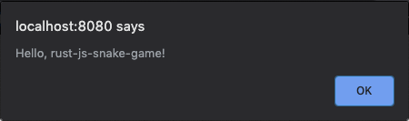

In the first part of the course, we will make requirements for the game, think of architecture and bootstrap the project.

## Game

We will create a [classic snake game](https://rodionchachura.github.io/rust-js-snake-game/). When the snake eats food, it becomes longer, and the score increases. If the snake heats the wall or bites the tail game is over.

Additionally, we will allow the player to stop the game by pressing the space button. To keep the user motivated, we will save the best score and show it alongside the current one. We make sure that the game looks good on any screen size, be it a tiny mobile phone or a large TV.

## Architecture

We want each component of the game to be as independent as possible. We will implement the core logic of the game with Rust and will export API to JavaScript via WebAssembly.



The main thing that we will export from Rust is Game struct with a constructor and two public methods. The first method will receive a duration from the last update and direction that the user wants a snake to take. The second method will check if the game is over.

On the JavaScript side, we will run the game loop and call API methods. We will render all game elements with canvas, capture user input, and save user best score.

## Bootstrap

To bootstrap our project, we will use templates that have everything in place to compile Rust library into WebAssembly and export it to JavaScript.

First, let’s install the tools we will need.

```shell{ promptUser: geekrodion }
curl https://rustwasm.github.io/wasm-pack/installer/init.sh -sSf | sh
cargo install cargo-generate
```

Next, we are going to use [the template](https://github.com/rustwasm/wasm-pack-template) to bootstrap the project.

```shell{ promptUser: geekrodion }
cargo generate --git https://github.com/rustwasm/wasm-pack-template.git --name rust-js-snake-game
cd rust-js-snake-game
```

Now we can build the project. The command below will create a wasm module and few js files that will expose wasm API.

```shell{ promptUser: geekrodion }
wasm-pack build
```



To create a web app that will use the wasm module, we will use [another template](https://github.com/rustwasm/create-wasm-app).

```shell{ promptUser: geekrodion }
npm init wasm-app www
cd www
```

To show our web app where to search for the wasm package, we need to open package.json, and add dependencies block.

```json:title=package.json
"dependencies": {
    "wasm-snake-game": "file:../pkg"
}
```

Next, we need to modify www/index.js to import wasm-snake-game instead of the hello-wasm-pack package:

```js:title=www/index.js
import * as wasm from "wasm-snake-game";

wasm.greet();
```

We are ready to test the whole thing!

```shell{ promptUser: geekrodion }
npm install
npm run start
```

