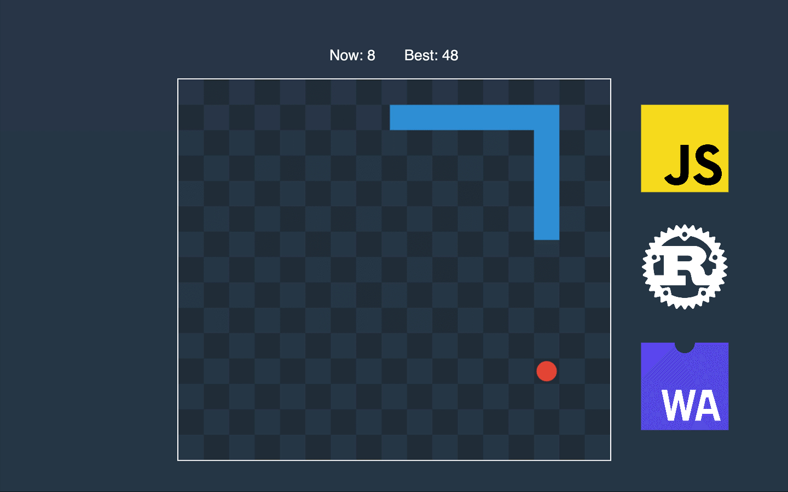

In this part, we will implement logic to place food in a random place that is free from the snake.

## Get Food Function

We want to write a function that receives the width and height of the game alongside with snake and returns position for the food. The algorithm is pretty simple. We will go over each cell and put aside those that don’t intersect with the snake. Then we randomly pick one of the cells and return it.


Before writing function, let’s add a dependency to *Cargo.toml* that will help us to generate a random number.

```toml:title=Cargo.toml
[dependencies]
# ...
rand = { version = "0.7.2", features = ["wasm-bindgen"] }
```

```rust:title=src/lib.rs
// ...
use rand::Rng;

// ...
fn get_food(width: i32, height: i32, snake: &[Vector]) -> Vector {
    let segments = get_segments_from_vectors(snake);
    let mut free_positions: Vec<Vector> = Vec::new();
    for x in 0..width {
        for y in 0..height {
            let point = Vector::new(f64::from(x) + 0.5, f64::from(y) + 0.5);
            if segments.iter().all(|s| !s.is_point_inside(&point)) {
                free_positions.push(point)
            }
        }
    }
    let index = rand::thread_rng().gen_range(0, free_positions.len());
    free_positions[index]
}
// ...
```

There is a lot of work with segments. Let’s start with a function that turns a sequence of vectors into segments.

```rust:title=src/lib.rs
fn get_segments_from_vectors(vectors: &[Vector]) -> Vec<Segment> {
    let pairs = vectors[..vectors.len() - 1].iter().zip(&vectors[1..]);
    pairs
        .map(|(s, e)| Segment::new(s, e))
        .collect::<Vec<Segment>>()
}
```

We will use segments only for calculations and won’t save them anywhere. Therefore Segment struct will keep only references to start and end.

```rust:title=src/lib.rs
pub struct Segment<'a> {
    pub start: &'a Vector,
    pub end: &'a Vector,
}
```

Before implementing the *Segment*’s methods, let’s write a function that will check if two float numbers are relatively equal.

```rust:title=src/lib.rs
static EPSILON: f64 = 0.0000001;

fn are_equal(one: f64, another: f64) -> bool {
    (one - another).abs() < EPSILON
}
```

Also, we will need a method that will calculate the length of the vector.

```rust:title=src/lib.rs
impl Vector {
    // ...

    pub fn length(&self) -> f64 {
        self.x.hypot(self.y)
    }
}
```

Now, we are ready to implement methods.

```rust:title=src/lib.rs
// ...
impl<'a> Segment<'a> {
    pub fn new(start: &'a Vector, end: &'a Vector) -> Segment<'a> {
        Segment { start, end }
    }

    pub fn get_vector(&self) -> Vector {
        self.end.subtract(&self.start)
    }

    pub fn length(&self) -> f64 {
        self.get_vector().length()
    }

    pub fn is_point_inside(&self, point: &Vector) -> bool {
        let first = Segment::new(self.start, point);
        let second = Segment::new(point, self.end);
        are_equal(self.length(), first.length() + second.length())
    }
}
// ...
```

To check if the point is inside of the segment, we split it with point and check if the sum of lengths is equal to the initial segment length.


To check how it’s all works, we need to update the *Game* constructor.

```rust
let food = get_food(width, height, &snake);
```

Now, let’s compile Rust, and try to reload the web page a few times to see how food position changes.


