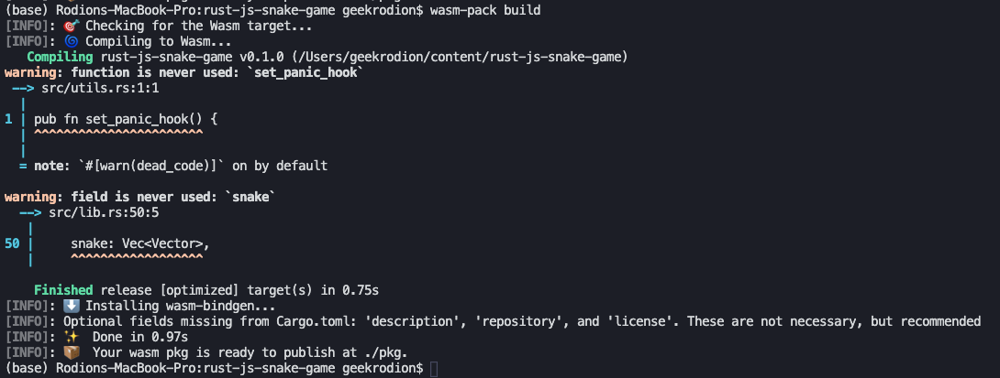

In this part, we will create an instance of the Game struct from JavaScript.

## Game State

We will measure distances with game cells. In this case, we can look at the image above and say that the game size is 17x15, and when a snake eats the food, it becomes one cell longer. We will measure time with milliseconds.

Now we can think of how we want to represent the state of the game. The state will contain the size of the game field — width and height, speed of the snake(cells in millisecond), the direction of the snake, the position of food, positions of snake edges, and score. Let’s open *src/lib.rs* and write it down.

```rust:title=src/lib.rs
#[wasm_bindgen]
#[derive(Copy, Clone)]
pub struct Vector {
    pub x: f64,
    pub y: f64,
}

#[wasm_bindgen]
pub struct Game {
    pub width: i32,
    pub height: i32,
    pub speed: f64,
    snake: Vec<Vector>,
    pub direction: Vector,
    pub food: Vector,
    pub score: i32,
}
```

To represent positions of objects in the game, we are using *Vector* struct. To make both structs accessible in JavaScript, we use a wasm_bindgen attribute. We marked all the fields as public, except the snake, because we’ll need to create a method to export vector of positions as JavaScript array. When we use *Game* public fields such as *direction* and *food* in JavaScript, we receive a copy. To make it work, *Vector* needs to have implemented *Copy* and *Clone* traits.

## Game Constructor

Let’s implement a constructor for the Game so that we can create an instance from JavaScript.

```rust:title=src/lib.rs
#[wasm_bindgen]
impl Game {
    #[wasm_bindgen(constructor)]
    pub fn new(width: i32, height: i32, speed: f64, snake_length: i32, direction: Vector) -> Game {
        let head_x = (f64::from(width) / 2_f64).round() - 0.5;
        let head_y = (f64::from(height) / 2_f64).round() - 0.5;
        let head = Vector::new(head_x, head_y);
        let tailtip = head.subtract(&direction.scale_by(f64::from(snake_length)));
        let snake = vec![tailtip, head];
        // TODO: place food in random cell
        let food = Vector::new(0.5, 0.5);

        Game {
            width: width,
            height: height,
            speed: speed,
            snake: snake,
            direction: direction,
            food: food,
            score: 0,
        }
    }
}
```

We place the head of the snake in the middle of the game field, and by applying vector operations, we calculate the position of the tail tip. For now, we leave food in the first cell. We’ll come back to it later and implement a function that will find a random free from snake place.


## Vector

We can find the use of vectors in almost every imaginable type of game, and it is good to know how they could be applied and what are the most popular operations are. In our game, we won’t have a dedicated struct for points, because the vector is sufficient both to specify directions and coordinates. If you are not comfortable with vectors, you can check out my [article](/blog/linear-algebra), where described all operations that we will use in this course.

For now, we only add methods that were used by the Game constructor.

```rust:title=src/lib.rs
#[wasm_bindgen]
impl Vector {
    #[wasm_bindgen(constructor)]
    pub fn new(x: f64, y: f64) -> Vector {
        Vector { x, y }
    }

    pub fn subtract(&self, other: &Vector) -> Vector {
        Vector::new(self.x - other.x, self.y - other.y)
    }

    pub fn scale_by(&self, number: f64) -> Vector {
        Vector::new(self.x * number, self.y * number)
    }
}
```

## JavaScript Side

The goal for this part is to see on the web page Game instance. First, let’s compile the Rust part.



Next, we create an *src* folder inside the *www* directory and put there two files — *config.js* and *game-manager.js.*

Let’s put in *config.js* parameters that we will use to create a game instance. Later we could play with these parameters and see how the game changes.

```js:title=www/src/config.js
export default {
  WIDTH: 17,
  HEIGHT: 15,
  SPEED: 0.006,
  SNAKE_LENGTH: 3,
  SNAKE_DIRECTION_X: 1,
  SNAKE_DIRECTION_Y: 0,
  FPS: 60
}
```

We will talk more about *GameManager* later. For now, we export class that creates *Game* and *console.log* it out.

```js:title=www/src/game-manager.js
import { Game, Vector } from 'wasm-snake-game'

import CONFIG from './config'

export class GameManager {
  constructor() {
    this.restart()
  }

  restart() {
    this.game = new Game(
      CONFIG.WIDTH,
      CONFIG.HEIGHT,
      CONFIG.SPEED,
      CONFIG.SNAKE_LENGTH,
      new Vector(
        CONFIG.SNAKE_DIRECTION_X,
        CONFIG.SNAKE_DIRECTION_Y
      )
    )
    console.log(this.game)
  }

  run() {
    // running the game
  }
}
```

Finally, let’s go to *index.js* and run *GameManager*.

```js:title=www/index.js
import { GameManager } from './src/game-manager'

const gameManager = new GameManager()
gameManager.run()
```

To test that everything works, we go to the web page and open console in developer tools.


