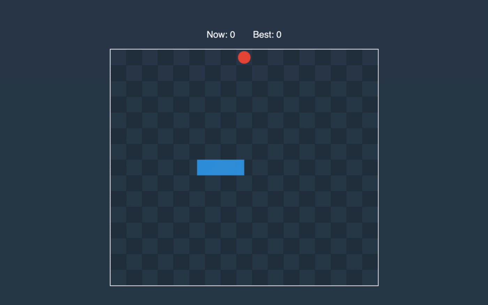

In this part, we will start the game loop and make the snake move.

## Process

It is time to add the method that will update the game state. For now, it will only receive milliseconds from the last update. We will handle snake direction change in the next part.

```rust:title=src/lib.rs
impl Game {
    // ...
    pub fn process(&mut self, timespan: f64) {
        self.process_movement(timespan);
    }
    // ...
}
```

We will need two methods to move the snake, so let’s add them first.

```rust:title=src/lib.rs
impl Vector {
    // ...
    pub fn add(&self, other: &Vector) -> Vector {
        Vector::new(self.x + other.x, self.y + other.y)
    }

    pub fn normalize(&self) -> Vector {
        self.scale_by(1_f64 / self.length())
    }
}
```

By using the *normalize* method, we can convert a vector to a unit vector with the length of one.

Now we are ready to write logic that will change positions of snake edges.

```rust:title=src/lib.rs
impl Game {
    // ...
    fn process_movement(&mut self, timespan: f64) {
        let distance = self.speed * timespan;
        let mut tail: Vec<Vector> = Vec::new();
        let mut snake_distance = distance;
        while self.snake.len() > 1 {
            let point = self.snake.remove(0);
            let next = &self.snake[0];
            let segment = Segment::new(&point, next);
            let length = segment.length();
            if length >= snake_distance {
                let vector = segment.get_vector().normalize().scale_by(snake_distance);
                tail.push(point.add(&vector));
                break;
            } else {
                snake_distance -= length;
            }
        }
        tail.append(&mut self.snake);
        self.snake = tail;
        let old_head = self.snake.pop().unwrap();
        let new_head = old_head.add(&self.direction.scale_by(distance));
        self.snake.push(new_head);
    }
    // ...
}
```

We start by calculating the distance the snake was supposed to crawl. Then we update the tail by going over each edge, except the last one(head), and shifting it. Because we don’t handle direction change in this part, the logic to update head position is pretty simple, we add to the old position direction scaled by the distance.

Let’s compile the Rust and go to the JavaScript side.

### Game Loop

Let’s update GameManager with the game loop.

```js:title=www/src/game-manager.js
export class GameManager {
  // ...
  tick() {
    const lastUpdate = Date.now()
    if (this.lastUpdate) {
      this.game.process(lastUpdate - this.lastUpdate)
    }
    this.lastUpdate = lastUpdate
    this.render()
  }

  run() {
    setInterval(this.tick.bind(this), 1000 / CONFIG.FPS)
  }
}
```

We are calling the *process* method to update the game state and render everything 60 times per second.


