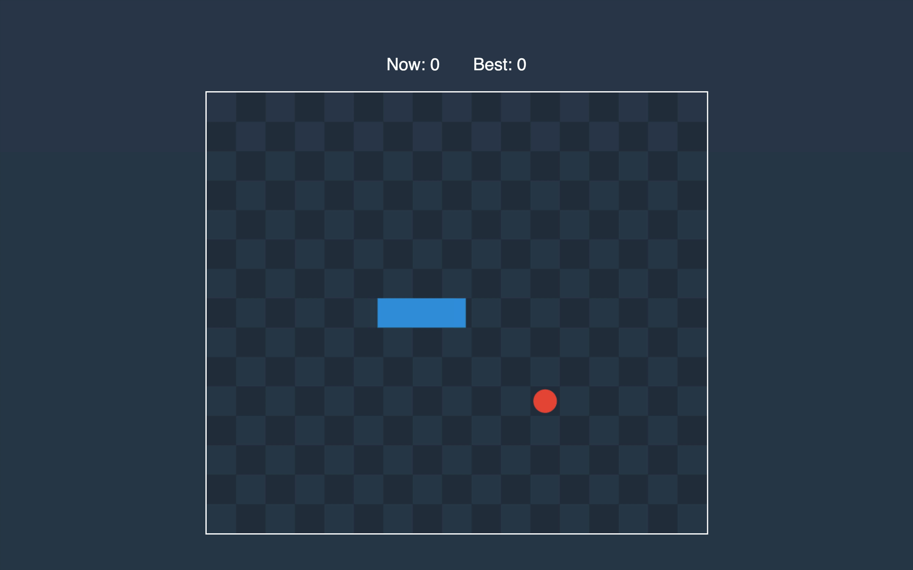

In this part, we will allow the user to control the snake direction and stop the game.

## Movement

To communicate to Rust what direction the player wants to move the snake, we will use the enum.

```rust:title=src/lib.rs
#[wasm_bindgen]
pub enum Movement {
    TOP,
    RIGHT,
    DOWN,
    LEFT,
}
```

Also, we need two more *Vector* methods.

```rust:title=src/lib.rs
impl Vector {
    // ...
    pub fn equal_to(&self, other: &Vector) -> bool {
        are_equal(self.x, other.x) && are_equal(self.y, other.y)
    }
    
    pub fn is_opposite(&self, other: &Vector) -> bool {
        let sum = self.add(other);
        sum.equal_to(&Vector::new(0_f64, 0_f64))
    }
}
```

Now we can update methods with an optional argument for movement.

```rust:title=src/lib.rs
impl Game {
    fn process_movement(&mut self, timespan: f64, movement: Option<Movement>) {
      // ...
    }

    pub fn process(&mut self, timespan: f64, movement: Option<Movement>) {
        self.process_movement(timespan, movement);
    }
}
```

Let’s add a block between the last two lines.

```rust:title=src/lib.rs
impl Game {
    // ...
    fn process_movement(&mut self, timespan: f64, movement: Option<Movement>) {
        // ...
        let new_head = old_head.add(&self.direction.scale_by(distance));
        if movement.is_some() {
            let new_direction = match movement.unwrap() {
                Movement::TOP => Vector {
                    x: 0_f64,
                    y: -1_f64,
                },
                Movement::RIGHT => Vector { x: 1_f64, y: 0_f64 },
                Movement::DOWN => Vector { x: 0_f64, y: 1_f64 },
                Movement::LEFT => Vector {
                    x: -1_f64,
                    y: 0_f64,
                },
            };
            if !self.direction.is_opposite(&new_direction)
                && !self.direction.equal_to(&new_direction)
            {
                let Vector { x: old_x, y: old_y } = old_head;
                let old_x_rounded = old_x.round();
                let old_y_rounded = old_y.round();
                let new_x_rounded = new_head.x.round();
                let new_y_rounded = new_head.y.round();

                let rounded_x_changed = !are_equal(old_x_rounded, new_x_rounded);
                let rounded_y_changed = !are_equal(old_y_rounded, new_y_rounded);
                if rounded_x_changed || rounded_y_changed {
                    let (old, old_rounded, new_rounded) = if rounded_x_changed {
                        (old_x, old_x_rounded, new_x_rounded)
                    } else {
                        (old_y, old_y_rounded, new_y_rounded)
                    };
                    let breakpoint_component = old_rounded
                        + (if new_rounded > old_rounded {
                            0.5_f64
                        } else {
                            -0.5_f64
                        });
                    let breakpoint = if rounded_x_changed {
                        Vector::new(breakpoint_component, old_y)
                    } else {
                        Vector::new(old_x, breakpoint_component)
                    };
                    let vector =
                        new_direction.scale_by(distance - (old - breakpoint_component).abs());
                    let head = breakpoint.add(&vector);

                    self.snake.push(breakpoint);
                    self.snake.push(head);
                    self.direction = new_direction;
                    return;
                }
            }
        }
        self.snake.push(new_head);
    }
    // ...
}
```

First, we match movement to the corresponding vector. In our game the start of coordinates in the left top corner. Therefore vector pointed to the top has a negative Y-component.

When the new direction isn’t equal or isn’t opposed to the old one we round old and new components, to check if the snakehead crossed the center of the cell because only in this case we can update the direction.

Then we push an edge at the center of the crossed cell to shake tail. Finally, we calculate a new position for the head and update the direction.

Let’s compile Rust and go to the JavaScript side to implement the controller.

## Controller

The controller updates the value of the movement field and executes the callback on the stop button press.

```js:title=www/src/controller.js
import { Movement } from "wasm-snake-game";

const MOVEMENT_KEYS = {
  [Movement.TOP]: [87, 38],
  [Movement.RIGHT]: [68, 39],
  [Movement.DOWN]: [83, 40],
  [Movement.LEFT]: [65, 37]
}

const STOP_KEY = 32

export class Controller {
  constructor(onStop = () => {}) {
    window.addEventListener('keydown', ({ which }) => {
      this.movement = Object.keys(MOVEMENT_KEYS).find(key => MOVEMENT_KEYS[key].includes(which))
    })
    window.addEventListener('keyup', ({ which }) => {
      this.movement = undefined
      if (which === STOP_KEY) {
        onStop()
      }
    })
  }
}
```

Let’s create an instance of *Controller* in *GameManager* constructor.

```js:title=www/src/game-manager.js
import { Controller } from './controller'

export class GameManager {
  constructor() {
    // ...
    this.controller = new Controller(
      this.onStop.bind(this)
    )
  }
}
```

When the game is resumed, we change *lastUpdate* so that it seems there was no stopping. Also, we want to pass the *movement* to the *process* method and update the *tick* method, so that it won’t call Rust and render when the game stopped.

```js:title=www/src/game-manager.js
export class GameManager {
  // ...
  tick() {
    if (!this.stopTime) {
      const lastUpdate = Date.now()
      if (this.lastUpdate) {
        this.game.process(lastUpdate - this.lastUpdate, this.controller.movement)
      }
      this.lastUpdate = lastUpdate
      this.render()
    }
  }
  // ...
}
```

Now we can go to the page, move the snake around the field, and stop the game by pressing the space button.


