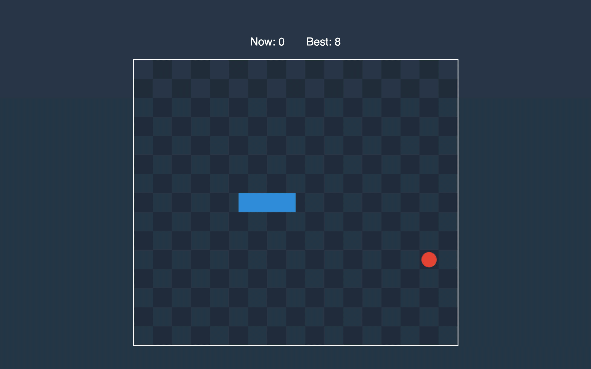

In this part, we will complete the development of the game by adding logic that will restart the game when the player lost.

## Game Over

To detect when the snake eats its tail, we will use the *Segment* method that will return the projection of the point on the segment.

```rust:title=src/lib.rs
impl Vector {
    // ...
    pub fn dot_product(&self, other: &Vector) -> f64 {
        self.x * other.x + self.y * other.y
    }
}

impl<'a> Segment<'a> {
    // ...
    pub fn get_projected_point(&self, point: &Vector) -> Vector {
        let vector = self.get_vector();
        let diff = point.subtract(&self.start);
        let u = diff.dot_product(&vector) / vector.dot_product(&vector);
        let scaled = vector.scale_by(u);
        self.start.add(&scaled)
    }
}
```

The magic involved to find the projection of the point on the segment is outside this course scope.🧙‍♂️


Now we are ready to add the method that will tell us if the game should be over.

```rust:title=src/lib.rs
impl Game {
    // ...
    pub fn is_over(&self) -> bool {
        let snake_len = self.snake.len();
        let last = self.snake[snake_len - 1];
        let Vector { x, y } = last;
        if x < 0_f64 || x > f64::from(self.width) || y < 0_f64 || y > f64::from(self.height) {
            return true;
        }
        if snake_len < 5 {
            return false;
        }

        let segments = get_segments_from_vectors(&self.snake[..snake_len - 3]);
        return segments.iter().any(|segment| {
            let projected = segment.get_projected_point(&last);
            segment.is_point_inside(&projected) && Segment::new(&last, &projected).length() < 0.5
        });
    }
    // ...
}
```

First, we check if the head of the snake is outside of the game field. If the snake has more than five segments, we want to check for self-intersection.


We declare a self-intersection when the projected head is inside of one of the tail segments, and the distance between the projected point and head is less than half of the cell.

Let’s compile Rust and finish the JavaScript side!

## Restarting the Game

We will check if the game is over right after the call to *process* method.

```js:title=www/src/game-manager.js
export class GameManager {
  // ...
  restart() {
    // ...
    this.lastUpdate = undefined
    this.stopTime = undefined
  }
  // ...
  tick() {
    if (!this.stopTime) {
      const lastUpdate = Date.now()
      if (this.lastUpdate) {
        this.game.process(lastUpdate - this.lastUpdate, this.controller.movement)
        if (this.game.is_over()) {
          this.restart()
          return
        }
        if (this.game.score > Storage.getBestScore()) {
          localStorage.setItem('bestScore', this.game.score)
          Storage.setBestScore(this.game.score)
        }
      }
      this.lastUpdate = lastUpdate
      this.render()
    }
  }
  // ...
}
```

Now we can open the web page and enjoy the game!

