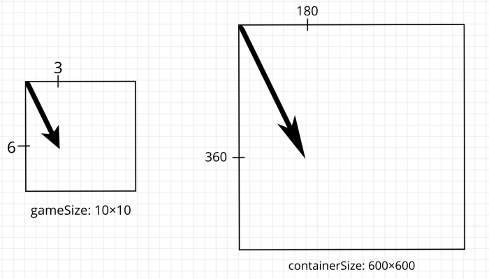

In this part, we will render all the objects of the game.

## Exporting Snake

We are almost ready to render all objects of the game. The only field that we were unable to reach from JavaScript was the snake. Let’s fix this.

We will use *js-sys* dependency to return JavaScript *Array* of vectors. Let’s add it to the list of dependencies in *Cargo.toml*.

```toml:title=Cargo.toml
[dependencies]
wasm-bindgen = "0.2"
js-sys = "0.3.32"
```

Now we can add a public method that will return an *Array*. It will clone the snake, and convert each vector to JavaScript value.

```rust:title=lib.rs
// ...
use js_sys::Array;
// ...

#[wasm_bindgen]
impl Game {
    // ...
    pub fn get_snake(&self) -> Array {
        self.snake.clone().into_iter().map(JsValue::from).collect()
    }
}
```

## HTML

Before writing rendering logic, we want to prepare the HTML. To make content take the full height of the page, we make the height of *html* and *body* equal to *100%*. In the *body*, we have a place for current and best scores and container for canvas, that we attach in JavaScript.

```html:title=www/index.html
<!DOCTYPE html>
<html>
  <head>
    <meta charset="utf-8" />
    <meta name="viewport" content="width=device-width, initial-scale=1" />
    <title>Snake Game</title>
    <style>
      html {
        height: 100%;
      }
      * {
        box-sizing: border-box;
        outline: 0;
        margin: 0;
      }
      body {
        height: 100%;
        background: #2c3e50;
        padding: 60px;
        font-family: sans-serif;
        display: flex;
        flex-direction: column;
      }
      canvas {
        border: 2px solid white;
      }
      #container {
        flex: 1;
        display: flex;
        align-items: center;
        justify-content: center;
      }
      header {
        display: flex;
        flex-direction: row;
        align-items: center;
        justify-content: center;
        color: white;
      }
      p {
        font-size: 3vmin;
        margin: 2%;
      }
    </style>
  </head>
  <body>
    <header>
      <p>Now: <span id="current-score"></span></p>
      <p>Best: <span id="best-score"></span></p>
    </header>
    <div id="container"></div>
  </body>
  <noscript>This page contains webassembly and javascript content, please enable javascript in your browser.</noscript>
  <script src="./bootstrap.js"></script>
</html>
```

## View

All the rendering will happen in the *View* class.

```js:title=www/src/view.js
export class View {
  constructor(gameWidth, gameHeight, onViewChange = () => {}) {
    this.gameWidth = gameWidth
    this.gameHeight = gameHeight
    this.container = document.getElementById('container')
    this.onViewChange = onViewChange
    this.setUp()

    window.addEventListener('resize', () => {
      const [child] = this.container.children
      if (child) {
        this.container.removeChild(child)
      }
      this.setUp()
      this.onViewChange()
    })
  }

  setUp() {
    console.log('setting up ...')
  }
}
```

The constructor of the *View* class receives a callback so that the owner of an instance could make an extra rerender if needed. Later we will see how *GameManager* will handle this callback.

```js:title=www/src/view.js
export class View {
  // ...

  setUp() {
    const { width, height } = this.container.getBoundingClientRect()
    this.unitOnScreen = Math.min(
      width / this.gameWidth,
      height / this.gameHeight
    )
    this.projectDistance = distance => distance * this.unitOnScreen
    this.projectPosition = position => position.scale_by(this.unitOnScreen)

    const canvas = document.createElement('canvas')
    this.container.appendChild(canvas)
    this.context = canvas.getContext('2d')
    canvas.setAttribute('width', this.projectDistance(this.gameWidth))
    canvas.setAttribute('height', this.projectDistance(this.gameHeight))
  }
}
```

In the setUp() method, we take the width and height of the container to calculate the conversion rate between cells and pixels. Then we create two functions that will help us to project distances and positions from game to the view. Finally, we set up a canvas for rendering.



```js:title=www/src/view.js
const getRange = length => [...Array(length).keys()]

export class View {
  // ...
 
  render(food, snake, score, bestScore) {
    this.context.clearRect(
      0,
      0,
      this.context.canvas.width,
      this.context.canvas.height
    )
    
    this.context.globalAlpha = 0.2
    this.context.fillStyle = 'black'
    getRange(this.gameWidth).forEach(column =>
      getRange(this.gameHeight)
      .filter(row => (column + row) % 2 === 1)
      .forEach(row =>
        this.context.fillRect(
          column * this.unitOnScreen,
          row * this.unitOnScreen,
          this.unitOnScreen,
          this.unitOnScreen
        )
      )
    )
    this.context.globalAlpha = 1

    const projectedFood = this.projectPosition(food)
    this.context.beginPath()
    this.context.arc(
      projectedFood.x,
      projectedFood.y,
      this.unitOnScreen / 2.5,
      0,
      2 * Math.PI
    )
    this.context.fillStyle = '#e74c3c'
    this.context.fill()

    this.context.lineWidth = this.unitOnScreen
    this.context.strokeStyle = '#3498db'
    this.context.beginPath()
    snake
      .map(this.projectPosition)
      .forEach(({ x, y }) => this.context.lineTo(x, y))
    this.context.stroke()

    document.getElementById('current-score').innerText = score
    document.getElementById('best-score').innerText = bestScore
  }
}
```

The last method receives the positions of the food and snake and scores to render all game objects. First, it clears everything from the previous render. Then it creates a field that looks like a chess-board. After that, it renders food and snake. Finally, it shows the current and best scores.

## Game Manager

To bind it all together, let’s go to the *GameManager* class.

```js:title=www/src/game-manager.js
import { Game, Vector } from 'wasm-snake-game'

import CONFIG from './config'
import { View } from './view'

export class GameManager {
  constructor() {
    this.restart()
    this.view = new View(
      this.game.width,
      this.game.height,
      this.render.bind(this)
    )
  }

  restart() {
    // ...
  }

  render() {
    this.view.render(
      this.game.food,
      this.game.get_snake(),
      this.game.score,
      // TODO actual best score
      0
    )
  }

  run() {
    this.render()
  }
}
```

In the constructor, we create an instance of *View* class. To make an extra rerender on resizing, we pass the bound resize method.

Now, we can open a web page, see how everything is rendered and try to resize the window.


